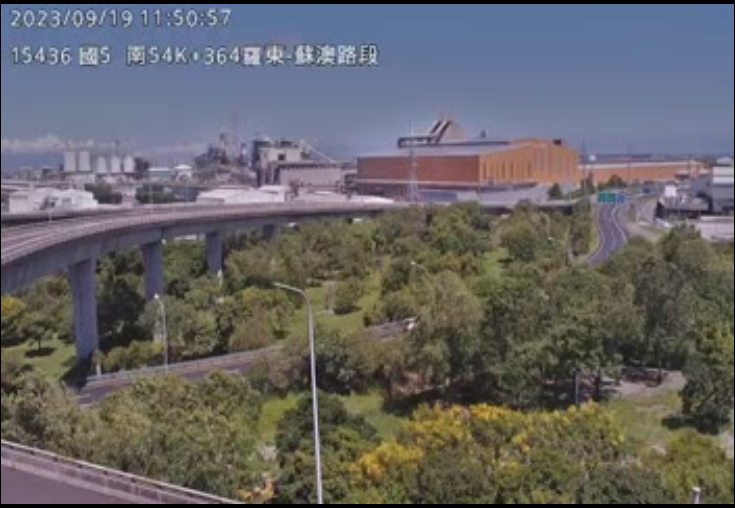
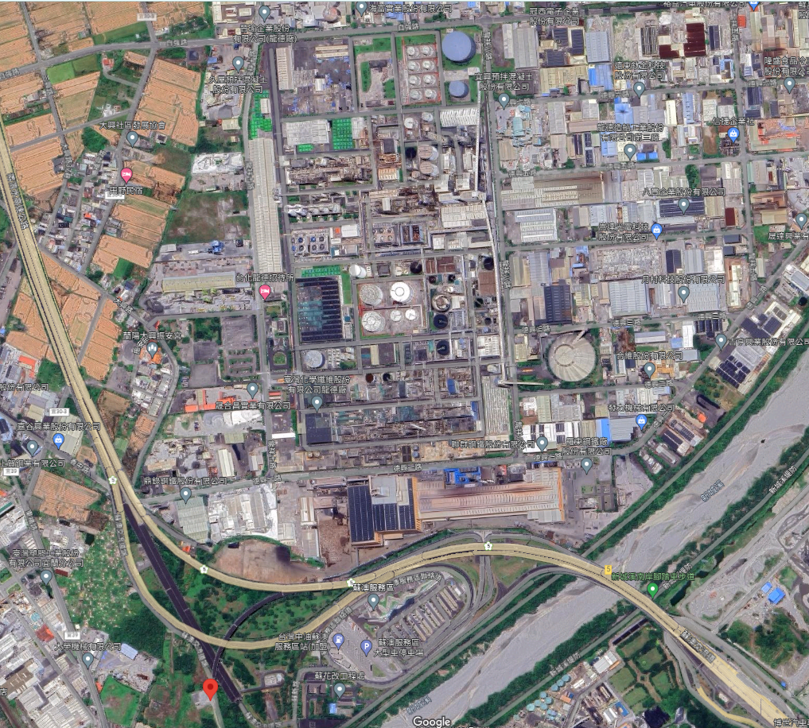
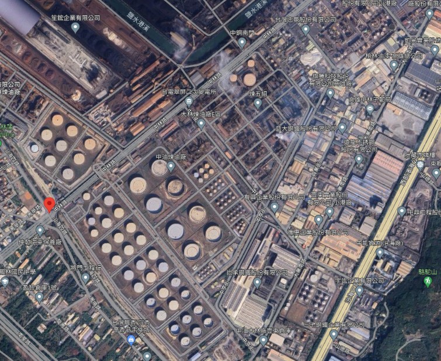
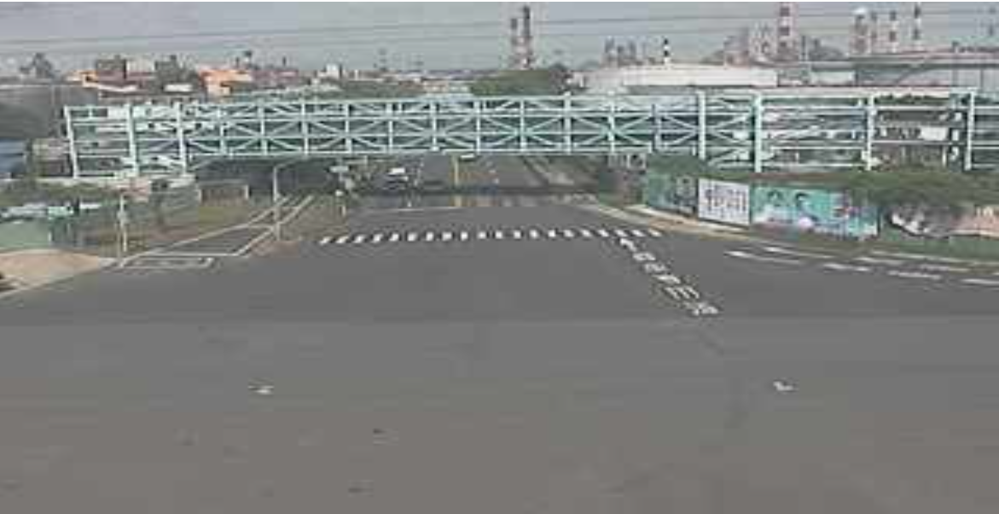

# 煙流影像來源資料庫

{: .no_toc }

<details open markdown="block">
  <summary>
    Table of contents
  </summary>
  {: .text-delta }
- TOC
{:toc}
</details>
---

## 背景

## 即時影像

- [tw.live](https://tw.live/)
  - [最新天氣觀測](https://tw.live/weather/)
  - 即時影像監視器網站提供台灣各地旅遊景點、市區道路、省道、國道高速公路等 CCTV 閉路電視攝影機即時影像，免費提供民眾隨時查看交通路況、天氣資訊以及旅遊景點人潮狀況以規劃旅行路線。本站影像來源由交通部、高公局、公路總局、各地縣市政府、國家公園風景區以及警廣即時路況等資料庫提供。
  - © Copyright 2023 即時影像監視器 All rights reserved.
- 台灣即時影像監視器 [twipcam](https://www.twipcam.com/cam/n5-s-28k+235)

```html
<div class="w3-content" style="max-width:100%;">

```

### 龍德工業區

- 來源：高速公路局
- 定點即時影像
  - 擷取週期：(似無限制)
  - 連線時間：不接受連續連線。每次連線
    - 12秒(YOLO直接連線)
    - 15秒：wget下載後、附加檔名命名為.mpeg檔
    - (https://www.twipcam.com/每10秒更新連結，用`?t=0.XXX`隨機時間戳記來連結)
    - 40秒(`"https://tw.live/cam/?id=CCTV-N5-S-29-512-M"` chrome連線)。
  - 下載檔案：約6~8MB

- 羅東蘇澳路段南向(54K+364)
  - 同時可以看到交流道及龍德工業區
  - IP: https://cctvp02.freeway.gov.tw/mjpeg/X01001614900301





## 高雄市即時影像

### 大林煉油廠

- 來源：高雄市交通局
- 高雄市道路 沿海四路、中林路 即時影像
  - 位置22.52470940967401, 120.3502816597705
  - IP: `https://cctv6.kctmc.nat.gov.tw/47e2aeaf`
  - 網站自動更新的原理過程，似乎藉cookie.js持續將使用者cookie與該公司連線。

```html
Indicate whether to send a cookie in a cross-site request by specifying its SameSite attribute

at cookie.js?domain=www.twipcam.com&callback=_gfp_s_&client=ca-pub-9857843162062228&cookie=ID%3D610953d246a9cabd-22db6032d4e70027%3AT%3D1695026920%3ART%3D1695101836%3AS%3DALNI_MZy00cvYMug6aJCUsLr7Pl4hjoBAg&gpic=UID%3D00000c49b30e6c6a%3AT%3D1695026920%3ART%3D1695101836%3AS%3DALNI_Ma1x1j3NHCTyMMJ5UTqKaCDclLAfQ:1:1
```




### 林園工業區

- 來源：環境部 空氣品質監測站[測站影像](https://airtw.moenv.gov.tw/cht/EnvMonitoring/Central/SitePhoto.aspx)
  - 每小時更新、只存留24小時
  - IP https://airtw.moenv.gov.tw/AirSitePic/20230919/052-202309191410.jpg


- 來源：交通部公路總局
  - 台17線 249K+000 即時影像
  - 22.4979, 120.415
  - IP: `https://cctv-ss04.thb.gov.tw/T17-249K+000`

### 仁大工業區

- 環境部左營空品測站的東北方(測站介紹)

- 夜間排放
 
- 黑煙(054-202202031500)

```bash
s=054;for m in {01..12};do for y in 20{22..23};do for h in {00..23}; do for d in {01..31};do for dir in {01..99};do ymd=$y$m$d;fn=${s}-${ymd}${h}$dir.jpg;if ! [[ -e $fn ]];then wget -q https://airtw.moenv.gov.tw/AirSitePic/$ymd/$fn;fi;done;done;done;done;done &
```

### 中鋼公司


### 觀光局4K影像

- 高雄觀光局4K及時影像[旗津海水浴場即時影像](https://youtu.be/ka7FV0sCvxQ)


[蓮池潭小龜山](https://www.youtube.com/watch?v=dCycHSYZBmg)


- [高雄壽山情人觀景台](https://www.youtube.com/watch?v=C03Itx8iSC0)
 


- [台中高美濕地](https://www.youtube.com/watch?v=fjhg3gAnMFg)


## Youtube

- 工安空汙頻遭詬病 高雄林園、臨海工業區明年總體檢  [公視晚間新聞(20211029)](https://www.youtube.com/watch?v=QTAhFPTZd5U)
- 林園工業區夜間空拍縮時錄影 by [丞佳魚貨(2019年11月11日)](https://youtu.be/n9JAHc8fw_Q?si=Vtk38Fdz5q2U4Udk)

## 照片定位

- 李祈德及洪淑瑜(2010)利用數位照片定位系統建構地理資料庫應用於森林資源經營管理。[台灣林業 九十九年 六月號](https://www.forest.gov.tw/MagazineFile.aspx?fno=5748)
  - 林務局自2008年開始執行的第4次全國森林資源調查，利用調查人員每3公里系統間隔設立地面樣區之際，以GPS建立軌跡及以數位相機大量拍攝行經地點特殊林相、野生動物、水源地及崩塌地等照片。採用RoboGEO系統串聯GPS與數位照片，使照片具有空間資訊，再應用Opanda軟體編輯照片之EXIF（EXchangeable Image File Format），註記相關資料。此法雖可將照片定位，但過程需搭配多項軟體才能達到繳交資料標準。為此，林務局南投林區管理處於執行該調查之初即發展「數位照片定位系統」，以有效率的比對數位照片與GPS軌跡時間及編輯EXIF資訊，同時可迅速整理調查資料，並產製可供各項業務使用之圖資，作為建構轄區內地理資料庫之基礎。
- 林士哲()相片拍攝之位置、方位記錄與GIS的應用。[中央研究院計算中心通訊電子報](https://ndaip.sinica.edu.tw/content.jsp?option_id=2621&index_info_id=1544)
- 臺灣百年寫真／GIS資料庫(限制瀏覽) by [漢珍數位圖書股份有限公司](http://www.tbmc.com.tw/chinese_version/taiwandata/taiwan_20.html)
  - 漢珍數位圖書董事長朱小瑄表示，這套資料庫收集一八九五到一九四五年間兩萬五千張老照片。照片主要來源是日據時代出版的寫真帖（攝影集）、書籍配圖與風景明信片。
  - 照片蒐集完成後，再聘請專業編輯撰寫圖文詮釋、整理地圖，再與中央研究院地理資訊科學GIS研究中心團隊合作，將每一張照片內容查到其經緯度座標後，以軟體設計內嵌於GIS（地理資訊系統）上。讀者可在不同時期的地圖上點選，呈現圖文並茂的數位資源。
- 數位典藏與數位學習國家型科技計畫([2002~2013](https://teldap.tw/index.html))


- 台灣創新技術博覽會 by 國家科學及技術委員會(國科會)、中央研究院、教育部、衛生福利部
  - 空氣汙染快速分析儀及汙染來源分佈系統 by [國立臺灣師範大學](https://www.futuretech.org.tw/futuretech/index.php?action=product_detail&prod_no=P0008700005436)
