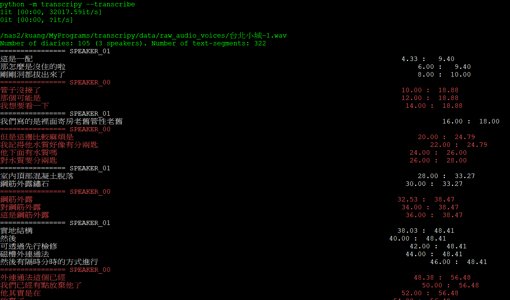

# Transcripy實作經驗

{: .no_toc }

<details open markdown="block">
  <summary>
    Table of contents
  </summary>
  {: .text-delta }
- TOC
{:toc}
</details>
---

## 背景

- source： [github:Haschtl/transcripy](https://github.com/Haschtl/transcripy/tree/main)

## Dependency

- python版本：太舊會有問題，python 3.11~12 is OK
- ntlk版本：太新(如3.9.1)會有資安防寫功能，3.7 is OK
- 似乎沒有必要安裝、且版本規則彼此衝突、不可能存在者：
  - `simpleaudio`
  - `spleeter`
  - `typer`、 `protobu`、`pyannote-database`

## HF token

- 作者提供的模型需要hugging face的TOKEN才能下載、在地端執行。
  - [pyannote/segmentation](https://huggingface.co/pyannote/segmentation)
  - [pyannote/speaker-diarization](https://huggingface.co/pyannote/speaker-diarization)
- 需在`./transcripy/audio2voices.py`內新增一行設定(`use_auth_token`)：

```python
model = Model.from_pretrained(model, 
                  use_auth_token="ACCESS_TOKEN_GOES_HERE")
```

## 執行結果



```bash
$ lst data/output/transcripts/
total 148K
-rw-r--r-- 1 kuang SESAir 11K Nov  4 15:17 台北小城-1.transc #沒有時間戳的連續TXT檔
-rw-r--r-- 1 kuang SESAir 22K Nov  4 15:17 台北小城-1.srt #每句話分開一段
-rw-r--r-- 1 kuang SESAir 49K Nov  4 15:17 台北小城-1.sami #視頻平台的字幕顯示
-rw-r--r-- 1 kuang SESAir 40K Nov  4 15:17 台北小城-1.dfx #webVTT交換檔
-rw-r--r-- 1 kuang SESAir 20K Nov  4 15:17 台北小城-1.txt #如下
(py311)
kuang@l40 /nas2/kuang/MyPrograms/transcripy
$ head data/output/transcripts/台北小城-1.txt
# Language: zh
00:00:04.334 - 00:00:09.396: SPEAKER_01: 這是一配
00:00:06.000 - 00:00:09.396: SPEAKER_01: 那怎麼是沒住的啦
00:00:08.000 - 00:00:10.000: SPEAKER_01: 剛剛洞都拔出來了
00:00:10.000 - 00:00:18.880: SPEAKER_00: 管子沒接了
00:00:12.000 - 00:00:18.880: SPEAKER_00: 那個可能是
00:00:14.000 - 00:00:18.880: SPEAKER_00: 我想要看一下
00:00:16.000 - 00:00:18.000: SPEAKER_01: 我們寫的是裡面寄房老舊管性老舊
00:00:20.000 - 00:00:24.786: SPEAKER_00: 但是這邊比較麻煩是
00:00:22.000 - 00:00:24.786: SPEAKER_00: 我記得他水質好像有分兩匙
```

