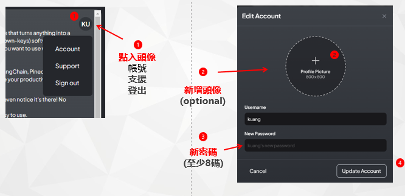
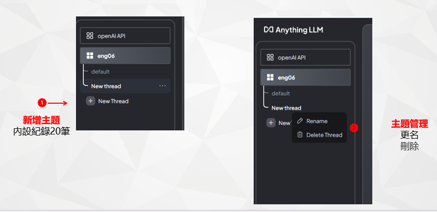
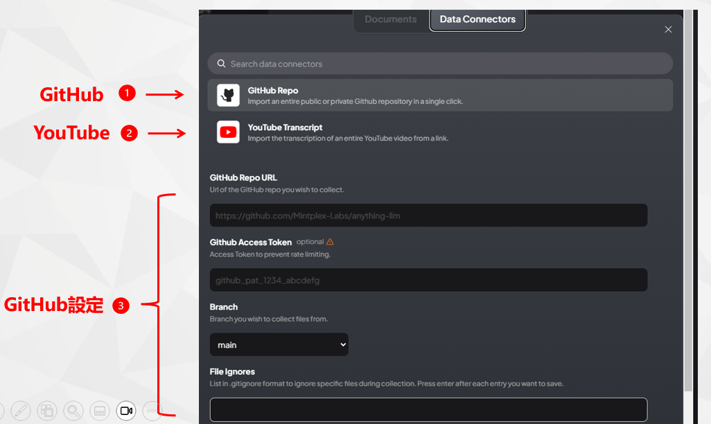

# AnythingLLM Chat
{: .no_toc }

  

    Table of contents
  

  {: .text-delta }
- TOC
{:toc}

---

## 背景

- AnythingLLM的服務介面林林總總，此處以最常用的對話介面為範圍主題進行說明。
  - 其他如[AI小幫手](./EmbChat.md)，雖然也有對話功能，但介面附加在其他網頁之內，且沒有帳密管理，服務功能也略有不足。
- AnythingLLM概念說明：可以詳見其[官網](https://useanything.com/)。
- 官網使用[說明文件](https://docs.useanything.com/)

## GPT統一入口介面程式

### 使用者權限

- AnythingLLM的使用者有3種角色。角色並不能新創或刪減。
- 內設(一般)使用者
  - 只能發送與管理員或經理新增到的工作區的聊天。
  - 新增工作區內的主題(thread)，連結到檔案、網頁、GH倉庫、影音或其他資料
  - 無法修改任何設定。
- 經理
  - 可以查看、建立和刪除任何工作區以及修改工作區特定
的設定。
  - 可以建立、更新和邀請新使用者加入工作區。
- 管理者
  - 最高使用者等級權限。可以查看並執行整個系統中的所
有操作。
  - 新增使用者、帳密、權限管理
  - 修改LLM、vectorDB、嵌入或其他連線與API token等設定。

### 登入

- AnythingLLM目前沒有提供其他登入方式(如AD/LDAP等)的選項，只有其內部管理者設定的帳密權限管理。
- 權限角色：管理者、經理、內設(一般人)，角色說明如[上](#使用者權限)
- 帳號設計
  - 使用者名稱並無限定不允許數字，但為了與未來LDAP(FreeIPA)結合，此處就不用員編作為使用者名稱、也不用中文。
  - 電郵名稱(@左側英文字)、不含數字(避免太長)
  - 全為數字者：改為拼音名+姓(縮寫)
- 初設密碼：
  - 員編重複2次
  - AnythingLLM要求密碼至少需8碼
- 畫面

1. 網址@[eng06](eng06.sinotech-eng.com:3001)
2. 登入使用者。如不登出，本地網頁瀏覽器會記錄帳密。
3. 登入密碼。至少8碼
4. 登入(下次瀏覽器連線後，會自動登入)

### 畫面分區

- 一如其他chatbot的習慣，AnythingLLM的主畫面切分為2大部分，左側邊條除了設定(板手符號，只有管理者看得到)及說明外，就是工作區(workspace, LLM、經理級以上可以新增)及其目錄下的主題(thread、所有人都可新增)
- 中間部分為對話區
  - 最下一行為使用者提問區，按下enter或紙飛機icon，則可輸入提問。
  - GPT回覆內容，如果沒有特別指定，一般對話紀錄為20筆。筆數需視選取的LLM而異，如果允許Token數較少，紀錄太多會妨礙其記憶體使用。
  - 輸入/輸出語言：視LLM而異，
- 右側個人區
  - 可修改頭像、變更密碼、登出
  - 如不登出，瀏覽器將會記憶帳密，下次點選網址不需再登入。
  - 如有安全顧慮(經理以上)，要記得**每次**使用完隨即登出
  

### 個人區與密碼管理

- 由於外部LLM的API視需要收費的，因此經理級以上人員是有相應的管理責任，登入後強烈建議**更改密碼**
- 點選又上風的頭像可以進入個人區進行修改
- 密碼只有最低長度的限制，其餘並無要求。
- 目前沒有提供忘記密碼的自動化補救措施，管理者有權限可以修改任何人的密碼，可洽任何一位研資部同仁。

### 切換/新增對話主題

- 在工作區下，任何人可以切換或新增對話主題(thread)，圍繞著特定文件檔案、或特定網頁。
- 不同使用者之間彼此看不到他人的對話紀錄，但可以看得到暫存區的檔案目錄及名稱，作為主題連結的對象。

- 新增主題名稱一律為"New Thread"
- 新增主題後，可以在其右側...位置更名或刪除。
- 刪除後對話紀錄將會消失，使用者應自行儲存管理。

- 新增主題後， 會出現主題要連結的檔案(或連結)，
  - 這個連結只會出現在這裡，主題對話過程中不能新增或改變。
  - 點入連結後會另開新的畫面。

### 檔案、網頁與資料的連結

1. 既有檔案的連結
  - 過去所有使用者開啟的檔案，點選後，會出現使用的按鍵，需要按下後將其移到右側，才會被GPT用以強化文本的產生(RAG)
2. 新增檔案：可以用開啟檔案或拖拉放在虛線位置，
3. 網頁
  - 可以接受內部或外部的網址
  - 按下取回(fetch)後，可以將將其內容下載至系統資料庫中。
4. 開新目錄：如果檔案太多，不便連結，可以建立新資料夾
5. 除了檔案網頁外，也可以連結其他類資料，點選分頁後可進入另一畫面

### GH倉庫及影音檔案之連結

- AnythingLLM可以連結到私人的GitHub倉庫，此處輸入倉庫的網址以及通關密鑰。
- YouTube影音檔案的逐字稿(transcription)

## 經理的任務

### 新增工作區

- 經理以上可以新增工作區，重新命名、刪除並進行工作區的設定。
- 經理不能更動內設的語言模型。
- 工作區名稱右側齒輪：進入工作區的設定。

### 一般設定

- 向量資料庫的總向量數：0表示沒有限制。
- 更名
- 刪除。對話會及設定全數會被刪除。

### 對話設定

- LLM提供者：可以選擇雲端或地端的LLM，設定API、或指定GPT版本。
- 對話模式
  - 對話：會以語言模型的基本知識與RAG檔案內容來回答問題
  - 查詢：會以RAG檔案內容來回答問題，如超出範圍，則不回答。
- 對話歷史：內設為20，視語言模型的Token數而定。
- 前提：是否臆測、回答的語調、潛在對象特質等等。
- 溫度：只會針對工作區產生作用。一般設為0.7，如果要產生嚴謹的報告，需要降低LLM回答的溫度。

### 向量資料庫

- RAG檔案或其他輸入內容，將會以向量化模型來儲存，其資料庫在此設定。
- 資料庫ID：內設與工作區名稱一致。
- 最大文本片段：內設建議為4個片段
- 文件相似度的界閥值：有不限、低、中、高等4種選項，相似度要求越高，回答越精準。

### 邀請(允許)工作區的使用者

- 經理級以上可以訪問所有的工作區，使用系統的LLM資源，不需要允許或邀請
- 每個工作區可以指定不同的使用群體，以區隔API資源的使用。

### 代理者設定

- 可用語言模型之選擇，目前有openAI、Anthropic等2個選項。
- 內設開啟的代理者
  - 長期記憶的RAG
  - 文件檢視及摘要
  - 網頁文本之爬取
  - 

## 管理者的任務

