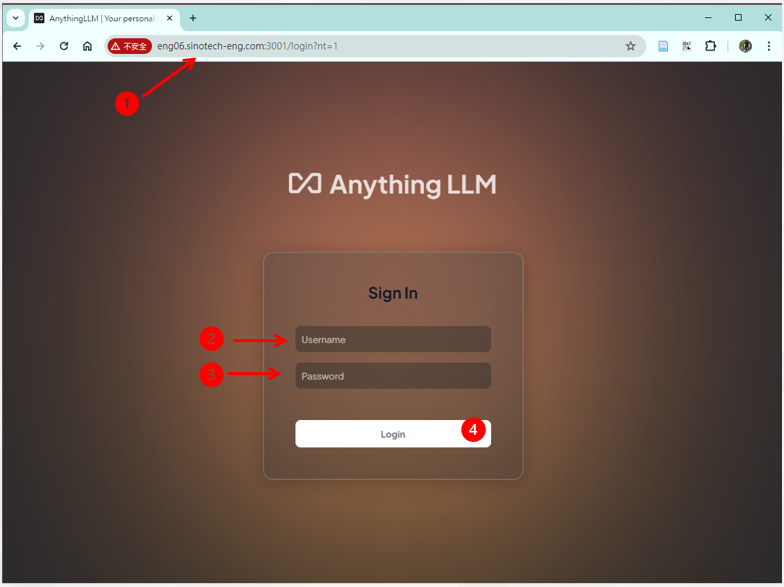
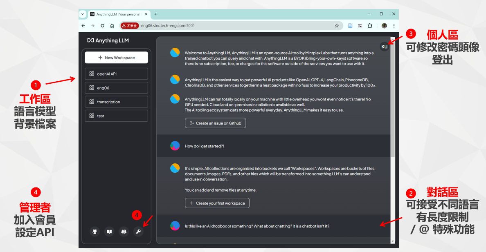

# AnythingLLM Chat
{: .no_toc }

  

    Table of contents
  

  {: .text-delta }
- TOC
{:toc}

---

## 背景

- AnythingLLM的服務介面林林總總，此處以最常用的對話介面為範圍主題進行說明。
  - 其他如AI小幫手，雖然也有對話功能，但介面附加在其他網頁之內，且沒有帳密管理，服務功能略有不足。
  - 
- 
## 地端GPT入口介面程式

### 登入

- AnythingLLM目前沒有提供其他登入方式(如AD/LDAP等)的選項，只有其內部管理者設定的帳密權限管理。
- 權限腳色：管理者、經理、內設(一般人)
  - 管理者：所有設定權限
  - 經理：
- 帳號設計
  - 使用者名稱並無限定不允許數字，但為了與未來LDAP(FreeIPA)結合，此處就不用員編作為使用者名稱、也不用中文。
  - 電郵名稱、不含數字(避免太長)
  - 全為數字者：改為拼音名+姓(縮寫)
- 初設密碼：
  - 員編重複2次
  - AnythingLLM要求密碼至少需8碼
- 畫面

1. 網址@[eng06](eng06.sinotech-eng.com:3001)
2. 登入使用者。如不登出，本地網頁瀏覽器會記錄帳密。
3. 登入密碼。至少8碼
4. 登入(下次瀏覽器連線後，會自動登入)

### 畫面分區

- 一如其他chatbot的習慣，AnythingLLM的主畫面切分為2大部分，左側邊條除了設定()及說明外，
- 畫面

