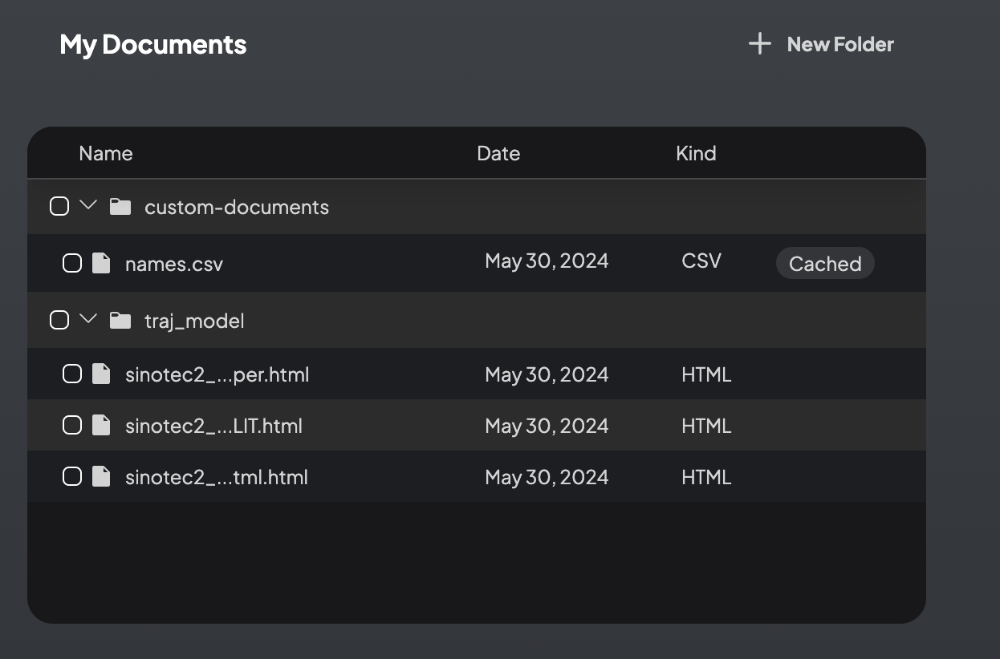
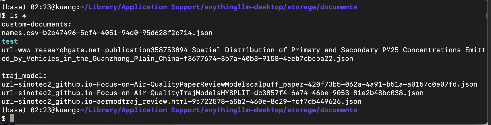

# AnythingLLM後台文件系統
{: .no_toc }

<details open markdown="block">
  <summary>
    Table of contents
  </summary>
  {: .text-delta }
- TOC
{:toc}
</details>
---

## 背景

- AnythingLLM執行的方式有三：
  - 生產階段
    - 以docker方式進行，每個docker image之間不會彼此干擾，
    - 雖然docker server只能是http形式提供服務，經由apache代理，也可以在https服務。
  - 測試階段
    - 以個別node server形式執行
    - 可以進行系統的調整測試、程式的修改與偵錯
    - 隨時可以重啟、重裝、沙箱性質的系統
  - 個人服務
    - 以Desktop軟體形式，而不是伺服器型態服務，
    - [官網](https://docs.useanything.com/getting-started/installation/overview#docker-vs-desktop-version)有完整的比較，簡言之，桌面版沒有會員與角色相關的服務、沒有小幫手、外表設定也減少很多。
- 不論執行方式如何，其後台運作有很高的一致性
  - docker
    - 程式都包裝在印象檔內，印象檔的`storage`目錄,需設定有主機的本地目錄與之配合，規範在環境變數`$STORAGE_DIR`。
    - 為使檔案傳輸方便，docker中的執行者ID與現實主機中執行者ID如果一致，會有幫助。
  - node server
    - 在`anythingLLM/server`目錄下編譯、執行
    - 第一次執行會自行產生`anythingLLM/server/storage`目錄，如果要重啟，可以考慮刪除該目錄。
  - DeskTop軟體
    - 程式會在OS指定路徑，以macOS而言，會在`~/Library/Application Support/anythingllm-desktop/`
    - 程式架構與server版有很大差異，但還是有個`storage`目錄作為設定、對話與文件等等儲存的空間。

## `$STORAGE_DIR`內容

- 基本上，`$STORAGE_DIR`存放了設定與資料庫、模型、向量資料庫、以及文件`documents`，就是各工作區上傳的文件網頁檔案存放的地方。

```bash
$ ls -lrth
total 952
drwxr-xr-x  4 kuang  staff   128B Apr 28 16:03 comkey
drwxr-xr-x  4 kuang  staff   128B Apr 28 20:13 models
-rw-r--r--  1 kuang  staff   333B May 26 06:51 boot_output.log
drwxr-xr-x  2 kuang  staff    64B May 26 19:47 hotdir
drwxr-xr-x  4 kuang  staff   128B May 26 19:47 lancedb
drwxr-xr-x  7 kuang  staff   224B May 26 19:47 vector-cache
drwxr-xr-x  2 kuang  staff    64B May 26 21:07 tmp
-rw-r--r--  1 kuang  staff   420K May 26 21:07 anythingllm.db
drwxr-xr-x  4 kuang  staff   128B May 29 04:18 documents
```

## 後台與程式的交互作用

### 後台讀取、執行權限

- 可執行(進入程式新創的目錄)、讀取程式產生的檔案、
  - 目錄不會加入程式編碼
  - 檔名經過程式db註記，會加上專屬的編碼，
  - 檔案內容經過格式轉換，原始檔案不會儲存。
  - 如下範例。為網頁爬取之內容。

|||
|-|-|
|程式中目錄與上載之檔案|後台儲存區實際的目錄與檔案名稱|

### 上載文本結果分析

- 網頁爬取範例如下
- 文本的基本smeta info共10項。視網頁訊息及分析結果而異:
  - `"id"`程式db編碼、也會鑲嵌在檔名最後段
  - `"url"`網際網路或本機檔案連結、無目錄分隔、
  - `"title"`檔名、
  - `"docAuthor"`（不會分辨uid/gid）、
  - `"description"`（無值）、
  - `"docSource"`操作紀錄、
  - `"chunkSource"`真正的url、
  - `"published"`文本檔案時間、網頁刊載之時間戳記
  - `"wordCount"`不會分辨變數、代碼、拼音、數字等非自然語言文字、
  - `"token_count_estimate"`包括非NLP部分
- `"pageContent"`：為實際爬取結果。會有網頁的 navbar、sidebar、header、footer等等，仍需要清洗。

```json
$ more url-sinotec2_github.io-Focus-on-Air-QualityPaperReviewModelscalpuff_paper-420f73b5-062a-4a91-b51a-a0157c0e07fd.json
{
    "id": "420f73b5-062a-4a91-b51a-a0157c0e07fd",
    "url": "file://sinotec2_github.io-Focus-on-Air-QualityPaperReviewModelscalpuff_paper.html",
    "title": "sinotec2_github.io-Focus-on-Air-QualityPaperReviewModelscalpuff_paper.html",
    "docAuthor": "no author found",
    "description": "No description found.",
    "docSource": "URL link uploaded by the user.",
    "chunkSource": "link://https://sinotec2.github.io/Focus-on-Air-Quality/PaperReview/Models/calpuff_paper/",
    "published": "2024/4/28 下午8:13:27",
    "wordCount": 3552,
    "pageContent": "Focus on Air Quality\n...CALPUFF應用相關論文\n...國內軌跡模式學位論文\n按模式種類列於sinotec2.github.io\nUser Guides\nScire, ...\nBack to top\n\nCopyright © 2021- Dr. Yunchuan Kuang. Distributed by an MIT license.\n\n 30 views    27342 site_visits    12013 visitors\n\nPage last modified: Jun 7 2022 at 04:37 PM.\n\nEdit this page at GitHub",
    "token_count_estimate": 6313
}
```

### 後台寫入權限與效果

- 可從OS開目錄、程式可讀取、可進入，但不能刪除OS開創的目錄
- 可直接貼上json檔案，但程式是從json內容判斷檔名，並不接受OS的檔名