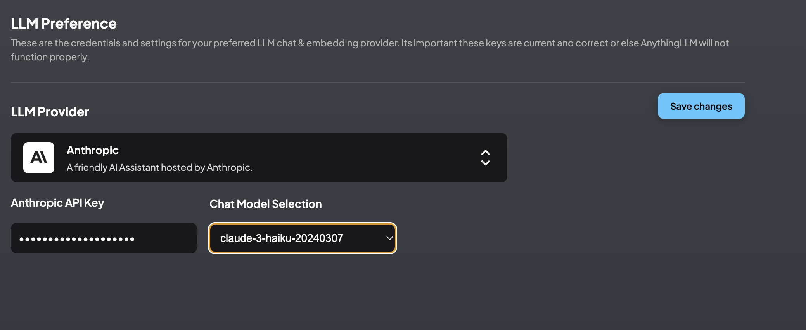
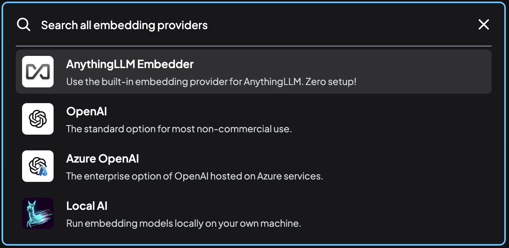

# 管理者的權責
{: .no_toc }

  

    Table of contents
  

  {: .text-delta }
- TOC
{:toc}

---

## 背景

- 此處介紹管理者在系統設定方面的權責，其中有些也是經理可以管理的範圍。
- 經理及管理者可以設定的部分，詳下表。

項目|經理|管理者|功能目的
:-|:-:|:-:|-
[系統偏好設定](#系統偏好設定)|x|x|使用者刪除、使用者對話次數上限
[邀請連結](#邀請連結)|x|x|點入連結即可新增使用者
[使用者管理](#使用者管理)|x|x|新增編輯停權及刪除
[工作區列表](#工作區列表)|x|x|新創及刪除工作區
[工作區對話](#工作區列表)|x|x|檢視輸出或刪除
[外觀](#外觀)|x|x|logo參考及支援
[API Keys](#api-keys)||x|Swagger API server and Keygen
[LLM偏好](#llm偏好)||x|內設語言模型
[逐字稿模型](#逐字稿模型)||x|影音檔轉逐字稿的語言模型
[嵌入器偏好](#嵌入器偏好)||x|設定嵌入器
向量資料庫||x
嵌入對話||x|AI小幫手
事件紀錄||x

## 管理者的任務

- 基本上管理者除了一般使用者與經理的權責之外，還必須負責「INSTANCE SETTINGS」中大半項目的設定，很多是與LLM的統一設定有關。

### 系統偏好設定

這裡進行實例的整體設定和配置。

- 使用者可以刪除工作區：
  - 允許使用者刪除他們所屬的工作區。 
  - 這項設定將會影響到工作區的其他人。
- 限制每個用戶每天的訊息數
  - 限制使用者在 24 小時內只能進行成功查詢或聊天的次數。
  - 啟用此功能可防止使用者增加 OpenAI 或其他付費方案的成本。
- 這項設定是管理者與經理都可以更改的，也沒有限定使用者與工作區的範圍，是作用在全系統。如有不同的設定需求需要進一步協調。

### 邀請連結

- 這項功能會產生一次性、訪問特定工作區、新增使用者的連結，可以減省管理者新增使用者的工作，讓使用者自行鍵入名稱及密碼。
  - 工作區的成員設定只能就現有的使用者，勾選加入其工作區，並不能產生新的使用者。
  - 連結新創使用者，不能指定特定的名稱。
  - 一旦接受邀請，連結就會失效。
  - 系統還沒有開放批次作業的方式，如果要產生多個邀請連結，以便寄給多個對象，必須依序逐一進行勾選。
- 如圖中範例，sinotec2接受了邀請，還有一條連結產生了卻還沒有人回應。[範例連結](http://eng06.sinotech-eng.com:3001/accept-invite/0TJ37Y0-7FE41X0-GVMEZ5T-T6AT522)

- 點選產生邀請連結後的畫面
- 須至少點選一個工作區
- 按下`Create Invite`會產生一個連結，將其複製到email中即可發出(或其他散布途徑)。

- 點選連結後出現新創使用者的畫面
- 輸入帳密、接受邀請後，將會開啟AnythingLLM對話窗，並自動登入新帳號。
- 工作區的成員也會自動加入，不必另外設定。如果由管理者新增使用者，還需要各個工作區新增成員、另外通知使用者初始帳密，登入後再修改密碼。

### 使用者之管理

- 此處可以新增、編輯、停權或刪除使用者權限
1. 新增：帳號、密碼、權限角色
2. 編輯：更改密碼、 權限角色
3. 停權：立即登出、並不得再登入，帳號及記錄依然存在
4. 刪除：無可回復

- 由於系統內沒有使用者的其他訊息，因此強烈建議使用者需按照管理者的安排命名，這樣才能建立正確的（費用）連結。

### 工作區列表

- 這裡提供所有工作區的列表，可以在此檢視各個工作區的連結(分享)、參與人數、起始時間、也可快速刪除工作區。
- 此處新增工作區，會要求鍵入工作區名稱，與主畫面新增工作區效果一樣。

### 工作區對話

- 管理工作區的對話紀錄，包括檢視、輸出、或刪除
- 沒有排序、篩選、整併、計數等功能，需輸出成檔案進一步分析。

### 外觀

- 此處控制系統的logo、對話框的初始訊息、參考連結、及技術支援email
- 內定之系統訊息

- 鍵入訊息後要儲存才會生效

- 回到首頁後就會即時出現訊息

### API Keys

- AnythingLLM提供了swagger API伺服器，可以從命令列來控制系統，這在測試或以伺服器方式的生產階段，是非常有用的工具。
- 除了API伺服器之外，還提供了API Key的產生程式，以提供連線的協定密鑰。

### LLM偏好

- 就是內設的語言模型。
- 如果工作區使用的是內設語言模型，從此處修改，將會一次修改所有的工作區設定。
- 設定之後需按下儲存使設定生效。

### 逐字稿模型

- 可以選擇內建（本機執行）或是openAI 的whisper等2種語言模型。
- 同樣的，更改選擇之後，需要按下儲存才能生效。

### 嵌入器偏好

- 嵌入器（Embeder）和下面會談到的AI小幫手是不同的服務方式，後者仍然是個對話框、是個聊天機器人，而前者接受使用者訊息之後，會回應一組相似度的數值。
- 嵌入器是用來評量輸入內容轉碼、特徵提取、並與資料庫相近程度等等的服務工具。
- Anything LLM提供4種選項。

向量資料庫||x
||x|AI小幫手
事件紀錄
### 嵌入對話

AI小幫手

