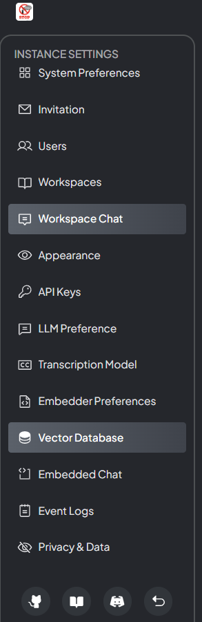
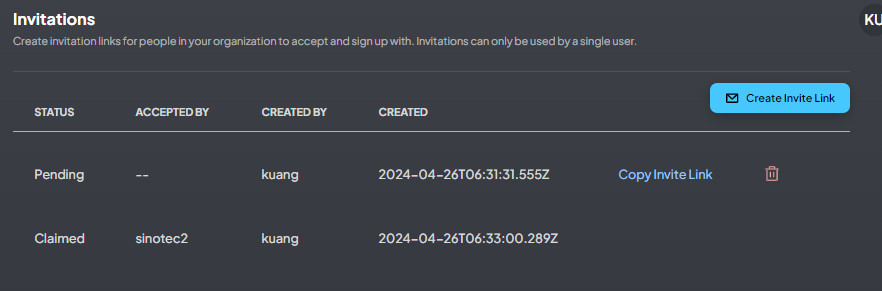
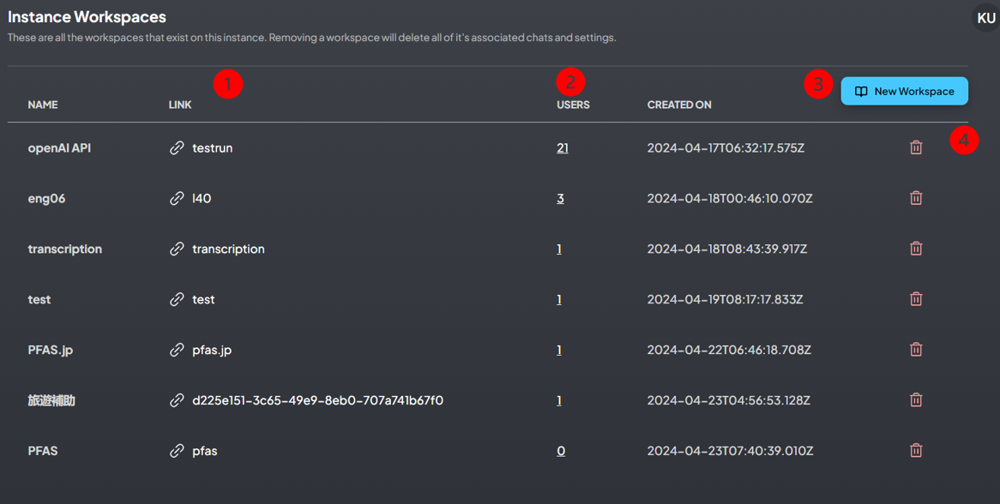
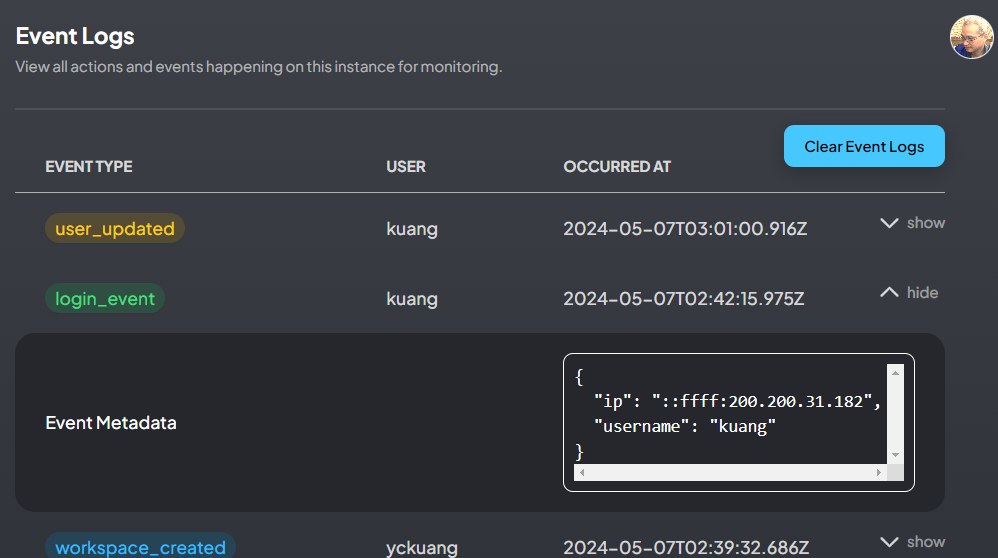

# 管理者的權責
{: .no_toc }

  

    Table of contents
  

  {: .text-delta }
- TOC
{:toc}

---

## 背景

- 此處介紹管理者在系統設定方面的權責，其中有些也是經理可以管理的範圍。
- 經理及管理者可以設定的部分，詳下表。
  - 最大的差別在於管理者對API金鑰與使用紀錄(ip)的管理與監視，這些都與經費資源的管理有關。
  - 技術部分：管理者對個別LLM應用如逐字稿、嵌入器、小幫手、向量資料庫等的設定，對整體系統功能有絕對的影響力。

### AnythingLLM設定與權責

項目|經理|管理者|功能目的
:-|:-:|:-:|-
[系統偏好設定](#系統偏好設定)|x|x|使用者刪除、使用者對話次數上限
[邀請連結](#邀請連結)|x|x|點入連結即可新增使用者
[使用者管理](#使用者管理)|x|x|新增編輯停權及刪除
[工作區列表](#工作區列表)|x|x|新創及刪除工作區
[工作區對話](#工作區列表)|x|x|檢視輸出或刪除
[外觀](#外觀)|x|x|logo參考及支援
[API Keys](#api-keys)||x|批次設定作業，可以用curl指令或在swagger UI環境
[LLM偏好](#llm偏好)||x|內定LLM、給定LLM之API token
[逐字稿模型](#逐字稿模型)||x|Whisper之內定細節
[嵌入器偏好](#嵌入器偏好)||x|除內裝引擎外，提供了2個雲端及2個地端選項
[向量資料庫](#向量資料庫)||x|系統有8種方案可以選擇
[嵌入對話](#嵌入對話)||x|[AI小幫手](./EmbChat.md)
[事件紀錄](#事件紀錄)||x|檢視使用者登入IP
[隱私權](#隱私權)||x|

|
:-:|:-:
經理權責範圍(6項)|管理者權責(14項)

## 管理者的任務

- 基本上管理者除了一般使用者與經理的權責之外，還必須負責「INSTANCE SETTINGS」中大半項目的設定，很多是與LLM的統一設定(與經費)有關。

### 系統偏好設定

這裡進行實例的整體設定和配置。

- 使用者可以刪除工作區：
  - 允許使用者刪除他們所屬的工作區。 
  - 這項設定將會影響到工作區的其他人。
- 限制每個用戶每天的訊息數
  - 限制使用者在 24 小時內只能進行成功查詢或聊天的次數。
  - 啟用此功能可防止使用者增加 OpenAI 或其他付費方案的成本。
- 這項設定是管理者與經理都可以更改的，也沒有限定使用者與工作區的範圍，是作用在全系統。如有不同的設定需求需要進一步協調。

### 邀請連結

- 這項功能會產生一次性、訪問特定工作區、新增使用者的連結，可以減省管理者新增使用者的工作，讓使用者自行鍵入名稱及密碼。
  - 工作區的成員設定只能就現有的使用者，勾選加入其工作區，並不能產生新的使用者。
  - 連結新創使用者，不能指定特定的名稱。
  - 一旦接受邀請，連結就會失效。
  - 系統還沒有開放批次作業的方式，如果要產生多個邀請連結，以便寄給多個對象，必須依序逐一進行勾選。
- 如圖中範例，sinotec2接受了邀請，還有一條連結產生了卻還沒有人回應。[範例連結](http://eng06.sinotech-eng.com:3001/accept-invite/0TJ37Y0-7FE41X0-GVMEZ5T-T6AT522)

- 點選產生邀請連結後的畫面
- 須至少點選一個工作區
- 按下`Create Invite`會產生一個連結，將其複製到email中即可發出(或其他散布途徑)。

- 點選連結後出現新創使用者的畫面
- 輸入帳密、接受邀請後，將會開啟AnythingLLM對話窗，並自動登入新帳號。
- 工作區的成員也會自動加入，不必另外設定。如果由管理者新增使用者，還需要各個工作區新增成員、另外通知使用者初始帳密，登入後再修改密碼。

### 使用者之管理

- 此處可以新增、編輯、停權或刪除使用者權限
1. 新增：帳號、密碼、權限角色
2. 編輯：更改密碼、 權限角色
3. 停權：立即登出、並不得再登入，帳號及記錄依然存在
4. 刪除：無可回復

- 由於系統內沒有使用者的其他訊息，因此強烈建議使用者需按照管理者的安排命名，這樣才能建立正確的（費用）連結。

### 工作區列表

- 這裡提供所有工作區的列表，可以在此檢視各個工作區的連結(分享)、參與人數、起始時間、也可快速刪除工作區。
- 此處新增工作區，會要求鍵入工作區名稱，與主畫面新增工作區效果一樣。

### 工作區對話

- 管理工作區的對話紀錄，包括檢視、輸出、或刪除
- 沒有排序、篩選、整併、計數等功能，需輸出成檔案進一步分析。

### 外觀

- 此處控制系統的logo、對話框的初始訊息、參考連結、及技術支援email
- 內定之系統訊息

- 鍵入訊息後要儲存才會生效

- 回到首頁後就會即時出現訊息

### API Keys

- AnythingLLM提供了swagger API伺服器，可以從命令列來控制系統，這在測試或以伺服器方式的生產階段，是非常有用的工具。
- 除了API伺服器之外，還提供了API Key的產生程式，以提供連線的協定密鑰。

### LLM偏好

- 就是內設的語言模型。
- 如果工作區使用的是內設語言模型，從此處修改，將會一次修改所有的工作區設定。
- 設定之後需按下儲存使設定生效。

### 逐字稿模型

- 可以選擇內建（本機執行）或是openAI 的whisper等2種語言模型。
- 同樣的，更改選擇之後，需要按下儲存才能生效。

### 嵌入器偏好

- 嵌入器（Embeder）和下面會談到的AI小幫手是不同的服務方式，後者仍然是個對話框、是個聊天機器人，而前者接受使用者訊息之後，會回應一組相似度的數值。
- 嵌入器是用來評量輸入內容轉碼、特徵提取、並與資料庫相近程度等等的服務工具。
- Anything LLM提供4種選項。

向量資料庫||x
||x|AI小幫手
事件紀錄
### 嵌入對話

AI小幫手

- 批次設定作業，必須取得系統的API金鑰，由curl指令、或在swagger UI介面進行操作。
- 批次新增使用者的作業方式(以python程式進行`curl`指令之迴圈控制)，詳見[add_user.py程式說明](./add_users.md)。
1. 按下產生金鑰，以產生新的API金鑰。(舊的似乎不會自動失效，如果不再需要，須個別刪除) 
2. 複製金鑰，在curl指令中使用`curl -H "Authorization: Bearer ******"`，或在swagger UI介面套用。
3. 點選API文件，進一步說明以及(或)UI介面操作。

1. 進入swagger介面後，如果要修改，會需要將Authorize關閉，點選右上角鎖頭或每一項操作的鎖頭，都可以進行關閉動作。
2. 點入鎖頭後，會需要輸入API金鑰。
3. 輸入後，點選Authorize(授權)、鎖頭會呈現閉鎖狀態。
4. 離開輸入介面，按下關閉，或右上角`x`，進行個別分項的查詢、修改、或設定。

### LLM偏好

1. 下拉選單選擇LLM提供者，作為內定LLM。(或給定API key)
2. 給定API key。此為管理者重要權責，因與付費有關，一般使用者及經理都無權限更改。此欄具自動隱密性、只能貼上，不能讀取，即使是管理者也無法由此複製API key內容。
3. 選擇模型：同樣，也與經費有關。就LLM之細項模型，經理也可以在工作區進行局部更改，**這將會改變個別工作區付費的費率。**
4. 儲存改變

- LLM模型考量
  - 雲端服務：不見得最新是最好，還要看供應商提出的費率，選擇又新、又便宜的方案。
  - 地端雖然完全免費，但因開源的語言模型與最新商用版，期間至少有半年以上的落差，LLM資料庫及應答能力會有不小差距，除非是機敏資料、需要解析大量文檔，否則地端LLM似乎沒有競爭力。

### 逐字稿模型

- 這裡設定whisper模型的內定細節。
- 語音檔案輸入的方式，詳見[GH倉庫及影音檔案之連結](./AnyChat.md#gh倉庫及影音檔案之連結)。
- 系統提供了2個選項
  - 下圖是內設公開版的whisper，使用地端資源，有RAM及檔案大小的限制。
  - 也可以付費使用openAI的其他whisper選項，設定後，經理可以在其工作區選取內定逐字稿模型。

### 嵌入器偏好

- 嵌入器引擎的內設細節。嵌入器是個自然語言轉換器，將輸入檔轉成數字向量。
- 系統提供了5個選項，除了系統內裝的嵌入器以外，其餘分別是
  - openAI 非商業用途標準選項
  - Azure openAI
  - local AI(地端)
  - Ollamma(地端)

### 向量資料庫

- 共提供了8種向量資料庫的讀寫軟體形式

### 嵌入對話

- 嵌入對話是對外開放、不需帳密、沒有IP紀錄的對話小幫手，因此在管理上需要有特殊考量：  
  - 以資料查詢為主，避免開放式問答
  - 限制發問者的網域，增列發問者的白名單
  - 每天最多問答的限制
  - 動態LLM及溫度的設定，以避免濫用。
  - 機敏性對話，如內部規章、合約條文等等：應設定以地端GPT來進行小幫手服務。
- 詳見[新創修改小幫手](./EmbChat.md#新創修改小幫手)

### 事件紀錄

- 觀察重點
  - 登入IP，使用者名稱如無法辨識，可以由IP判斷其登入桌機位置。
  - 登入錯誤：可由詳細記錄中找出使用者是否鍵入錯誤名稱
  - 新創工作區及上傳檔案。

### 隱私權

- 系統中使用第三方程式碼的授權等問題

## API Token Usage Checking

- API與chatbot是不同的帳戶、有不同的計費架構，要登入到正確的管理網頁。

### openAI

- 點選左側長條圖。
- 出現當月的總用量，各個模型的token數、以及總費用
- 如果要了解餘額，要點選全機構的帳單

- 出現信用卡帳單：餘額/總額
- 總額包括openAI送的18USD
- 歷次請款記錄也會列在下面提供稽核

### Anthropic

- 點選右上角頭像進入個人設定下拉選單，選擇用量（Usage）
- 點選左側用量（Usage），會出現過去31日的每天輸入與輸出的token總數，可以檢討使用情形

- 點選左側(或個人設定下拉選單)計畫與帳單(Plan and Billing)，可以看到目前計畫內還有多少存款，如果不足，需要再加值。

