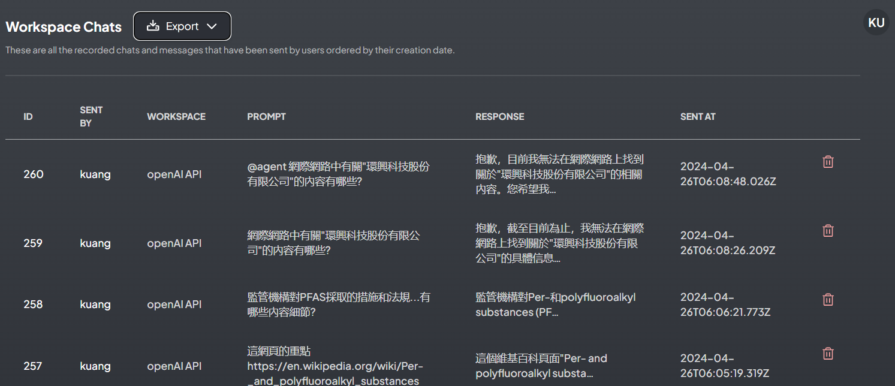

# 管理者的權責
{: .no_toc }

  

    Table of contents
  

  {: .text-delta }
- TOC
{:toc}

---

## 背景

- 此處介紹管理者在系統設定方面的權責，其中有些也是經理可以管理的範圍。
- 經理及管理者可以設定的部分，詳下表。

項目|經理|管理者|功能目的
:-|:-:|:-:|-
[系統偏好設定](#系統偏好設定)|x|x|使用者刪除、使用者對話次數上限
[邀請連結](#邀請連結)|x|x|點入連結即可新增使用者
[使用者管理](#使用者管理)|x|x|新增編輯停權及刪除
[工作區列表](#工作區列表)|x|x|新創及刪除工作區
[工作區對話](#工作區列表)|x|x|檢視輸出或刪除
[外觀](#外觀)|x|x|logo參考及支援
[API Keys]()||x|
LLM偏好||x
逐字稿模型||x
嵌入器偏好||x
向量資料庫||x
嵌入對話||x
事件紀錄||x

## 管理者的任務

- 基本上管理者除了一般使用者與經理的權責之外，還必須負責「INSTANCE SETTINGS」中所有的設定。

### 系統偏好設定

實例的整體設定和配置

- 使用者可以刪除工作區：
  - 允許非管理員使用者刪除他們所屬的工作區。 
  - 這項設定將會影響到刪除者以外工作區的其他人。
- 限制每個用戶每天的訊息數
  - 制非管理員使用者在 24 小時內只能進行多次成功查詢或聊天。
  - 啟用此功能可防止使用者增加 OpenAI 或其他付費方案的成本。

### 邀請連結

- 這項功能可以減省管理者新增使用者的工作，讓使用者自行鍵入名稱及密碼。
  - 經理只能就現有的使用者，勾選加入其工作區，並不能自行產生使用者的帳密。
  - 連結新創使用者，不能指定特定的名稱。
- 如圖中範例，sinotec2接受了邀請，還有一條連結產生了卻還沒有人回應。[範例連結](http://eng06.sinotech-eng.com:3001/accept-invite/0TJ37Y0-7FE41X0-GVMEZ5T-T6AT522)

- 點選產生邀請連結後的畫面
- 須至少點選一個工作區
- 按下`Create Invite`會產生一個連結，將其複製到email中即可發出(或其他散布途徑)。

- 點選連結後出現新創使用者的畫面
- 接受邀請後，將會開啟AnythingLLM對話窗，並自動登入新帳號。
- 工作區成員也會自動加入。

### 使用者管理

- 此處可以新增、編輯、停權或刪除使用者權限
1. 新增：帳號、密碼、權限角色
2. 編輯：更改密碼、 權限角色
3. 停權：立即登出、並不得再登入，帳號及記錄依然存在
4. 刪除：無可回復

### 工作區列表

- 這裡提供所有工作區的列表，可以在此檢視各個工作區的連結(分享)、參與人數、起始時間、也可快速刪除工作區。
- 此處新增工作區，會要求鍵入工作區名稱，與主畫面新增工作區效果一樣。

### 工作區對話

- 管理工作區的對話紀錄，包括檢視、輸出、或刪除
- 沒有排序、篩選、整併、計數等功能，需輸出成檔案進一步分析。

### 外觀

- 此處控制系統的logo、對話框的初始訊息、參考連結、及技術支援email
- 內定之系統訊息

- 鍵入訊息後要儲存才會生效

- 回到首頁後就會即時出現訊息

### API Keys