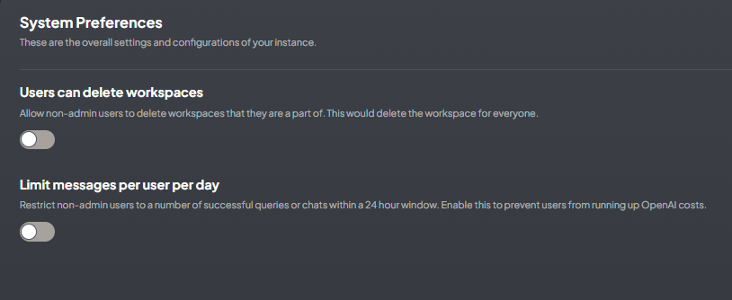

# AnythingLLM Chat
{: .no_toc }

  

    Table of contents
  

  {: .text-delta }
- TOC
{:toc}

---

## 背景

- AnythingLLM的服務介面林林總總，此處以最常用的對話介面為範圍主題進行說明。
  - 其他如[AI小幫手](./EmbChat.md)，雖然也有對話功能，但介面附加在其他網頁之內，且沒有帳密管理，服務功能也略有不足。
- AnythingLLM概念說明：可以詳見其[官網](https://useanything.com/)。
- 官網使用[說明文件](https://docs.useanything.com/)
- AnythingLLM的使用者有3種角色。角色並不能新創或刪減。
- 內設(一般)使用者
  - 只能發送與管理員或經理新增到的工作區的聊天。
  - 新增工作區內的主題(thread)，連結到檔案、網頁、GH倉庫、影音或其他資料
  - 無法修改任何設定。
- 經理
  - 可以查看、建立和刪除任何工作區以及修改工作區特定
的設定。
  - 可以建立、更新和邀請新使用者加入工作區。
- 管理者
  - 最高使用者等級權限。可以查看並執行整個系統中的所
有操作。
  - 新增使用者、帳密、權限管理
  - 修改LLM、vectorDB、嵌入或其他連線與API token等設定。

## 經理的任務

### 新增工作區

- 經理以上可以新增工作區，重新命名、刪除並進行工作區的設定。
- 經理不能更動內設的語言模型。
- 工作區名稱右側齒輪：進入工作區的設定。

### 一般設定

1. 向量資料庫的總向量數：0表示沒有連結檔案。
2. 更名
3. 工作區前置訊息(先點+號)
4. 訊息內容
5. 儲存訊息
6. 
刪除。對話會及設定全數會被刪除。

### 對話設定

- LLM提供者：可以選擇雲端或地端的LLM(2)，設定API、或指定GPT版本(3)。
- 對話模式(4)
  - 對話：會以語言模型的基本知識與RAG檔案內容來回答問題
  - 查詢：會以RAG檔案內容來回答問題，如超出範圍，則不回答。
- 對話歷史：內設為20，視語言模型的Token數而定(5)。
- 前提：是否臆測、回答的語調、潛在對象特質等等(6)。
- 溫度：只會針對工作區產生作用。一般設為0.7，如果要產生嚴謹的報告，需要降低LLM回答的溫度(7)。

### 向量資料庫

1. RAG檔案或其他輸入內容，將會以向量化模型來儲存，其資料庫在此設定。
2. 資料庫ID：內設與工作區名稱一致。
3. 最大文本片段：內設建議為4個片段
4. 文件相似度的界閥值：有不限、低、中、高等4種選項，相似度要求越高，回答越精準。
5. 重設

### 邀請(允許)工作區的使用者

- 經理級以上可以訪問所有的工作區，使用系統的LLM資源，不需要允許或邀請
- 每個工作區可以指定不同的使用群體，以區隔API資源的使用。
1. 按下齒輪進入工作區的設定
2. 成員(Members)
3. 目前成員清單：只有一般使用者需要給予訪問權，經理或管理者不需要。
4. 管理成員，點入後進入另對話框

1. 從所有使用者中尋找符合的項目
2. 使用勾選的方式
3. 選擇所有使用者、取消選擇
4. 完成設定，儲存結果

### 代理者設定

1. 可用語言模型之選擇，目前有openAI、Anthropic等2個選項。
2. 可選擇開啟的代理者：存檔到網頁上，會有洩漏的風險。
3. 開啟網頁搜尋。
4. 有google(每天限100次)及serper.dev(超過2500次會開始收費)
5. 會需要輸入ID及token。可至指定連結免費申請。

## 管理者的任務

- 基本上管理者除了一般使用者與經理的權責之外，還必須負責「INSTANCE SETTINGS」中所有的設定。

### 系統偏好設定

實例的整體設定和配置

- 使用者可以刪除工作區：
  - 允許非管理員使用者刪除他們所屬的工作區。 
  - 這項設定將會影響到刪除者以外工作區的其他人。
- 限制每個用戶每天的訊息數
  - 制非管理員使用者在 24 小時內只能進行多次成功查詢或聊天。
  - 啟用此功能可防止使用者增加 OpenAI 或其他付費方案的成本。

### 邀請連結

- 這項功能可以減省管理者新增使用者的工作，讓使用者自行鍵入名稱及密碼。
  - 經理只能就現有的使用者，勾選加入其工作區，並不能自行產生使用者的帳密。
  - 連結新創使用者，不能指定特定的名稱。
- 如圖中範例，sinotec2接受了邀請，還有一條連結產生了卻還沒有人回應。[範例連結](http://eng06.sinotech-eng.com:3001/accept-invite/0TJ37Y0-7FE41X0-GVMEZ5T-T6AT522)

- 點選產生邀請連結後的畫面
- 須至少點選一個工作區
- 按下`Create Invite`會產生一個連結，將其複製到email中即可發出(或其他散布途徑)。

- 使用者

