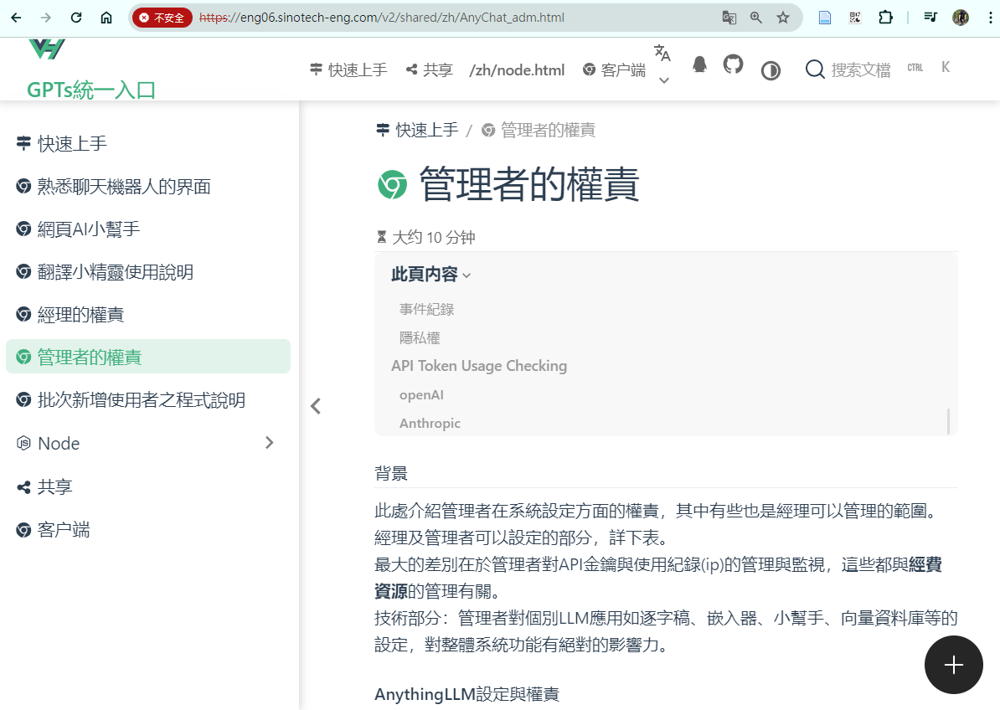
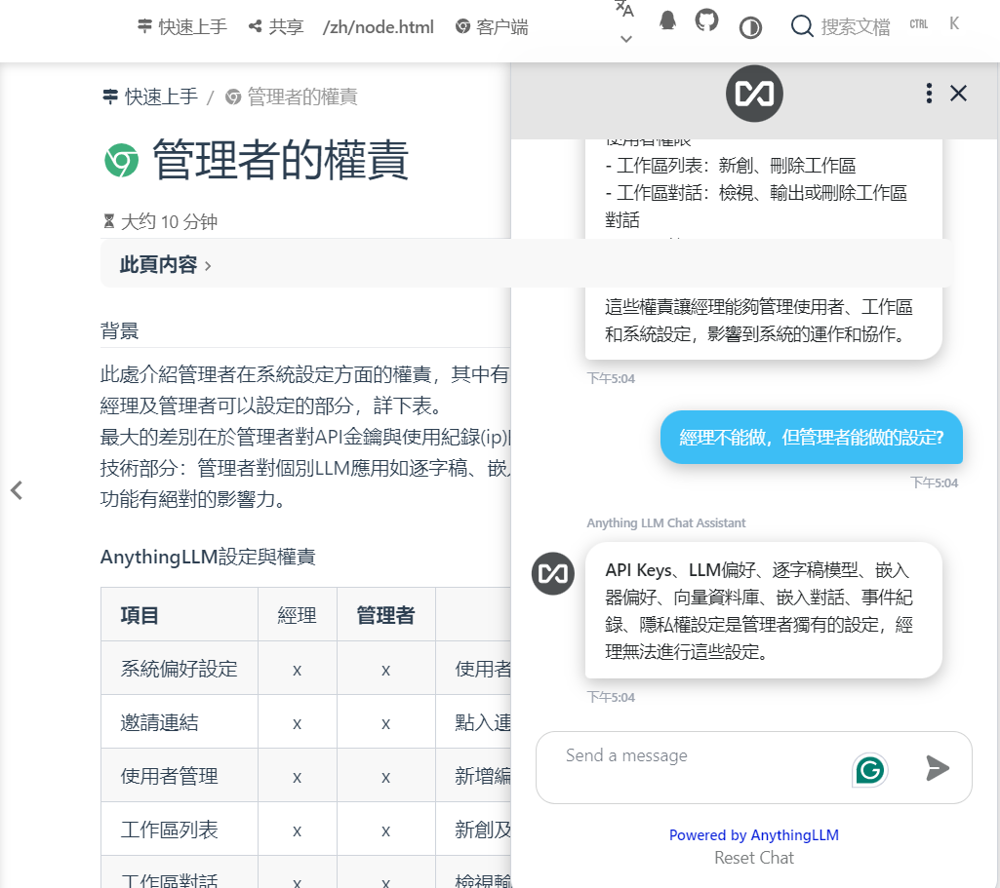

# 在https靜態網頁中嵌入AI聊天
{: .no_toc }

<details open markdown="block">
  <summary>
    Table of contents
  </summary>
  {: .text-delta }
- TOC
{:toc}
</details>
---

## 背景

### 目標

- 在https靜態網頁(如vuepress)中，鑲嵌AI小幫手。
- 與既有的GPT套件整合，不另外撰寫系統程式。

### 工作流程

- 啟動anythingLLM生產服務
- AnythingLLM[新增工作區](./AnyChat_mng.md#新增工作區)、[載入網頁內容文字檔](./AnyChat.md#檔案網頁與資料的連結)、[設定語言模型](./AnyChat_mng.md#設定工作區)、新增[Embedded Chat](./AnyChat_adm.md#嵌入對話)
- [複製程式碼](./EmbChat.md#程式碼)到靜態網頁的frontmatter。
- 重新編譯靜態網頁、發表網頁、測試效果
- 調整anythingLLM的設定，只要不更改工作區名稱、程式碼不會更動、就不需要重新編譯。

### 整合時面臨的限制

- 靜態網頁的要求（需求）
  - https靜態網頁中，不允許鑲嵌http網頁或服務。
  - http靜態網頁，沒有辦法連接IPA服務，僅能是公開網頁，不能限定讀者。
- 生產階段anythingLLM的作法
  - 官網建議以docker方式營運、開關較為單純、避免直接使用node、會更改使用者的環境(`nvm`與其他環境變數)。
  - docker啟動的anythingLLM服務，必須接到一個本地http端口，不能接到https端口。主機上端口如果設定被apache https監聽，就不能作為docker的出口，反之亦然。
  - 官網沒有[啟動node服務](./product_yml.md#node生產方案)的相關說明
- apache2網頁伺服器的限制
  - http和https對端口的綁定有很大的出入，後者必須有`Listen {port} https`指令，否則即時使用`<VirtualHost *：{port}>`指令，也不能開啟https://端口。
  - anythingLLM的公開網頁(server/public)內容，其根目錄必須是`http(s)://host.domain_name:port`，不能是某個https的目錄。用apache 目錄設定、alias、反向代理等方式，也都不能作用。
- node.js/apache2 HTTPS服務的衝突
  - 生產階段node會啟動其內定的HTTPS服務，不能與工作站apache2 https有相同的key.pem、cert.pem。
  - 使用者本地瀏覽器對SSL CERT許可的設定方式，也會影響鑲嵌的效果，因為會同時使用2組CERT。
    - 可行的隱私權設定：Chrome的標準
    - Edge可以分別登入vuepress及anythingLLM的https網頁，無法接受鑲嵌整合。但`http://devp.sinotech-eng.com/emb.html`中可以接受鑲嵌`https`的服務。
- Embedded Chat所用的LLM，必須是anythingLLM的preferencd LLM(eg. `LLM_PROVIDER='openai'`)，不能是工作區專用LLM。

## 靜態網頁的要求（需求）

http方案雖然直接、有效整合，但問題缺點還不少

1. 既有的網頁系統，如vuepress網誌、iis內部官網首頁、工程服務網頁等等，絕大多數都是https。
2. 新的系統也許可以同時維持http/https平行運作，但舊系統要複製並且獨立運作，就不容易了。
3. 很多系統是dotnet專案，還需要編譯才能發布，http的鑲嵌內容確實會造成相容性的錯誤。
4. 如果獨立服務的系統，還可以維持http方案，但面臨整合、分眾、帳密管控等等，似乎就再也沒有這個選項了。

## 生產階段anythingLLM的作法

- docker最大的困難在於必須使用主機的網路伺服器來管理端口。docker映像內部一個端口、外部主機搭配一個端口，不單是重複設定，而且docker與apache2的https還不相容，二者對端口都有強烈的佔有權，這使得docker方案變得不可行。
- 絕大多數的服務可以維持使用官網建議的docker方案，不需要整合、也不需要https。只需要留一個端口，專門服務網頁小幫手即可。
- 官網雖然沒有[啟動node服務](./product_yml.md#node生產方案)的相關說明，但提供了`Dockerfile`、`docker-compose.yml`，以及`docker-entrypoint.sh`等腳本，可以從其中找到啟動的方式。
- [執行批次腳本](./product_yml.md#執行批次腳本)
  - 安裝、編譯、產生schema（只需執行一次）、
  - 啟動服務要注意
    - 環境變數`NODE_ENV=production`
    - 從備份檔案複製`.env`檔案
    - 記得部署schema
    - 依序啟動`server/index.js`與`collector/index.js`等2個伺服器。
- 啟用node.js的HTTPS相關程式，需設定`server/.env`檔案，如[.env檔案設定](./product_yml.md#env檔案設定)
  - `SERVER_PORT='https://eng06.sinotech-eng.com:3014'` ，這個設定似乎不太經典，但系統沒有報錯，如果不設https前綴，仍然會回到http前綴、或`localhost`，有其必要性。然此設定會被系統覆蓋，記得每次從備份檔再複製一份。
  - `ENABLE_HTTPS='true'`:這個設定會讓`index.js`啟動相應的HTTPS服務，dockerfile內也沒有下載啟用apache2的痕跡，足見其HTTPS服務是有別於apache2的。
  - `HTTPS_CERT_PATH`、`HTTPS_KEY_PATH`:SSL的認證檔，必須**不同**於apache2的證書與金鑰。
- 排程設定
  - 啟動比較沒有問題，按照程序循序執行即可(不必每次安裝編譯)。
  - 關閉則要小心執行。因為`index.js`使用了絕對路徑，可以此為特徵進行篩選，將其pid予以刪除。

    ```bash
    #!/bin/bash
    for $i in $(ps -ef|grep node|grep '/nas2/kuang/MyPrograms/anythingLLM'|grep index.js|awk '{print $2}');do
      kill -9 $i
    done
    ```

## apache2與node.js https相容性問題

- apache2是靜態網頁平台依賴的伺服器，node.js是語言模型的伺服器，二者都是https，有自己的SSL金鑰與憑證、啟動的設定詳[前](#生產階段anythingllm的作法)。

### 金鑰與憑證的檔案可讀性

- apache2的執行者是`root`，金鑰與憑證可以設成`og-rwx`。
- node.js的執行者是一般人，金鑰與憑證產生後必須讓`og+r`。

### 瀏覽器的差異表現

使用者瀏覽器的選擇與SSL設定方式，將會影響是否出現小幫手。

- Chrome
  - 經多次重新整理會可以出現
- Edge
  - 似乎不接受node.js的金鑰與憑證。

## 成果畫面

- 小幫手icon + 



- 打開、對話成果



## ToDo‘s

- 版面衝突
  - 小幫手的+與vuepress的回到頁首（火箭），太靠近、大小差不多會彼此干擾。
  - `anythingllm-chat-widget.min.js`是放在vuepress的頁尾，所產生的物件無法遮蔽vuepress的`此頁內容`
  - 小幫手不受縮放影響。
- 瀏覽器選擇性SSL的問題
```bash
# 使用官方 Node.js 14 镜像作为基础镜像
FROM node:14

# 创建工作目录并将应用程序代码复制到工作目录
WORKDIR /app
COPY . .

# 安装依赖
RUN npm install

# 暴露端口
EXPOSE 3000

# 启动服务
CMD ["node", "app.js"]
```

