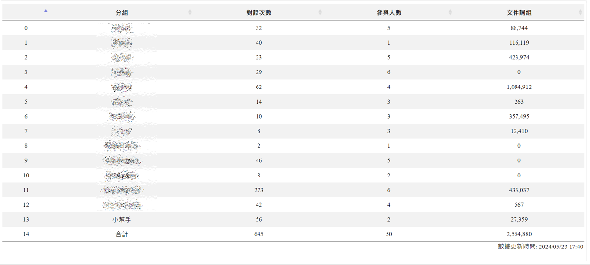

# 各組應用情況動態分析
{: .no_toc }

<details open markdown="block">
  <summary>
    Table of contents
  </summary>
  {: .text-delta }
- TOC
{:toc}
</details>
---

## 背景

- 掌握anythingLLM各組應用情形，其目的在於：
  - 了解對話數量的情形，各組系統的利用率
  - 了解參與人員數，是否都能孰悉系統操作，分析宣導與教育訓練需求對象。
  - 掌握文件詞組的總數，是否孰悉上載的程序、以及詞組的花費與分配等等。
- 應用到anythingLLM API的url's與特性

|主題|url|GET/POST|取值方式
|:-:|-|:-:|:-:|
|聊天|`'api/v1/admin/workspace-chats'`|POST|dict|
|名稱|`'api/v1/admin/workspace-chats'`|POST|dict tree|
|文件|`api/v1/documents`|GET|dict tree|

- 聊天紀錄雖然也是只能下載(`curl -XGET`指令)，但因為數量較大，系統設計每次下載20筆(一頁)，因此系統需要知道`curl`要下載哪一頁，所以反而變成需要`curl -XPOST`指令告訴系統頁數資訊，再由系統輸出該頁的內容。

## msg.py程式說明

這個程式主要用於從AnythingLLM API 端點獲取數據,並將其整理成一個 pandas DataFrame。以下是對程式碼的詳細說明:

### 模組及函式

- 引入所需的模組: json、os、sys、numpy、pandas。
- 定義 get_total_token_count(data)函數 ,用於計算 `data["localFiles"]["items"]` 中所有項目的 `token_count_estimate` 的總和。
- 設定 API 金鑰 `APIK="..."`。
- 定義命令字串cmd,其中包含用於向 API 端點發送 HTTP 請求的 `cURL` 命令。此命令使用 POST 方法向 `http://eng06.sinotech-eng.com:PORT/PATH` 端點貼上頁數，獲取該頁的對話數據紀錄,並將響應存儲在 `msg.txt` 文件中。
- 定義一個包含列標題的 DataFrame df。

### 端口迭代

迭代從 30001 到 30013 的端口號,並對每個端口號執行以下操作(兩個路徑、段落):

- 路徑一：分析**聊天信息數**、**參與人數**
  - 路徑：`'api/v1/admin/workspace-chats'`
  - 將端口號和路徑替換到 cmd 字串中。
  - 使用 `os.system()` 函數執行 cURL 命令,並從 msg.txt 文件中讀取 JSON 響應。
  - 如果響應中的 chats 列表為空,則退出循環。
  - 將每個聊天消息添加到 `chats_all` 列表中。
- 路徑二：分析上載文件的**總詞組數**
  - 再次執行 cURL 命令,這次是向 `api/v1/documents` 端點發送 GET 請求,並從 msg.txt 文件中讀取 JSON 響應。
  - 調用 `get_total_token_count(docs)` 函數計算文檔的總詞組數。
- 將三個數據添加到 df DataFrame 的新行中。

### 後處理

- 讀取 /nas2/kuang/MyPrograms/query_anything/grpsvr.json 文件,並將其加載到 slags 字典中。
- 創建一個新的 DataFrame ss,其中包含 slags 字典的鍵和值。對 ss 進行排序,並將排序後的 grp 值賦給 df['分組']。
  - 適應端口失聯狀況
  - "小幫手"並不是分組名稱，需另加。

  ```python
    sgrp={int(i)-3000:j for i,j in zip(list(ss['num']),list(ss.grp))}
    sgrp.update({14:"小幫手"})
    df['分組']=[sgrp[i] for i in list(df['分組'])]
  ```

- 打印 `df` DataFrame,並計算各列的總和。將總和添加到 df 的最後一行。
- 將 `df` DataFrame 保存為 `/nas2/VuePressDist/ICT/file.csv` 文件，串接`any_now.html`當中的ajax.js程式([程式碼](./any_now.html))。

總的來說,這個程式從多個 API 端點獲取數據,並將其整理成一個 DataFrame。它計算了三項統計數據,並將結果保存到 CSV 文件中。

[msg.py source code](./msg.py)


```python
def outp():
    with open('/nas2/kuang/MyPrograms/query_anything/grpsvr.json','r',encoding='utf8') as f:
        grps = json.load(f)
    ss=DataFrame({'grp':[i for i in grps],'num':[grps[i] for i in grps]})
    sgrp={int(i)-3000:j for i,j in zip(list(ss['num']),list(ss.grp))}
    sgrp.update({14:"小幫手"})
    ss=ss.sort_values('num')
    n=len(df)
    df['分組']=[sgrp[i] for i in list(df['分組'])]
    df.loc[n]=['合計']+list(df.sum().values)[1:]
    for c in col[1:]:
        df[c]=[cmm(i) for i in df[c]]
    print(df)
    df.to_csv('/nas2/VuePressDist/ICT/file.csv')
```

## any_now.html

這個前端的頁面，使用ajax.js指令，將前述`/nas2/VuePressDist/ICT/file.csv`文件，轉成可排序的表格畫面。

### 成果

- [網頁](https://eng06.sinotech-eng.com/ICT/any_now.html)
- 畫面



### 表格設定

- 水平置中
- 無分頁
- 無搜尋
- 無總頁數資訊

```html
<script src="https://cdn.datatables.net/1.10.24/js/jquery.dataTables.min.js"></script>
<script src="https://cdnjs.cloudflare.com/ajax/libs/jquery-csv/1.0.11/jquery.csv.min.js"></script>
<script>
$(document).ready(function() {
    $.ajax({
        url: 'file.csv',
        dataType: 'text',
        success: function(data) {
            var csvData = $.csv.toArrays(data);
            var headers = csvData[0];
            var tableData = csvData.slice(1);

            var table = $('#csvTable').DataTable({
                data: tableData,
                columns: headers.map(function(header) {
                    return { title: header, className: "dt-body-center" };
                }),
                columnDefs: [
                { "targets": 1, "render": $.fn.dataTable.render.number(',', '.', 0) }
                ],
                responsive: true,
                paging: false,
                lengthChange: false,
                searching: false,
                info: false,
            });
        }
    });
});
</script>
```

### 顏色設定

- 表頭、奇數行、偶數行分開設定

```html
<style> #csvTable tr:nth-child(even) { background-color: #f2f2f2; } </style>
<style> #csvTable tr:nth-child(odd) { background-color: #ffffff; } </style>
<style> #csvTable th { background-color: #f2f2f2; } </style>
```

### 時間標註

- 配合crontab的設定，解析度為10分鐘
- 因為每10分鐘就會有一筆，就直接從使用者連線或重新整理的時刻取得時間(`Date()`)

```html
<style> #footer { text-align: right; } </style>
<div id="footer"></div>
<script>
// Update current time when the page loads or refreshes
$(document).ready(function() {
    updateCurrentTime();
});

function updateCurrentTime() {
    var now = new Date();
    var year = now.getFullYear();
    var month = ('0' + (now.getMonth() + 1)).slice(-2); // 月份從 0 開始，因此要加 1
    var day = ('0' + now.getDate()).slice(-2);
    var hours = now.getHours();
    var minutes = now.getMinutes();
    var formattedMinutes = Math.floor(minutes / 10) * 10;
    var formattedMinutesString = (formattedMinutes === 0 ? '00' : formattedMinutes);
    var formattedTime = year + '/' + month + '/' + day + ' ' + hours + ':' + formattedMinutesString;
    $('#footer').text('數據更新時間: ' + formattedTime);
}
</script>
```

### apache配合修改

- 根目錄修正成`DocumentRoot "/nas2/VuePressDist"`，讓所有目錄下的檔案都可讀取
- 將url設定成符合權責限定的使用者才能訪問

```bash
<Directory "/nas2/VuePressDist/AnythingLLM">
    AuthType Basic
    AuthName "LDAP Protected Area"
    AuthBasicProvider ldap
    AuthLDAPURL "ldap://ldap.example.com/ou=users,dc=example,dc=com?uid"
    AuthLDAPBindDN "cn=admin,dc=example,dc=com"
    AuthLDAPBindPassword "secret"
    Require ldap-group cn=allowed_group,ou=groups,dc=example,dc=com
</Directory>
```

## 自動執行

- 每天24小時執行，每隔10分鐘搜尋一遍。
- 偵錯
  - 如果所有系統關閉(周末、夜間)，將不會寫出檔案，還是保留最後的數據。
  - 如果有任何系統關閉，還是會寫出其他系統的數據。

```bash
0/10 * * * * /nas2/kuang/MyPrograms/query_anything/msg.py  > /dev/null 2>&1
```