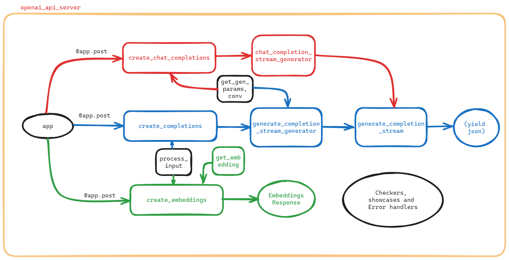

# openai_api_server程式之周邊小程式
{: .no_toc }

  

    Table of contents
  

  {: .text-delta }
- TOC
{:toc}

---

## 背景

- 整體程式串流[詳圖](2024-01-04-11-52-11.png)，說明詳見[openai_api_server Create's and Gen's](./openai_api_serverGen.md)，此處說明周邊相關的小函式，用以確認、取得、展示、及錯誤訊息處理。

(made by [excalidraw](https://sinotec2.github.io/Focus-on-Air-Quality/utilities/Graphics/excalidraw/))

### 表列IO

函式名稱|input|output
-|-|-
check_api_key (API key 的有效性檢查)|`auth`: 一個由`HTTPAuthorizationCredentials` 決定的選項`Options`，預設值是由 `get_bearer_token` 函式提供的。|
[create_error_response](#create_error_response)|`code`: 整數，代表錯誤的程式碼或類型。用來指示錯誤的種類。/`message`: 字串，包含有關錯誤的描述性訊息。用來解釋發生了什麼錯誤。| `JSONResponse` 物件，其中包含了一個符合特定格式的 JSON 格式的錯誤回應。/HTTP 狀態碼為 400（Bad Request）請求有誤|建立符合特定格式的 JSON 錯誤回應
validation_exception_handler|`request`: 代表發送請求的相關資 /`exc`: 是捕獲到的 `RequestValidationError` 例外情況的實例|
check_model(異步路由操作，主要用於檢查模型是否有效)|`request`: 包含模型資訊的請求對象|如果模型無效，返回建立的錯誤回應；否則返回 `None`，表示模型有效|
check_length(輸入長度 是否符合模型)|request,prompt,max_tokens,worker_addr,client|通過則返回 `None`、否則錯誤訊息|
check_requests|request、`max_tokens`、`n`、`temperature`、`top_p`、和 `stop`|通過則返回 `None`、否則錯誤訊息|
...|...|...

## checkings and errors

### check_api_key

這是一個用於建立錯誤回應的輔助函式，主要是為了方便建立符合特定格式的 JSON 錯誤回應。以下是這個函式的中文說明：

**輸入**

- `code`: 整數，代表錯誤的程式碼或類型。用來指示錯誤的種類。
- `message`: 字串，包含有關錯誤的描述性訊息。用來解釋發生了什麼錯誤。

**輸出**

- 返回一個 `JSONResponse` 物件，其中包含了一個符合特定格式（可能是定義的 `ErrorResponse` 類型）的 JSON 格式的錯誤回應。
- HTTP 狀態碼為 400（Bad Request），表示請求有誤。

**重要的程式邏輯**

1. 使用 `ErrorResponse` 類型建立一個包含錯誤訊息和程式碼的 JSON 物件。
2. 使用 `JSONResponse` 類型將 JSON 物件轉換為 HTTP 響應。
3. 設定 HTTP 狀態碼為 400，表示請求有誤。

簡而言之，這個函式的目的是提供一個統一的方式來建立錯誤回應，確保它們符合特定的 JSON 格式，並具有一致的 HTTP 狀態碼。

### validation_exception_handler

這是一個 FastAPI 應用程式中用來處理 `RequestValidationError` 例外情況的異常處理程序。以下是這個異常處理程序的中文說明：

1. 當應用程式捕獲到 `RequestValidationError` 例外情況時，將呼叫這個異常處理程序。
2. `validation_exception_handler` 函式接受兩個參數：`request` 和 `exc`。
   - `request`: 代表發送請求的相關資訊。
   - `exc`: 是捕獲到的 `RequestValidationError` 例外情況的實例。
3. 使用 `create_error_response` 函式建立一個符合特定格式的 JSON 錯誤回應。
   - 傳遞 `ErrorCode.VALIDATION_TYPE_ERROR` 作為錯誤程式碼，表示這是一個與請求驗證相關的錯誤。
   - `str(exc)` 作為錯誤訊息，將 `RequestValidationError` 的詳細錯誤描述轉換為字串。
4. 返回建立的 JSON 錯誤回應。

簡而言之，這個異常處理程序的目的是在請求驗證錯誤時返回一個統一格式的錯誤回應，使客戶端能夠理解並處理錯誤。

### check_length

這是一個異步的 FastAPI 路由操作，用來。以下是這個函式的中文說明：

**輸入**

1. `request`: 包含請求資訊的對象。
2. `prompt`: 字串，代表模型的輸入提示。
3. `max_tokens`: 整數，代表模型的最大令牌數。
4. `worker_addr`: 字串，代表模型工作服務器的地址。
5. `client`: `httpx.AsyncClient` 實例，用於進行異步的 HTTP 請求。

**重要的程式邏輯**

1. 使用 `client` 向模型工作服務器發送 `model_details` 請求，以獲取模型的上下文長度（`context_len`）。
2. 使用 `client` 向模型工作服務器發送 `count_token` 請求，以獲取給定提示（`prompt`）的令牌數量（`token_num`）。
3. 檢查 `token_num + max_tokens` 是否超過模型的上下文長度（`context_len`）。
   - 如果超過，則建立一個錯誤回應，指示使用者減少輸入的長度。
   - 如果未超過，則返回 `None`，表示輸入長度驗證通過。

**輸出**

- 如果輸入長度驗證通過，則返回 `None`。
- 如果輸入長度超過模型限制，則返回一個符合特定格式的 JSON 錯誤回應，提供相應的錯誤訊息。

### check_model

這是一個 FastAPI 應用程式中用來檢查模型的異步函式 `check_model`。以下是這個函式的中文說明：

1. 檢查請求中指定的模型是否符合特定條件。
2. 使用 `app_settings` 中的 `controller_address` 取得控制器的位址。
3. 使用 `httpx` 函式庫建立一個異步 HTTP 客戶端 `client`。
4. 使用 `client` 發送 `POST` 請求至控制器的 `/list_models` 端點，以取得可用模型清單。
5. 從回應中提取模型清單 `models`。
6. 檢查請求中指定的模型是否在可用模型清單中。
   - 如果不在清單中，則呼叫 `create_error_response` [函式](#create_error_response)建立一個符合特定格式的錯誤回應。
      - 使用 `ErrorCode.INVALID_MODEL` 作為錯誤程式碼，表示這是一個無效的模型錯誤。
      - 提供錯誤訊息，說明只有清單中列舉的模型是允許的，並指出請求中的模型不符合規定。
   - 如果模型符合條件，則返回 `None`。
7. 返回建立的錯誤回應或 `None`。

總的來說，這個異步函式的目的是檢查請求中的模型是否在可用模型清單中，如果不在清單中，則返回一個錯誤回應。

### check_requests

這是一個用於檢查請求參數的函式，主要用於確保參數的合法性。以下是這個函式的中文說明：

1. `check_requests` 函式接受一個 `request` 參數，代表應用程式的請求。
2. 函式檢查 `request` 中的各個參數，包括 `max_tokens`、`n`、`temperature`、`top_p`、和 `stop`。
3. 如果任何一個參數不符合特定的條件，函式將使用 `create_error_response` [函式](#create_error_response)建立一個錯誤回應，並返回該回應。
   - 例如，如果 `max_tokens` 小於等於 0，則會建立一個錯誤回應，表示該參數超出了合理範圍。
4. 如果所有參數都是合法的，函式將返回 `None`，表示沒有錯誤。

簡而言之，這個函式確保請求中的參數都在合法的範圍內，如果有不合法的情況，則返回一個符合特定格式的錯誤回應，以便客戶端能夠理解和處理錯誤。

### show_available_models

這是一個 FastAPI 應用程式中的一個路由端點 (endpoint)，用來顯示可用的模型。以下是這個端點的中文說明：

**輸入：**

- HTTP GET 請求 `/v1/models`。
- 在請求中檢查 API 金鑰的有效性，使用 `check_api_key` [函式](#check_api_key)。

**輸出：**

- 如果 API 金鑰有效，則會執行以下邏輯：
  1. 從應用程式設定 (`app_settings`) 中獲取控制器的地址 (`controller_address`)。
  2. 使用非同步的 `httpx.AsyncClient()` 進行異步 HTTP 請求。
  3. 向控制器發送 `POST` 請求以刷新所有工作程序 (`/refresh_all_workers`)。
  4. 向控制器發送 `POST` 請求以列出所有模型 (`/list_models`)。
  5. 獲取回應中的模型列表。
  6. 按模型名稱對模型進行排序。
  7. 創建模型卡片 (`ModelCard`) 的列表，每張卡片包含模型的 ID、根目錄和模型權限（此處還未實現真正的模型權限細節）。
  8. 使用這些模型卡片創建 `ModelList` 實例，其中包含模型卡片的數據。
- 返回 `ModelList` 實例作為 JSON 回應。

**重要的程式邏輯：**

- 使用 `httpx` 库進行非同步的 HTTP 請求，與控制器進行通信。
- 使用 `ModelCard` 和 `ModelList` 類型來組織和呈現模型相關的資訊。

總體而言，這個端點的目的是提供一個以 JSON 格式返回可用模型列表的 API，同時使用 API 金鑰進行身份驗證。

## getings

### get_gen_params

這是一個使用 FastAPI 和 Python 的異步函式，名為 `get_gen_params`。以下是這個函式的程式碼的中文說明：

**輸入**
- `model_name`（模型名稱）：字串，表示要使用的模型的名稱。
- `worker_addr`（工作地址）：字串，表示工作者的地址。
- `messages`（訊息）：字串或包含字典的列表，表示對話中的訊息。字典包含 "role" 和 "content"，分別表示角色和內容。
- `temperature`（溫度）：浮點數，表示生成文本的多樣性。
- `top_p`（Top-p 機制）：浮點數，控制生成文本的多樣性。
- `max_tokens`（最大標記數）：整數，表示生成文本的最大標記數。
- `echo`（回應）：可選布林，表示是否回應生成的文本。
- `stream`（串流）：可選布林，表示是否以串流模式生成文本。
- `stop`（停止）：可選字符串或包含字符串的列表，表示生成文本的停止條件。

**輸出**
- 字典，包含用於生成文本的各種參數，例如模型名稱、提示、溫度、Top-p 機制等。

**重要的程式邏輯**
1. 使用 `await get_conv(model_name, worker_addr)` 獲取對話相關的資訊(see [get_conv](#get_conv))。
2. 使用獲取的對話資訊初始化 `Conversation` 物件。
3. 如果 `messages` 是字串，則將其設為提示（prompt）；否則，解析訊息並設定到 `Conversation` 物件中。
4. 如果 `max_tokens` 為空，則設定為 512。
5. 創建 `gen_params` 字典，包含模型名稱、提示、溫度、Top-p 機制、最大標記數、回應、串流等參數。
6. 如果沒有停止條件 (`stop`)，則使用對話的停止條件更新 `gen_params`；否則，使用提供的停止條件。
7. 返回 `gen_params` 字典。

總的來說，這個函式的目的是構建生成文本的參數字典，使其包含必要的模型和對話相關的資訊，以供後續使用。

### get_worker_address

這段程式碼是使用 Python 的 async/await 和 httpx 庫編寫的一個函式。這個函式的名稱是 get_worker_address，它是一個協助函式，用來獲取控制器端指定的工作器的地址。

**輸入參數：**

- model_name：要查詢的工作器模型名稱。
- client：用來發送 HTTP 請求的 httpx 客戶端物件。

**輸出參數：**

- worker_address：獲取的工作器地址。

**主要邏輯：**

- 建立一個名為 controller_address 的變數，其值為應用程式設定中的控制器地址。
- 使用 client 創建一個 POST 請求，發送到控制器地址 + "/get_worker_address"。
- 在請求的 JSON 物件中，傳遞要查詢的工作器模型名稱。
- 等待請求的回應，並從回應中獲取獲取的工作器地址。
- 如果獲取的工作器地址為空字串，則表示沒有可用的工作器，拋出一個 ValueError 例外。
- 如果成功獲取到工作器地址，則將工作器地址存儲到變數 worker_addr 中，並在程式碼 logger 中輸出。

### get_conv

這是一個使用 FastAPI 框架中的 `httpx` 非同步 HTTP 客戶端的異步函式，用於獲取特定模型和工作地址的**對話（conversation）模板**。called from：
- get_gen_params, from
  - create_chat_completion

**輸入**

- `model_name` (str): 指定的模型名稱。
- `worker_addr` (str): 工作地址，表示模型所在的工作單位。

**程式輸出**

- 對話（conversation）模板。

**重要的程式邏輯**

1. 檢查 `conv_template_map` 中是否已經存在指定模型和工作地址的對話模板。如果存在，則直接返回。
2. 如果 `conv_template_map` 中不存在，則使用 `httpx` 客戶端發送非同步 POST 請求到指定的工作地址 (`worker_addr + "/worker_get_conv_template"`)。
3. 請求標頭包括預定義的 `headers`，並使用 JSON 格式發送模型名稱 (`{"model": model_name}`)。
4. 設定請求的逾時時間為預定義的 `WORKER_API_TIMEOUT`。
5. 從響應中提取對話模板，並將其存儲在 `conv_template_map` 中，以便未來直接使用。
6. 返回獲取的對話模板。

簡而言之，這個函式的目的是非同步地獲取指定模型和工作地址的對話模板，以提高效能並避免重複請求。

### get_embedding

這是一個 FastAPI 應用程式中的非同步函式，用於獲取嵌入向量（embedding）、call from [create_embeddings](./openai_api_serverGen.md#create_embeddings) 。以下是這個函式的中文說明：

**輸入**

- `payload`: 一個字典，包含了從客戶端發送的有關模型和相關資訊的資料。其中應該包含 `model` 鍵，指定要使用的模型。

**輸出**

- 非同步函式的輸出型別是 `embedding`，表示模型生成的嵌入向量。

**重要的程式邏輯**

1. 從 `app_settings` 中獲取控制器地址和模型名稱。
2. 使用 `httpx.AsyncClient()` 創建一個異步 HTTP 客戶端。
3. 呼叫 `get_worker_address` 函式以獲取特定模型的工作器地址。
4. 使用異步 `client.post` 方法向工作器發送 POST 請求：
   - URL: `worker_addr + "/worker_get_embeddings"`
   - Headers: 事先定義的 `headers`，可能在代碼的其他地方定義。
   - JSON 資料: 從客戶端接收的 `payload`。
   - 設定了一個 `timeout`，確保在規定的時間內獲取嵌入向量。
5. 從工作器的回應中提取嵌入向量，並將其解析為 JSON 格式。
6. 返回獲取的嵌入向量。

簡而言之，這個函式的目的是通過異步方式向工作器發送請求，獲取特定模型的嵌入向量，並將其返回給呼叫者。
