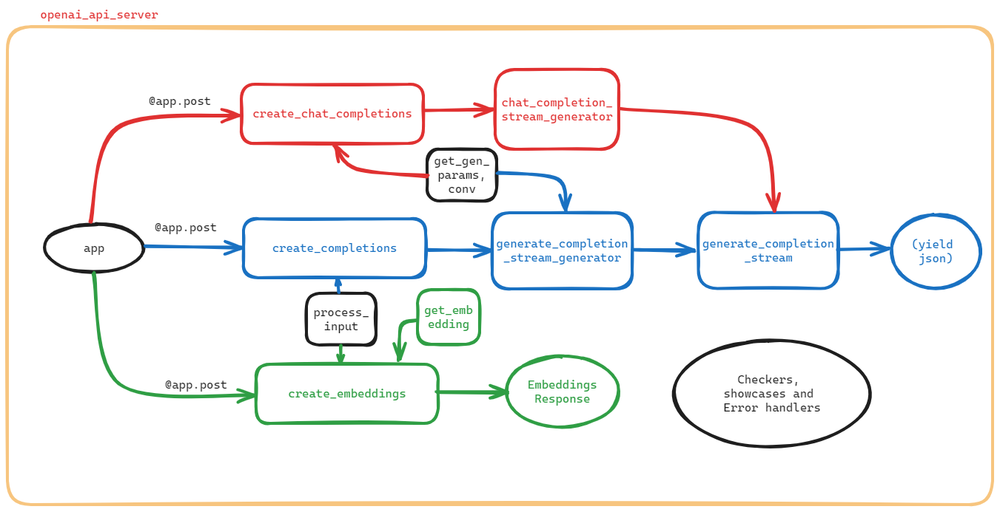

# openai_api_server中create's and generate's
{: .no_toc }

<details open markdown="block">
  <summary>
    Table of contents
  </summary>
  {: .text-delta }
- TOC
{:toc}
</details>
---

## 背景

- 此處將`create_*`(新創) `generate_*`(生成)等函式，也是主要的程式說明列於此處。
- openAI公開其API伺服器程式，在FastChat系統中，作為批次、或遠端呼叫LLM的介面。整體程式邏輯及軌道如圖。



- 基本上這個API提供了3種類的LLM服務型態，分別為連續對話(chat completion、屬遠端服務)、以及提示補全(completion)與內嵌(embeddings)等2項批次(或遠端)作業，3項服務之特性與比較詳見[LLM service types](./openai_api_serverGen.md#llm-service-types)。
- 這3項服務以內嵌較為單純，而連續對話與提示補全較為複雜，至少都有create與stream_generator等2個函式，還共用了一個函式(`generate_complete_stream`)來產生最終結果(串流到網頁上的json檔案)。，此處集中討論`create_*`(新創) `generate_*`(生成)等函式，其他周邊函式請見[另處詳細說明](./openai_api_server.md)

### 程式之執行

- 句型

```bash
python3 -m fastchat.serve.openai_api_server --host localhost --port 8000
```

- help(未指定allowed則為通式)

```python
usage: openai_api_server.py [-h] [--host HOST] [--port PORT] [--controller-address CONTROLLER_ADDRESS] [--allow-credentials] [--allowed-origins ALLOWED_ORIGINS]
                            [--allowed-methods ALLOWED_METHODS] [--allowed-headers ALLOWED_HEADERS] [--api-keys API_KEYS]
```

- 實例(kuang@DEVP ~/MyPrograms/FastChat/up_fastchat.cs)

```bash
$env/bin/python3 -m fastchat.serve.openai_api_server --host $ip --port 55083 --controller-address $addc 
```

- 用curl從node03呼叫

```bash
curl http://200.200.32.195:55083/v1/chat/completions \
  -H "Content-Type: application/json" \
  -H "Authorization: Bearer $OPENAI_API_KEY" \
  -d '{
     "model": "vicuna-7b-v1.5-16k",
     "messages": [{"role": "user", "content": "Say this is a test!"}],
     "temperature": 0.7
   }'
```

- 結果：

```bash
{
"id":"chatcmpl-3ZG4uSbK6iLmjH9ECAFcYa",
"object":"chat.completion",
"created":1704419148,
"model":"vicuna-7b-v1.5-16k",
"choices":[{
   "index":0,"message":{
      "role":"assistant",
      "content":"Sure! How can I assist you with the test?"
      },
   "finish_reason":"stop"
   }],
"usage":{
   "prompt_tokens":45,
   "total_tokens":56,
   "completion_tokens":11
   }
}
```

### definitions

```python
kuang@DEVP ~/MyPrograms/FastChat

$ py=./fastchat/serve/openai_api_server.py

$ grep 'class ' $py
class AppSettings(BaseSettings):

$ grep 'def ' $py
async def check_api_key(
def create_error_response(code: int, message: str) -> JSONResponse:
async def validation_exception_handler(request, exc):
async def check_model(request) -> Optional[JSONResponse]:
async def check_length(
def check_requests(request) -> Optional[JSONResponse]:
def process_input(model_name, inp):
async def get_gen_params(
async def get_worker_address(model_name: str, client: httpx.AsyncClient) -> str:
async def get_conv(model_name: str, worker_addr: str):
async def show_available_models():
async def create_chat_completion(request: ChatCompletionRequest):
async def chat_completion_stream_generator(
async def create_completion(request: CompletionRequest):
async def generate_completion_stream_generator(
async def generate_completion_stream(payload: Dict[str, Any], worker_addr: str):
async def generate_completion(payload: Dict[str, Any], worker_addr: str):
async def create_embeddings(request: EmbeddingsRequest, model_name: str = None):
async def get_embedding(payload: Dict[str, Any]):
async def count_tokens(request: APITokenCheckRequest):
async def create_chat_completion(request: APIChatCompletionRequest):
def create_openai_api_server():
```

### 表列IO

函式名稱|input|output
-|-|-
[主程式](#openai_api_server)|APP|開啟`/token_check` 的端點，用於檢查 API 金鑰的有效性。提供了 3項服務之相應 API 端點，分別對應到不同目錄
[openai_api_server](#openai_api_server)|主機、埠、是否允許(密碼、來源字串、http方法及表頭)、`api-key`| `args`
[create_chat_completion](#create_chat_completion)|`ChatCompletionRequest`|`ChatCompletionResponse`
[chat_completion_stream_generator](#chat_completion_stream_generator)|模型名稱、參數、SSE數量、工作器位址|[SSE](#sse)
[create_completion](#create_completion)|`CompletionRequest`|`CompletionResponse`
[generate_completion_stream_generator](#generate_completion_stream_generator)|`CompletionRequest`|[SSE](#sse)
[generate_completion_stream](#generate_completion_stream)|`payload`、`worker_addr`|將區塊解碼成為 JSON，然後使用 `yield` 發送這些數據
[generate_completion](#generate_completion)|`payload`、`worker_addr`|工作器生成完成後的回應(JSON)
[create_embeddings](#create_embeddings)|接受文本請求|生成文本的嵌入向量

## openai_api_server

這段程式碼是一個使用 FastAPI 框架建立的伺服器，提供了 OpenAI 相容的 RESTful API。以下是程式的主要特點和結構：

### 主要特點

1. 支援 [Chat Completions](#create_chat_completion)、[Completions](#create_completion) 和 [Embeddings](#create_embeddings) 等3項服務的 API。這3項服務的特性與比較詳述如[下](#llm-service-types)。
2. 使用 FastAPI 框架，提供了簡單易用的 API 定義和路由管理。
3. 使用 `httpx` 庫進行非同步的 HTTP 請求(see [httpx](#httpx))，用於與[模型控制器](https://sinotec2.github.io/AIEE/NLP/FastChat/FastChat_setup/#控制埠的啟動)進行通信。

### 結構和模組

1. **Constants 模組：**
   - 包含一些常數，如 `WORKER_API_TIMEOUT` 和 `WORKER_API_EMBEDDING_BATCH_SIZE`。(程式見[../constants.py](../constants.py))

2. **Conversation 模組：**
   - 定義了 `Conversation` 類，用於處理對話相關的邏輯，例如處理對話的開始和結束，以及消息的格式。(見[../conversation.py](../conversation.py))

3. **Protocol 模組：**
   - 定義了與 OpenAI API 通信的協定，包括 `ChatCompletionRequest`、`CompletionRequest` 和 `EmbeddingsRequest` 等。
   - 包含了相應的響應類型，例如 `ChatCompletionResponse`、`CompletionResponse` 和 `EmbeddingsResponse`。(見[../protocol/openai_api_protocol.py](../protocol/openai_api_protocol.py))

4. **API Protocol 模組：**
   - 定義了與 API 通信的協定，例如 `APIChatCompletionRequest` 和 `APITokenCheckRequest`。
   - 包含了相應的響應類型，例如 `APITokenCheckResponse` 和 `APITokenCheckResponseItem`。([../protocol/api_protocol.py](../protocol/api_protocol.py))

5. **AppSettings 模組：**
   - 使用 [Pydantic](#pydantic) 定義了應用程式的設定，包括模型控制器的地址和 API 金鑰。

6. **主應用程式：**
   - 創建了一個 FastAPI 應用程式實例 `app`。
   - 使用 `CORS` 中間件處理跨域請求。
   - 包含一個異常處理程序，處理 `RequestValidationError` 例外情況。

### 主要邏輯：

1. 該應用程式定義了一個 `/token_check` 的端點，用於檢查 API 金鑰的有效性。
2. 提供了 Chat Completions、Completions 和 Embeddings 的相應 API 端點，分別對應 `/chat/completions`、`/completions` 和 `/embeddings`。

### 備註：

- 這只是程式碼的開頭部分，未包含所有功能實現。實際上，它應該有其他端點、業務邏輯實現，以及與模型控制器的通信等。

## create's and generate's

這裡介紹有關創建、產生功能的函式。

### create_openai_api_server

這是一個創建 FastAPI 應用程式的函式 `create_openai_api_server`，用來設定 **API 伺服器**的參數。以下是這個函式的中文說明：

#### 輸入：

- `--host`：指定主機名稱的命令列參數（預設為 "localhost"）。
- `--port`：指定連接埠號碼的命令列參數（預設為 8000）。
- `--controller-address`：指定控制器位址的命令列參數（預設為 "http://localhost:21001"）。
- `--allow-credentials`：一個命令列參數，如果存在，則表示允許憑據。
- `--allowed-origins`：指定允許的來源列表的 JSON 字串（預設為 ["*"]）。
- `--allowed-methods`：指定允許的 HTTP 方法列表的 JSON 字串（預設為 ["*"]）。
- `--allowed-headers`：指定允許的 HTTP 標頭列表的 JSON 字串（預設為 ["*"]）。
- `--api-keys`：指定 API 金鑰列表的命令列參數，以逗號分隔。

#### 輸出：

- 返回包含上述參數的 argparse 命名空間對象 `args`。

#### 重要的程式邏輯：

1. 透過 `argparse` 模組創建命令列解析器。
2. 解析命令列參數，包括主機名稱、連接埠號碼、控制器位址、是否允許憑據、允許的來源、允許的方法、允許的標頭、以及可選的 API 金鑰列表。
3. 將解析的參數應用到 FastAPI 應用程式中：
   - 添加 CORS 中介軟體，根據命令列參數設定允許的來源、憑據、方法和標頭。
   - 將控制器位址和 API 金鑰列表設定為應用程式設定。
4. 記錄參數設定。
5. 返回解析後的命令列參數對象 `args`。

簡而言之，這個函式負責解析命令列參數，配置 FastAPI 應用程式，並返回包含參數設定的對象。

### create_chat_completion

[chat_completion](#chat_completion)是語言模型的服務功能之一。這個函式基本上是一個 FastAPI 應用程式的路由定義，該路由**處理 POST 請求**，用於創建聊天補全（chat completion）。以下是這個路由處理函式的中文說明：

#### 輸入：

- **`request: ChatCompletionRequest`**: 一個由 [Pydantic](#pydantic) 模型 `ChatCompletionRequest` 定義的物件，包含了用於聊天補全的相關資訊。

#### 輸出：

- 這個路由處理函式會回傳一個 `ChatCompletionResponse` 物件，包含了生成的聊天補全的選擇（choices）和相關的使用資訊（usage）。

#### 重要的程式邏輯：

1. 使用 `check_api_key` [函式](./openai_api_server.md#check_api_key)檢查 API 金鑰，確保請求具有有效的授權。
2. 調用 `check_model` [函式](./openai_api_server.md#check_model)，檢查模型相關的錯誤，如果有錯誤則回傳錯誤回應。
3. 調用 `check_requests` [函式](./openai_api_server.md#check_requests)，檢查請求的其他錯誤，如果有錯誤則回傳錯誤回應。
4. 使用 `httpx.AsyncClient` 創建一個異步的 HTTP 客戶端，這將用於與後端工作程序通信(see [httpx](#httpx))。
5. 調用 `get_worker_address` [函式](./openai_api_server.md#get_worker_address)，獲取後端工作程序的地址。
6. 調用 `get_gen_params` [函式](./openai_api_server.md#get_gen_params)，獲取生成模型所需的參數。
7. 調用 `check_length` [函式](./openai_api_server.md#check_length)，檢查生成的內容的長度是否符合要求。
8. 如果設定為串流模式（`request.stream=True`），則啟動一個聊天補全的異步生成器，並返回 `StreamingResponse`。
9. 如果不是串流模式，則同步生成指定數量的聊天補全。
10. 將生成的聊天補全結果轉換為 `ChatCompletionResponseChoice` 物件，存入 `choices` 列表中。
11. 如果生成的過程中有錯誤，將回傳對應的錯誤回應。
12. 統計使用資訊，填充 `UsageInfo` 物件。
13. 最終組合生成的 `ChatCompletionResponse` 物件，包含生成的選擇和使用資訊，回傳給客戶端。

### chat_completion_stream_generator

這段程式碼是一個用於生成 **Server-Sent Events**（[SSE](#sse)）的異步生成器。以下是程式碼的中文說明：

#### 輸入

- `chat_completion_stream_generator` 函式是一個異步生成器，用於生成 SSE，提供即時的對話完成結果。
- 函式接受以下參數：
  - `model_name`: 模型的名稱。
  - `gen_params`: 生成參數，是一個字典。
  - `n`: 生成 SSE 的數量。
  - `worker_addr`: 工作器的位址。
- 生成的 SSE 遵循 [Event stream format](https://developer.mozilla.org/en-US/docs/Web/API/Server-sent_events/Using_server-sent_events#event_stream_format)。

#### 主要邏輯：

1. 為 SSE 生成一個唯一的 ID。
2. 進行 `n` 次生成 SSE 的迴圈，每次生成包含 `ChatCompletionStreamResponse` 的 SSE。
3. 在生成的 SSE 中，使用 `ChatCompletionResponseStreamChoice` 來包裝每次對話完成的選擇。(詳見[openai_api_protocol](../protocol/api_protocol.py))
4. 在對話完成的選擇中，使用 `DeltaMessage` 來包裝對話的增量部分。
5. 在每次生成 SSE 時，使用 `yield` 發送 SSE 到客戶端。
6. 最後，生成一個 [DONE] 的 SSE 表示 SSE 的生成完成。

簡而言之，這段程式碼用於以 SSE 的形式向客戶端提供即時的對話完成結果，並在生成結束後發送一個 [DONE] 的 SSE。

### create_completion

這是一個 FastAPI 應用程式的路由定義，該路由**接受 POST 請求**，路徑為 "/v1/completions"。以下是這個路由的中文說明：

#### 輸入

- `request: CompletionRequest`：POST 請求的主體，包含用於生成完成的相關資訊，如模型、提示、溫度等。

#### 依賴性

- `check_api_key`：一個[依賴性函式](./openai_api_server.md#check_api_key)，用於檢查 API 金鑰。

#### 重要的程式邏輯

1. **檢查 API 金鑰：**
   - 在路由函式開始執行前，會先呼叫 `check_api_key` [函式](./openai_api_server.md#check_api_key)檢查 API 金鑰的有效性。

2. **請求模型檢查：**
   - 呼叫 `check_model` [函式](./openai_api_server.md#check_model)檢查請求中的模型相關資訊。

3. **請求檢查：**
   - 呼叫 `check_requests` [函式](./openai_api_server.md#check_requests)檢查請求的其他相關資訊。

4. **處理輸入：**
   - 使用 `process_input` 函式處理輸入，其中涉及模型和提示的處理。

5. **獲取工作端點地址：**
   - 使用 `get_worker_address` [函式](./openai_api_server.md#get_worker_address)獲取工作端點的地址。

6. **檢查文本長度：**
   - 逐一檢查輸入提示中每個文本的長度，使用 `check_length` [函式](./openai_api_server.md#check_length)。

7. **生成完成：**

   - 使用 `generate_completion_stream_generator` [函式](#generate_completion_stream_generator)以串流方式完成回應（如果請求指定了串流方式）。

8. **回傳完成選擇結果：**
   
   - 如果請求指定不使用串流方式，則進行多次完成生成，使用 `generate_completion` [函式](#generate_completion)。
   - 組織生成結果，創建 `CompletionResponse` 物件，包含模型名稱、選擇、使用情況等。
   - 如果有錯誤，則回傳相應的錯誤回應。

簡而言之，這個路由處理了接收到的生成完成的請求，包括模型檢查、請求檢查、輸入處理、生成完成等步驟，並根據請求的設置回傳結果。

### generate_completion_stream_generator

這段程式碼是一個用於生成自動完成結果的 FastAPI 路由操作(called from [create_completion](#create_completion))。以下是這段程式碼的中文說明：

#### 輸入：

1. `request: CompletionRequest`：包含自動完成所需的請求參數，例如模型名稱、提示文本等。
2. `n: int`：表示生成多少個自動完成的選擇。
3. `worker_addr: str`：工作者的地址，用於獲取生成句子的相關資訊。

#### 輸出：

- 使用 `yield` 生成 **Server-Sent Events**（[SSE]）形式的數據流，向客戶端實時推送生成的自動完成選擇。
- 最後發送一個 `[DONE]` 的事件，表示數據流結束。

#### 重要的程式邏輯：
1. 使用 `shortuuid.random()` 生成一個唯一的 `id` 來標識這個自動完成操作。
2. 透過迴圈處理提示文本列表中的每個文本。
3. 內部迴圈 `for i in range(n):` 用於生成指定數量的自動完成選擇。
4. 調用 `get_gen_params` [函式](./openai_api_server.md#get_gen_params)獲取生成句子所需的參數。
5. 使用 `generate_completion_stream` [函式](#generate_completion_stream)生成自動完成的數據流，這是一個異步迭代器。
6. 解析生成的數據流，將每個選擇轉換為 SSE 格式的數據，通過 `yield` 發送到客戶端。
7. 如果生成的過程中出現錯誤，向客戶端發送錯誤信息，並以 `[DONE]` 結束數據流。
8. 在迴圈結束後，處理所有結束事件，發送 `[DONE]` 事件，標識整個自動完成操作結束。

總體來說，這段程式碼實現了一個以 SSE 形式實時推送自動完成結果的功能，能夠提供即時的用戶體驗。

### generate_completion_stream

這是一個使用 `httpx` 庫異步生成器 (`async generator`) 的函數(see [httpx](#httpx))，用於在應用程式中產生來自工作程式的異步資料流(called from [chat_completion_stream_generator](#chat_completion_stream_generator))。 以下是這個函數的中文說明：

#### 輸入：
1. `payload`: 一個字典，包含要傳遞給工作程序的資料。
2. `worker_addr`|: 工作程序的位址，表示資料流將從哪個工作程序取得。

#### 輸出：
- 這是一個異步產生器，它透過 `yield` 語句產生來自工作程式的資料。
- 這個生成器將被用於異步迭代，以在客戶端和伺服器之間實現異步的資料流傳輸。

#### 重要的程式邏輯：
1. 使用 `httpx.AsyncClient()` 建立一個異步的 HTTP 客戶端。(see [httpx](#httpx))
2. 定義 `delimiter`，它是用來拆分工作程序傳回的原始資料流的分隔符號。
3. 使用 `client.stream` 發送異步 POST 請求到指定的 `worker_addr + "/worker_generate_stream"` 位址，並等待異步回應。
4. 使用 `aiter_raw` 開始異步迭代響應的原始資料流。
5. 在異步迭代過程中，使用 `delimiter` 將原始資料流拆分為區塊。
6. 將每個區塊解碼為 JSON 格式的數據，然後使用 `yield` 發送這些數據。
7. 重複這個過程，直到資料流結束。

總的來說，這個函數的目的是以異步的方式從工作程序獲取生成的數據流，並通過異步生成器將這些數據流傳送到應用程序的其他部分。

### generate_completion

這段程式碼定義了一個名為 `generate_completion` 的異步函式，該函式用於向**工作器**發送生成完成請求。called from [create_chat_completion](#create_chat_completion) and [create_completion](#create_completion)。

以下是該程式碼的中文說明：

#### 輸入：
- `payload: Dict[str, Any]`：一個包含請求內容的字典，其中可能包括生成完成所需的相關資訊。
- `worker_addr: str`：表示**工作器**的地址，用於構建生成完成請求的URL。

#### 輸出：
- `completion`：包含**工作器**生成完成後的回應的 JSON 物件。

#### 重要的程式邏輯：
1. 使用 `httpx.AsyncClient()` 建立一個異步的 HTTP **客戶端**，這是進行非同步請求的工具。(see [httpx](#httpx))
2. 使用 `client.post` 方法發送一個 POST 請求到指定的 `worker_addr + "/worker_generate"` URL。
   - `headers`: 可能是在其他地方定義的請求標頭。
   - `json`: 將 `payload` 字典轉換為 JSON 並包含在請求中。
   - `timeout`: 設定請求的超時時間，使用了 `WORKER_API_TIMEOUT` 變數。
3. 等待請求完成，並將回應轉換為 JSON 格式的物件。
4. 返回包含**工作器**生成完成後回應的 JSON 物件。

這個函式的主要目的是與**工作器**進行非同步通信，向其發送生成完成請求並獲取回應。

### create_embeddings

這是一個 FastAPI 應用程式中的兩個 API 端點，用來創建文本的嵌入向量。以下是程式碼的中文說明：

1. 有兩個 API 端點，分別是 `/v1/embeddings` 和 `/v1/engines/{model_name}/embeddings`。
   - `/v1/embeddings` 的模型名稱（model_name）參數由請求的模型字段（`request.model`）提供。
   - `/v1/engines/{model_name}/embeddings` 的模型名稱（model_name）由路徑參數提供。
2. 這兩個端點都依賴於 `check_api_key` 這個前置[處理函式](./openai_api_server.md#check_api_key)，用於檢查 API 金鑰。
3. 使用 `check_model` [函式](./openai_api_server.md#check_model)檢查請求中的模型是否有效，如果模型無效，則返回相應的錯誤回應。
4. 使用 `process_input` 函式處理請求中的輸入文本。
5. 切分輸入文本為多個批次，每個批次的大小由 `WORKER_API_EMBEDDING_BATCH_SIZE` 決定。
6. 對每個批次呼叫 `get_embedding` [函式](./openai_api_server.md#get_embedding)，獲取文本的嵌入向量。
7. 檢查返回的嵌入向量是否包含錯誤，如果有錯誤，則返回相應的錯誤回應。
8. 將嵌入向量和相應的索引組成字典列表（`data`）。
9. 統計總的標記數量（`token_num`）。
10. 返回 `EmbeddingsResponse` 物件，其中包含處理後的嵌入向量數據、模型名稱和使用信息。

總的來說，這兩個 API 端點的目的是接受文本請求，生成文本的嵌入向量，並返回相應的結果。

### create_error_response

這是一個用於建立錯誤回應的輔助函式，主要是為了方便建立符合特定格式的 JSON 錯誤回應。以下是這個函式的中文說明：

#### 輸入：

- `code`: 整數，代表錯誤的程式碼或類型。用來指示錯誤的種類。
- `message`: 字串，包含有關錯誤的描述性訊息。用來解釋發生了什麼錯誤。

#### 輸出：

- 返回一個 `JSONResponse` 物件，其中包含了一個符合特定格式（可能是定義的 `ErrorResponse` 類型）的 JSON 格式的錯誤回應。
- HTTP 狀態碼為 400（Bad Request），表示請求有誤。

#### 重要的程式邏輯：

1. 使用 `ErrorResponse` 類型建立一個包含錯誤訊息和程式碼的 JSON 物件。
2. 使用 `JSONResponse` 類型將 JSON 物件轉換為 HTTP 響應。
3. 設定 HTTP 狀態碼為 400，表示請求有誤。

簡而言之，這個函式的目的是提供一個統一的方式來建立錯誤回應，確保它們符合特定的 JSON 格式，並具有一致的 HTTP 狀態碼。

## Terminology

### pydantic

Pydantic 是一個Python庫，具有多個引人入勝的使用理由：

1. **基於型別提示：** 使用 Pydantic，模式驗證和序列化由型別提示控制；學習成本低，撰寫的程式碼更少，且與IDE和靜態分析工具整合無間。

2. **速度：** Pydantic的核心驗證邏輯是用[Rust](#rust)編寫的，因此它是Python中最快的數據驗證庫之一，確保高效且高性能的數據驗證。

3. **JSON Schema 支持：** Pydantic模型可以生成JSON Schema，輕鬆與其他工具集成，這些工具依賴於這種標準。

4. **嚴格模式和寬鬆模式：** Pydantic提供靈活性的嚴格模式。它可以在`strict=True`模式下運行（其中數據不轉換），或在`strict=False`模式下運行，其中Pydantic嘗試在適當的情況下將數據轉換為正確的類型。

5. **支持標準庫類型：** Pydantic支持對許多標準庫類型進行驗證，包括dataclass和TypedDict。

6. **自定義：** Pydantic允許使用自定義驗證器和序列化器以多種強大的方式改變數據處理方式。

7. **生態系統：** 約有8,000個PyPI上的套件使用Pydantic，包括像FastAPI、huggingface、Django Ninja、SQLModel和LangChain等廣受歡迎的庫。

8. **經過實戰驗證：** Pydantic每月下載超過7000萬次，並被所有FAANG公司以及NASDAQ前25大公司中的20家公司使用。如果你嘗試使用Pydantic進行某些操作，很可能有其他人已經這樣做了。

- Posted on  Jan 30, 2021  in  Python 模組/套件推薦  by  Amo Chen@MyApollo [用 pydantic 輕鬆進行資料驗證](https://myapollo.com.tw/blog/pydantic-validate-data/)
- Pydantic Github: [Pydantic brings schema and sanity to your data](https://github.com/pydantic)
- [docs](https://docs.pydantic.dev/latest/)

### Rust

- [讓每個人都能打造出可靠又高效軟體的程式語言](https://www.rust-lang.org/zh-TW)

- 為何選擇 Rust？
   - 高效能：Rust 不僅速度驚人，而且節省記憶體。由於不需要執行時函式庫或垃圾回收機制，Rust 可以加速高效能需求的服務、執行在嵌入式裝置，並且輕鬆地與其他語言整合。
   - 可靠性：Rust 豐富的型別系統與所有權模型確保了記憶體以及執行緒的安全，讓您在編譯時期就能夠解決各式各樣的錯誤。
   - 生產力：Rust 擁有完整的技術文件、友善的編譯器與清晰的錯誤訊息，還整合了一流的工具 — 包含套件管理工具、建構工具、支援多種編輯器的自動補齊、型別檢測、自動格式化程式碼，以及更多等等。
- 使用 Rust 建構：在 2018 年，Rust 社群決定在不同領域中改善程式設計的體驗（詳見 [2018 願景規劃](https://blog.rust-lang.org/2018/03/12/roadmap.html)）。以下您可以找到許多品質優良的 [crates](#crates) 以及一些超讚的入門教學。
  - [命令列]()：立即使用 Rust 穩健的生態系統實作命令列工具，Rust 協助您安心維護且輕鬆發行應用程式。[建置工具]()。
  - WebAssembly：使用 Rust 逐一最佳化您的 JavaScript 模組， 發佈到 npm 並使用 webpack 包裝，您就能獲得速度超前的感受。[編寫網頁應用程式]()
  - 網際網路：可預期的效能、占用極少資源且堅若磐石般的可靠性，Rust 極為適合網路服務。[在伺服器上運作]()
  - [嵌入式系統]()：目標是資源匱乏的裝置？需要底層控制又不想失去高階語言的便利性？Rust 為您準備好了。
- 正式環境中的 Rust：現今全世界上百家公司企業為了尋求快速、節約資源而且能跨平台的解決辦法，都已在正式環境中使用 Rust。許多耳熟能詳且受歡迎的軟體，諸如 Firefox、Dropbox 以及 Cloudflare 都在使用 Rust。從新創公司到大型企業；從嵌入式裝置到可擴展的網路服務，Rust 完全適合。

### crates

在 Rust 語言中，`crates` 通常指的是 Rust 的套件管理系統 Cargo 中的套件（package）。

在 Rust 中，一個項目（project）通常包含一個 `Cargo.toml` 文件，這個文件描述了項目的設定、依賴以及其他相關的資訊。一個項目也可以包含多個 `crate`，這裡的 `crate` 是指一個可以被獨立編譯的庫或執行檔。

簡而言之，`crate` 就是 Rust 程式的一個獨立的模組或項目，而 `crates` 則是指這些模組或項目的複數形式。使用 Cargo 管理 Rust 項目時，你會聽到這樣的詞彙，例如 "managing dependencies in your Cargo.toml file for your Rust crates"，意指在 `Cargo.toml` 文件中管理 Rust 項目的相依套件。

### SSE

Server-Sent Events（SSE）是一種基於單向通信的網頁技術，它允許伺服器向瀏覽器推送即時事件。SSE 通常用於實現即時通知、更新或推送數據給瀏覽器，而無需瀏覽器不斷地發送請求。

以下是 SSE 的主要特點和運作原理：

1. **單向通信：** SSE 是一種單向通信協議，通信始於伺服器端，伺服器可以主動地向客戶端推送數據。

2. **基於事件的模型：** 數據以事件的形式發送，伺服器將數據封裝在稱為事件的消息中，然後發送給瀏覽器。客戶端可以使用 JavaScript 的事件監聽器來捕獲這些事件。

3. **長輪詢（Long Polling）：** SSE 使用長輪詢機制實現，瀏覽器向伺服器發送一個請求，伺服器保持請求打開，並在有新數據時立即將其推送給瀏覽器。如果沒有新數據，連接仍然保持打開，直到有新數據到達。

4. **易於實現：** SSE 不需要使用額外的庫或框架，瀏覽器原生支援 SSE，伺服器端實現也相對簡單。

5. **安全性：** SSE 遵循同源政策，僅允許與相同來源的伺服器進行通信，這有助於防止跨站請求偽造（CSRF）等安全問題。

6. **支援重新連接：** SSE 具有內建的重新連接機制，當連接斷開時，瀏覽器將自動嘗試重新連接伺服器。

下面是一個簡單的示範：

```html
<!DOCTYPE html>
<html lang="en">
<head>
  <meta charset="UTF-8">
  <meta name="viewport" content="width=device-width, initial-scale=1.0">
  <title>SSE Example</title>
</head>
<body>

<script>
  const eventSource = new EventSource('/sse-endpoint');

  eventSource.onmessage = function(event) {
    const data = JSON.parse(event.data);
    console.log('Received data:', data);
    // Handle the received data
  };

  eventSource.onerror = function(error) {
    console.error('Error occurred:', error);
    // Handle errors
  };
</script>

</body>
</html>
```

在這個例子中，`/sse-endpoint` 是伺服器的 SSE 端點，瀏覽器通過 `EventSource` API 來設定事件監聽器。伺服器端需要以特定的方式設定 HTTP 響應頭，使得瀏覽器能夠識別 SSE 連接。

請注意，SSE 主要用於**單向通信**，如果需要**雙向通信**，WebSocket 可能是更適合的選擇。

### httpx

HTTPX 是 Python 3 的功能齊全的 HTTP 用戶端，它提供同步和非同步 API，並支援 HTTP/1.1 和 HTTP/2。

- [official](https://www.python-httpx.org/)
- refered by [create_chat_completion](#create_chat_completion)、[generate_completion](#generate_completion)、[generate_completion_stream](#generate_completion_stream)、

### 比較beutifulsoup跟httpx的功能、用途與優缺點

`BeautifulSoup` 和 `httpx` 是兩個 Python 中用於不同目的的庫。

1. **BeautifulSoup:**
   - **功能與用途:**
     - `BeautifulSoup` 主要用於解析 HTML 和 XML 文件，方便提取和操作其中的數據。它提供了導航樹的方式，可以輕鬆地搜索和修改 HTML 或 XML 的結構。
   - **優點:**
     - 易於使用，特別是對於靜態網頁的數據提取。
     - 支援多種解析器，如 lxml、html5lib 等。
   - **缺點:**
     - 適用於靜態內容，對於動態生成的 JavaScript 內容支援較弱。
     - 不直接處理網絡請求，通常需要搭配 `requests` 或其他 HTTP 函數庫使用。

2. **httpx:**
   - **功能與用途:**
     - `httpx` 是一個現代的、異步的 HTTP 客戶端庫，用於發送 HTTP 請求。它支援同步和異步操作，提供了豐富的 API 以處理諸如 GET、POST、WebSocket 等請求。
   - **優點:**
     - 支援異步操作，特別適用於高性能、並發的應用。
     - 提供 WebSocket 支援，不僅僅限於 HTTP。
     - 較為現代，支援 HTTP/1.1 和 HTTP/2。
   - **缺點:**
     - 較為低階，需要額外的庫來解析 HTML 或 XML，通常搭配 `httpx.AsyncClient` 或 `httpx.Client` 使用。

**總結:**
- 如果你主要的需求是解析 HTML 或 XML，提取其中的數據，那麼 `BeautifulSoup` 是一個簡單而有效的工具。
- 如果你需要進行 HTTP 請求，特別是在異步環境中，`httpx` 提供了更全面的功能，適用於更廣泛的應用場景，並能夠處理更複雜的網絡任務。

### LLM service types

在自然語言處理領域，chat completion、Completions 和 Embeddings 代表了不同的服務型態。以下是對這三者的簡要比較：

1. **Chat Completion:**
   - **特點：**
     - 這是一種較新的模型，主要用於生成多輪、連續對話中的回應。
     - 能夠處理上下文並生成相應的文本回應。
     - 適用於對話型應用，例如聊天機器人。
     - 提供了一種更結構化的方式來傳遞信息給模型。
   - **示例：**
     - GPT（Generative Pre-trained Transformer）模型就是一個具有 chat completion 功能的例子。

2. **Completions:**
   是一種較舊的模型，如OpenAI的DeVinci。它們接收一個指令並產生輸出3。然而，這種模型不具有對話能力。使用者每次發送一個請求(prompt)，接收一個響應，然後結束交互。
   - **特點：**
     - 用於自動完成或生成一段文本。
     - 可以接受一個提示（prompt）並生成相應的補全。
     - 常用於生成文章、寫作助手等應用。
   - **示例：**
     - OpenAI 的 Codex 是一個 Completions 模型，可以根據編程提示生成程式碼。

3. **Embeddings:**
   這是語言模型的一種表示方式，通常用於捕捉詞彙、句子或段落的語義信息。Embeddings是將詞彙映射到高維空間的向量，這些向量可以捕捉詞彙之間的**相似性**和**關聯性**。
   - **特點：**
     - 提供文本或詞語的嵌入表示，是一種將文字轉換為向量的方法。
     - 通常用於計算相似性，文本分類，或其他 NLP 任務。
     - 通常需要使用者自己構建模型來處理嵌入表示。
   - **示例：**
     - Word2Vec 和 GloVe 是常見的嵌入模型，它們生成詞向量。

**總結：**
- Chat completion 適用於需要模擬對話並生成上下文相應回應的應用。
- Completions 適用於自動完成或生成一段文本，並且能夠根據提示生成相應的補全。
- Embeddings 是一種通用的 NLP 技術，用於將文本轉換為向量表示，適用於各種 NLP 任務。
