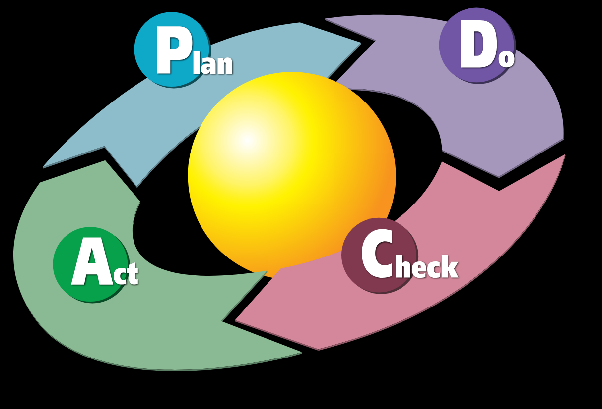
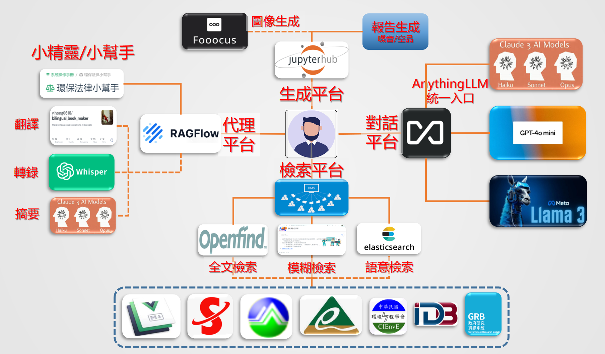

# 自然語言處理
{: .no_toc }

## 報告生成的弔詭(2023-09-17)

自然語言處理這一塊的應用有一點弔詭。畢竟環境工程經常性的報告、環境評估、監測報告、查證報告、日常性的監造日誌、技師審查意見等等，並不是辭藻堆砌的文件，而是數字與事實濃度非常高、是機器學習的好範本，似乎是不能期待語言模型產出的。但既然不能期待產出，又何必訓練？於是弔詭就成立了。（這段話不是機器產出的。）

對於想藉由抄襲、AI產生環工報告的年輕工程師，我的建議是去訪問環保署環境工程技師懲戒缺失實例的[網站](https://eric.epa.gov.tw/PeePortal/mobile/Default.aspx)。

既然這樣，NLP這一塊要做的事情有哪些？又有什麼必要性。這得從環境工程師歷來逃避的國語文能力開始說起。工程師提交的文章初稿可能需要先經過google translate 才能讓主任看得懂，這樣能理解 AI NLP應用的重要性吧？！

{: .fs-6 .fw-300 }

## AI服務系統架構 (2024-11-29)

- 蘇格拉底：一個沒有經過反省的生命是不值得活的。照樣，一條沒有經過應用驗證的知識，也是不值得儲存的。
- 今天來看，所謂"知識庫"的概念也是迂腐不切實際的：我們可以直接使用語言模型所歸納的知識、使用agent與API綜橫在各個知識庫之間，又何必在本地又儲存龐雜樹枝狀的"知識庫"?知識既然是要使用，又何必藏在"庫"中，納百川而無一去處的死海?
- Adptation：人類真正的智慧與知識，其實就是適應這個快速進步的世界、適應那些聰明人為我們人類社會帶來科技的進步與衝擊。古有明訓：適者生存，越會組裝垃圾的工程師將會勝出，收集的越快、組裝的越快，將會是永垂不朽的經典。

### 一鍵生成的再思

- 知識的存在：不再是工程師的腦袋裏，而是一組外部的記憶與邏輯。過去我們承傳知識的媒介是期刊文獻、報告、筆記，後來我們承傳程式碼、程式說明，現在都不必了，轉換到承傳"提示"、創意、與真正的匠心。
- AI時代的PDCA循環
  - 過去的工程師走PDCA循環常常在A之前就卡關了，不是因為C不過關，而是PDC的程序太慢了、特別D的產出與速度。
  - agent的時代即將告別這個瓶頸，工程師要思索的更多是如何確認驗證、以及產出對系統組織的意義，就是A到P之間，如何為組織擘劃更大、更實用與完整的計劃。
- 結論：我們無法攔阻一鍵生成的趨勢、我們只能為它排除障礙、設立監管機制，並且迎接它的到來。

### AI的 DIY 工具組合

- 經過了一整年的揣摩，大致上就使用者的需求面達成了下圖的DIY架構。
- "**平台**"者也，就是不同人們相遇、交換資訊的地方，重點在於參與的"**人**"有哪些，我們希望這些平台是

1. 工程師與主管之間的能共同協作的地方：工作成果之提交、批改、品質確認
2. 團隊分享信息、經驗傳承、知識累積的地方
3. 工程師與未來的自己共同協作的地方：工作發布、紀錄、反省與更新

- **檢索**平台
  - 這項需求總結了過去DMS的所有功能，除了傳統的全文檢索，我們納入了模糊檢索、摘要的檢索、以及嵌入向量的語意檢索。
  - DIY的意涵在於檢索紀錄與應用的AI化，user檢索的頻率將會決定全文檢索的範圍、是否納入語意檢索、快速摘要與建議閱讀等。使用者的檢索經驗將會創造其個人或團隊專屬的知識庫。
  - 為了提高全文檢索的速度及API，我們規劃引入openfind的OES系統，而經嵌入向量的語意搜尋，則使用ElasticSearch技術，模糊檢索的介面，則引用NLP分析意圖的技術，適時導向個別API，來呈現智慧檢索的介面。
- **對話**的意思，是即問即答的chatbot，
  - 小精靈也可能會有chatbot，但這裡要服務的需求是直接連線到語言模型的IO，中間沒有代理、沒有RAG、僅是語言模型與user的prompt、知識性與簡易文字處理的服務與紀錄。
  - 這是一類很大的需求。我們選用AnythingLLM作為入口。好處是彈性、帳密及權限管理、可追蹤記帳。
  - 對話平台的DIY在於經理權限以上對話線程的分享、知識性對話歷史筆記的製作與自動發佈，這對團隊能力的提升有重要的貢獻。
- **生成**：這類的需求是大量及批次的一鍵生成，重點在於提示工程的經驗傳承與工作平台。
  - 批次式的生成在於跨越個別系統的介面障礙，user可以在jupyterhub(JPH)統一介面上直接控制複雜的個別系統，批次生成所要的結果，這需要使用者DIY。
  - 我們選用JPH作為平台介面，讓提示工程、API銜接的python程式可以流傳與編輯，來確保產品的品質。
  - 生成的需求有2個面向，一個是報告、一個是圖像(指得是image、不是diagram/chart，後者會歸類在小精靈/小幫手)。
- **代理**這個群組是概念性的整合類別，DIY的意義在於user可以在此平台上、或其他的工具方法，來發展適用於個人或團隊的精靈/幫手。
  - 技術的重點在於API與網路服務屏障之消弭、計算資源的銜接、以及使用者介面。
  - 我們選用的方案是RAGFlow無碼的代理產生器，除了RAG之外，既有的功能包括了現有的API服務。

