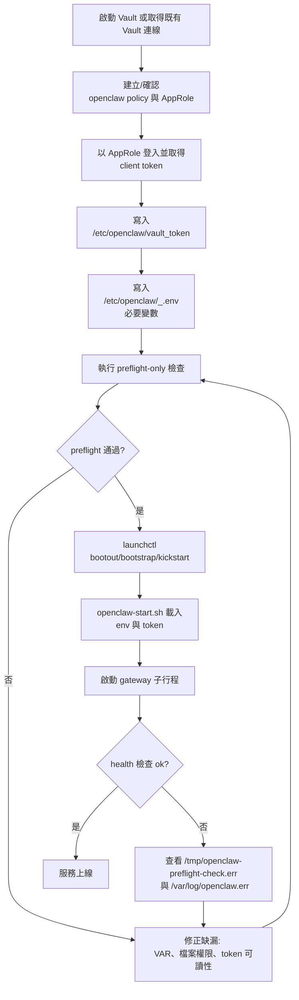

# Vault Linkings
{: .no_toc }

<details open markdown="block">
  <summary>
    Table of contents
  </summary>
  {: .text-delta }
- TOC
{:toc}
</details>
---

# Vault 與 OpenClaw 整合快速指南 🚀

## 適用範圍
macOS `launchd` + 嚴格 `preflight` 啟動流程。

## 目的 🎯
- 提供完整步驟：啟動 Vault（dev 或 docker-compose）、初始化與解封（unseal）、啟用 KV v2、儲存 OpenClaw 所需密鑰、配置最小權限 policy，並讓 OpenClaw 從 Vault 讀取密鑰。
- 確保 OpenClaw 啟動具備 fail-safe：preflight 沒過就不能啟動 gateway。

## 前提假設 📌
- 你會在本機或授權機器上執行此 PoC，且已安裝 Docker。
- 本指南使用 HashiCorp Vault OSS + Docker 進行 PoC。
- 請勿把正式環境密鑰提交到 git。此文件僅用於實驗/PoC。
- 執行架構目標：macOS launchd（`/Library/LaunchDaemons/com.openclaw.plist`）+ `/usr/local/bin/openclaw-start.sh`。

## 相關檔案 📂
- `workspace/docs/vault-integration-and-openclaw.md`（本文件）
- `workspace/docs/vault-poc-docker-compose.yml`（建議）
- `workspace/docs/vault-poc-setup.sh`（輔助腳本）

## 目前啟動模型（重要）⚙️
- launchd 會以 root 身份執行 `/usr/local/bin/openclaw-start.sh`。
- `openclaw-start.sh` 會在可讀時載入 `/etc/openclaw/_.env` 與 `/etc/openclaw/vault_token`。
- 腳本會從 `openclaw.json` 抽取 `${VAR}` 佔位符；任何必要環境變數缺失即 preflight 失敗。
- root 模式下，腳本會用乾淨環境把 `_.env` 中所有變數名與必要執行變數轉發給 `kuang` 子行程。
- 建議所有重啟前都先跑 `OPENCLAW_PREFLIGHT_ONLY=1`。

### 整體流程圖



## 1. 啟動 Vault（Docker Compose）- 最小 PoC 🧪

建立 docker-compose（`workspace/docs/vault-poc-docker-compose.yml`）：

```yaml
version: '3.7'
services:
  vault:
    image: vault:1.14.0
    ports:
      - "8200:8200"
    environment:
      VAULT_DEV_ROOT_TOKEN_ID: "root-token"
      VAULT_ADDR: "http://0.0.0.0:8200"
    cap_add:
      - IPC_LOCK
    command: "server -dev -dev-root-token-id=root-token"
```

說明：
- `-dev` 僅用於 PoC，不可用於正式環境。
- dev 模式會自動 unseal，且資料在記憶體中。

## 2. 啟動並驗證 ✅

指令：
- `docker compose -f workspace/docs/vault-poc-docker-compose.yml up -d`
- `export VAULT_ADDR=http://127.0.0.1:8200`
- `vault status`

預期：dev 模式下 `vault status` 應顯示 `Sealed: false`，且可使用 root token `root-token`。

## 3.（非 dev）初始化與解封（類正式流程）🔐

如果你執行的是正式 Vault（非 `-dev`），初始化指令為：
- `vault operator init -key-shares=5 -key-threshold=3`
  -> 會產生 5 組 unseal keys 與 root token，請安全保存（HSM/KMS 或離線紙本）。

解封步驟：
- `vault operator unseal <unseal_key_1>`
- 使用 3 組不同 key 重複直到 `sealed: false`

安全建議：
- unseal keys 必須保存在 Vault 主機之外（例如硬體模組或安全金庫）。
- 不要把 unseal keys 留在磁碟上。

## 4. 啟用 KV v2 並建立 OpenClaw 密鑰路徑 🗂️

指令（使用 root 或 admin token）：
- `vault auth enable userpass`   # 可選，啟用一種 auth 方法
- `vault secrets enable -path=secret kv-v2`
- `vault kv put secret/openclaw/channels TELEGRAM_BOT_TOKEN="<redacted>" LINE_CHANNEL_ACCESS_TOKEN="<redacted>" GITHUB_TOKEN="<redacted>"`

以上會把資料存到 `secret/data/openclaw/channels`（KV v2 語義）。

## 5. 建立 OpenClaw 最小權限 policy 🛡️

範例 policy 檔（`openclaw-policy.hcl`）：

```hcl
path "secret/data/openclaw/*" {
  capabilities = ["read"]
}
```

套用：
- `vault policy write openclaw openclaw-policy.hcl`

## 6. 建立 OpenClaw 使用的身份（Token 或 AppRole）👤

### 選項 A：Token（簡單 PoC）
- `vault token create -policy=openclaw -period=24h`
  -> 取得 token，OpenClaw 可作為 `VAULT_TOKEN` 使用（或存入 tokenFile）。

### 選項 B：AppRole（建議自動化）
- `vault auth enable approle`
- `vault write auth/approle/role/openclaw policies=openclaw`
- `vault read auth/approle/role/openclaw/role-id`
- `vault write -f auth/approle/role/openclaw/secret-id`
- 以 `role_id + secret_id` 登入：`vault write auth/approle/login role_id="..." secret_id="..."`
- 回應會包含可用的 client token。

## 7. 設定 OpenClaw 從 Vault 讀取密鑰 🔌

### 作法 1：環境變數（簡單）
- 將 `VAULT_ADDR` 與 `VAULT_TOKEN` 放在 `/etc/openclaw/_.env` 與 `/etc/openclaw/vault_token`，供 launchd 啟動鏈使用。
- 不要把長效密鑰直接放進 plist 的 `EnvironmentVariables`。
- 調整 `openclaw.json`（或 `openclaw.json.private`）使用密鑰佔位符，並在啟動流程加入 loader 腳本讀 Vault 後寫入本機 token 檔。

### 作法 2：tokenFile + 啟動腳本（較安全）
- 啟動時由包裝腳本用 AppRole 登入 Vault，再把密鑰寫入 OpenClaw 可讀的檔案。

範例啟動腳本（`vault-poc-setup.sh`）：

```bash
#!/usr/bin/env bash
set -e
export VAULT_ADDR=${VAULT_ADDR:-http://127.0.0.1:8200}
# 使用 AppRole 登入（若有）
if [ -n "$VAULT_ROLE_ID" ] && [ -n "$VAULT_SECRET_ID" ]; then
  token=$(vault write -field=token auth/approle/login role_id="$VAULT_ROLE_ID" secret_id="$VAULT_SECRET_ID")
  echo "$token" > /run/openclaw/vault_token
  chmod 600 /run/openclaw/vault_token
  export VAULT_TOKEN="$token"
fi

# 從 Vault 讀取密鑰並寫入 token files 或 openclaw.json.private 模板
mkdir -p /run/openclaw
telegram_token=$(vault kv get -field=TELEGRAM_BOT_TOKEN secret/openclaw/channels)
echo "$telegram_token" > /run/openclaw/telegram_bot_token.txt
chmod 600 /run/openclaw/telegram_bot_token.txt
# 其他 token 依此類推

# 如有需要可在最後啟動 OpenClaw gateway
# openclaw gateway start
```

說明：
- 請使用專用系統帳號與目錄（例如 `/run/openclaw`），並設定嚴格權限。
- 確認 `openclaw.json.private` 指向 tokenFile，或在啟動前由腳本動態更新記憶體設定。

## 8. macOS launchd：preflight-first 操作手冊 🧭

請依序執行（不可跳過 preflight）：

### 步驟 1：檢查 plist 語法與關鍵項
- `plutil -lint /Library/LaunchDaemons/com.openclaw.plist`
- `plutil -p /Library/LaunchDaemons/com.openclaw.plist | sed -n '1,220p'`

### 步驟 2：只執行 preflight（乾淨環境）
- `sudo -v`
- `sudo -n env -i HOME=/Users/kuang PATH=/usr/bin:/bin:/usr/local/bin OPENCLAW_STARTUP_RETRY_DELAY_SEC=0 OPENCLAW_PREFLIGHT_ONLY=1 /usr/local/bin/openclaw-start.sh >/tmp/openclaw-preflight-check.out 2>/tmp/openclaw-preflight-check.err`

preflight 成功判準：
- stderr 包含：`[openclaw-start] preflight ok: all required config environment variables are present`

若 preflight 失敗，請檢查：
- `openclaw.json` 裡的 `${VAR}` 佔位符是否缺值。
- `/etc/openclaw/_.env` 是否可被啟動流程讀取。
- `/etc/openclaw/vault_token` 是否可讀且非空。

### 步驟 3：preflight 通過後才重啟 daemon
- `sudo -n launchctl bootout system/com.openclaw >/dev/null 2>&1 || true`
- `sudo -n launchctl bootstrap system /Library/LaunchDaemons/com.openclaw.plist`
- `sudo -n launchctl kickstart -k system/com.openclaw`

### 步驟 4：驗證進程與健康檢查
- `pgrep -fa 'openclaw/dist/index.js gateway'`
- `curl -sS http://127.0.0.1:18789/health | head -20`
- `launchctl print system/com.openclaw | sed -n '1,120p'`

### 步驟 5：可選，關閉 sudo ticket
- `sudo -k`

## 9. OpenClaw 程式路徑的密鑰讀取方式 📖

- 若 OpenClaw 支援 `openclaw.json` 的 `tokenFile`（例如部分 channel 如 LINE），請把路徑設到 `/run/openclaw/telegram_bot_token.txt` 這類檔案。
- 若不支援，可用啟動腳本把 Vault 內容寫入 `openclaw.json.private`（注意：此檔不要提交到版本庫）。仍建議優先採用 file-per-secret。

## 10. Token 輪替 🔄

- 若使用 AppRole 與短效 token，請在啟動腳本或 sidecar 實作續租/更新邏輯，避免 race condition 並確保更新安全。

## 11. 清理與安全注意事項 🧹

- 永遠不要把正式 root token 以明文存放在磁碟。
- unseal keys 請用 HSM/KMS 或離線保存，不可留在 Vault 主機。
- policy 應遵循最小權限（僅允許必要 secret 路徑唯讀）。
- 所有密鑰檔權限至少 `chmod 600`。
- 建議啟用 Vault audit device 追蹤密鑰存取。
- launchd plist 應保持最小化；敏感資料應放在受保護檔案（`_.env`、token file）或 Vault。

## 12. 疑難排解 🛠️

- `vault status` 可查看是否 initialized / sealed。
- 若在 docker-compose dev 模式看到 `Sealed: false`，屬於預期；root token 即 `VAULT_DEV_ROOT_TOKEN_ID`。
- 若讀取密鑰回 `403/permission denied`，請檢查 policy 與 token capability。
- 若 launchd 重啟循環，先跑 `OPENCLAW_PREFLIGHT_ONLY=1`，再看 `/tmp/openclaw-preflight-check.err`。
- 若 preflight 錯誤訊息重複，可檢查狀態檔路徑（預設 `/var/tmp/openclaw-preflight.state`）。

## 13. 可選強化項目 ✨

- 增加一條 preflight parser 指令，部署前先列出 `openclaw.json` 所需 `${VAR}`。
- 對 AppRole 與短效 client token 加上自動續租/輪替流程。
- 加入 `workspace/`、`agents/main/sessions/` 與憑證保留邊界的稽核清單。

