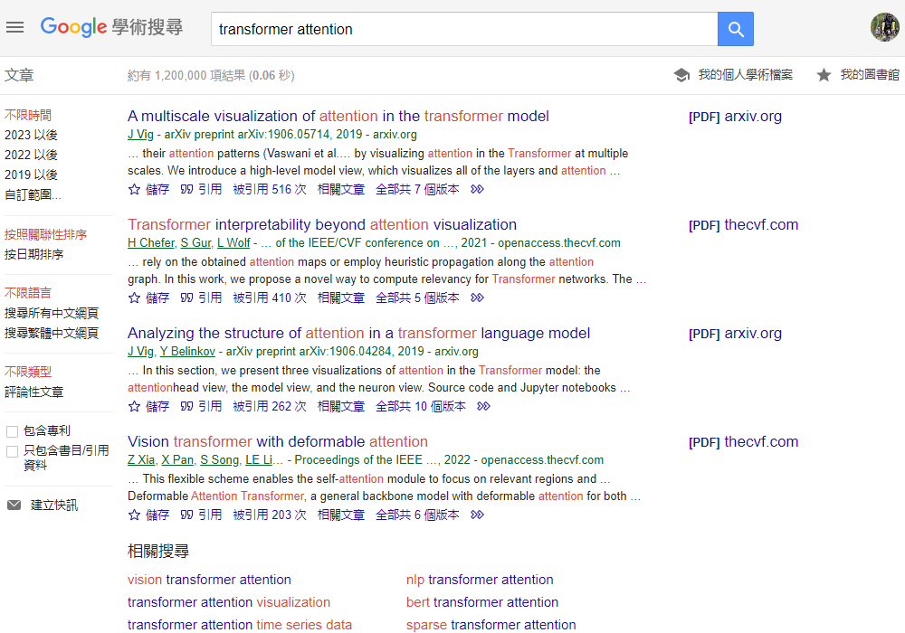

# google scholar
{: .no_toc }

  

    Table of contents
  

  {: .text-delta }
- TOC
{:toc}

---

## 背景

- 據聞目前研究報告搜尋引擎最強的還是google scholar。以其為範本應有重要標竿意義。

## 搜尋結果畫面檢討

### 左側文章

- 時間範圍：`不限時間`(內設、紅字)、點選後再搜尋，或`自訂範圍...`出現起訖框與搜尋按鈕

- 排序方式：`按照關聯性排序`(內設、紅字)以及`按日期排序`
- 語言限定：`不限語言`(內設、紅字)、`搜尋所有中文網頁`、`搜尋繁體中文網頁`
- 文章類別：`不限類型`(內設、紅字)、或`評論性文章`，後者應為review性質文章、不涉及技術細節。
- 包括選項：勾選方框，內設是不包括。選項有`包括專利`、`只包括書目/引用資料` (*似無作用*)

### 中間

## More

### Google學術替代品

對於開源的Google學術替代品，以下是一些可能的選擇：

1. **必應學術**：這是微軟開發的一個學術搜索引擎，可以搜索中文和英文文獻¹。
2. **微軟學術**：這是另一個由微軟開發的學術搜索引擎¹。
3. **百度學術**：這是由百度開發的一個學術搜索引擎¹。
4. **ResearchGate**：這是一個學術社交網站，用戶可以在上面搜索和分享學術論文¹。

這些都是一些功能強大的學術搜索引擎，可以作為Google學術的替代品。然而，請注意，雖然這些工具都提供了強大的搜索功能，但它們並不一定提供與Google學術相同的內容覆蓋範圍¹。

此外，還有一些其他的工具可以用來搜索學術文獻，例如：

1. **Sci-Hub**：這是一個提供免費學術文獻的網站，用戶只需要輸入論文的標題、PMID號、DOI號或URL等其中的任意一個，就可以一鍵免費獲取文獻PDF全文¹。
2. **文献部落**：這是一個免費下載文献的學術導航網站，為廣大研究生提供最便捷的文献下載方法¹。
3. **大木虫**：這是一個學術導航，界面簡潔清新，功能強大，這裡收集了大量常用且好用的數據庫網站、搜索引擎、鏡像網站¹。

請注意，這些都是一些可以用來搜索學術文獻的工具，並不一定是開源的。如果你正在尋找一個可以自己部署和修改的開源學術搜索引擎，那麼你可能需要查找一些專門的開源軟件項目¹。

來源: 與 Bing 的交談， 2023/11/9
(1) 除了谷歌学术镜像和Sci-Hub以外，还有没有别的好用的免费学术搜索引擎？ - [知乎](https://www.zhihu.com/question/472259815).
(2) 科研上Google/Scholar有哪些替代方案? - [知乎](https://www.zhihu.com/question/24849699).
(3) Google.[de](https://www.google.de/).
(4) Google.[ca](https://www.google.ca/).
(5) undefined. [dx.doi.org](http://dx.doi.org).

### 開源的學術搜索引擎

對於開源的學術搜索引擎，以下是一些可能的選擇：

1. **OALib**：Open Access Library (OALib) 是一個學術論文網站，其中涵蓋數學、物理、化學、人文、生物、材料、醫學和人文科學等領域，文章均可免費下載³。
2. **BaseSearch**：BaseSearch 是德國比勒菲爾德學術的一個多學科的學術搜索引擎，提供對全球異構學術資源的集成檢索服務，其中整合了德國比勒費爾德大學圖書館的圖書館目錄和大約160個開放資源（超過200萬個文檔）的數據³。
3. **Core**：Core 是一個跨學科的搜索網站，通過它可以尋找到6600萬open access的文獻⁴。
4. **ScienceOpen**：ScienceOpen 是2013年創建於柏林和波士頓的公司，擁有25000期刊，6200萬科學類別的文獻⁴。

請注意，這些都是一些可以用來搜索學術文獻的工具，並不一定是開源的。如果你正在尋找一個可以自己部署和修改的開源學術搜索引擎，那麼你可能需要查找一些專門的開源軟件項目¹²³⁴。

來源: 與 Bing 的交談， 2023/11/9
(1) 8个国外免费论文搜索引擎 - [知乎](https://zhuanlan.zhihu.com/p/447376658).
(2) 10个免费外文文献搜索资源（2020） - [知乎专栏](https://zhuanlan.zhihu.com/p/121848249).
(3) Google [學術搜尋](https://scholar.google.com.tw/schhp?hl=zh-TW).
(4) 科研必备的14个学术搜索引擎 - 知乎. https://zhuanlan.zhihu.com/p/621111289.