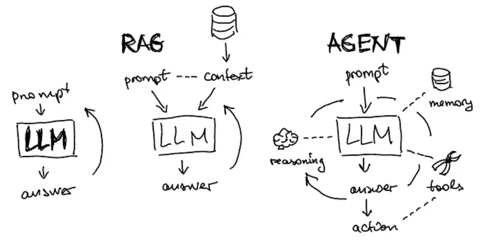

# 代理與流程編輯器
{: .no_toc }

  

    Table of contents
  

  {: .text-delta }
- TOC
{:toc}

---

## 背景

### 代理與聊天機器人的差異

[source:RAG聊天机器人 VS AI Agent：哪个更高效？PyTorch研习社(2024-08-20)	](https://www.53ai.com/news/RAG/2024082060423.html)

代理（Agent）和聊天機器人（Chatbot）雖然都可能是一種網路服務的形式，但在功能和應用上還是有一些明顯的差異：

1. **功能範圍**：
   - **代理**：通常是指能夠執行特定任務或一系列任務的軟體，這些任務可能包括數據處理、自動化工作流程、與其他系統的集成等。代理可以在後台運行，並且不一定需要與用戶直接互動。
   - **聊天機器人**：主要設計用來與用戶進行對話，回答問題，提供信息或完成簡單的任務。聊天機器人通常通過文字或語音與用戶互動，並且主要用於客服、信息查詢、娛樂等場景。

2. **互動方式**：
   - **代理**：通常不需要與用戶進行頻繁的互動，更多的是在後台自動執行任務。例如，電子郵件過濾代理、自動化營銷代理等。
   - **聊天機器人**：需要與用戶進行直接的互動，通過自然語言處理技術來理解和回應用戶的問題和需求。

3. **應用場景**：
   - **代理**：應用範圍廣泛，包括IT運維、自動化營銷、數據分析等。例如，網絡代理可以幫助用戶匿名瀏覽網頁，交易代理可以自動執行股票交易。
   - **聊天機器人**：主要應用於需要與用戶進行交流的場景，如客服系統、虛擬助手、在線購物助手等。例如，企業網站上的客服聊天機器人可以幫助解答用戶的常見問題。

4. **技術基礎**：
   - **代理**：通常基於程式腳本、自動化工具和API集成，專注於特定任務的自動化。
   - **聊天機器人**：基於自然語言處理（NLP）、機器學習和人工智能技術，專注於理解和生成自然語言。

| **特點** | **代理 (Agent)** | **聊天機器人 (Chatbot)** |
| --- | --- | --- |
| **功能範圍** | 執行特定任務或一系列任務，如數據處理、自動化工作流程 | 與用戶進行對話，回答問題，提供信息或完成簡單任務 |
| **互動方式** | 大多數工作是在後台按既定模式運行，不需要與用戶頻繁互動 | 通過文字或語音與用戶直接互動(提示工程) |
| **應用場景** | IT運維、自動化數據分析、小幫手、智慧搜尋 | 徵詢、編碼除錯、簡易文字處理等 |
| **技術基礎** | 基於腳本、自動化工具和API動態集成(包括語言模型與特別知識) | 基於自然語言處理（NLP）、預訓練、內建知識 |

### RAGFlow的代理

- RAGFlow 的代理機制將 RAG 技術與無代碼工作流程編輯器結合，適合複雜商業應用場景。透過代理，使用者可利用查詢分類、對話導向等功能，從知識庫中進行檢索並生成回應。可選擇現有模板或自行設定代理，並透過元件如檢索、生成、分類等來自訂工作流程。每個元件有特定的配置要求，確保流程運行順暢，且支持基礎操作如添加、複製和刪除元件。
- 更多詳情請參閱：[RAGFlow 官方文件](https://ragflow.io/docs/dev/agent_introduction)

### 元件

| 元件         | 說明                                                                                                                             |
| ------------ | -------------------------------------------------------------------------------------------------------------------------------- |
| 檢索 (Retrieval) | 從指定的知識庫檢索資訊，若無資訊則返回「空回應」。確保已選擇正確的知識庫。                                       |
| 生成 (Generate) | 讓 LLM 生成回應的元件，必須確保提示設置正確。                                            |
| 互動 (Interact) | 作為人類與機器人之間的介面，接收用戶輸入並顯示代理的回應。                                  |
| 分類 (Categorize) | 使用 LLM 將用戶輸入分類到預定的類別中，需設定每個類別的名稱、描述和示例，以及相應的下一步元件。 |
| 訊息 (Message) | 發送靜態訊息，若提供多條訊息則隨機選擇一條發送。確保下游為介面元件 Interact。               |
| 關聯 (Relevant) | 使用 LLM 判斷上游輸出與用戶查詢的相關性，並根據判斷結果指定下一步元件。                       |
| 重寫 (Rewrite) | 若查詢未檢索到相關資訊，則重新修訂查詢，直到達到預定次數上限。上游需為 Relevant，下游為 Retrieval。|
| 關鍵字 (Keyword) | 從 Wikipedia 檢索前 N 筆結果，使用前需正確設置 TopN 值。                                  |

### 編輯動作

| 基本操作           | 描述                                                                                               |
| ------------------ | -------------------------------------------------------------------------------------------------- |
| 新增元件 (Add a component)      | 從左側面板拖放所需元件到畫布上。                                                            |
| 刪除元件 (Delete a component)    | 在畫布上將滑鼠移到元件的三點符號 (...) 顯示刪除選項，點選以移除元件。                     |
| 複製元件 (Copy a component)      | 在畫布上將滑鼠移到元件的三點符號 (...) 顯示複製選項，點選以複製元件。                     |
| 更新元件設置 (Update component settings) | 在畫布上點擊所需元件即可顯示其設置。                                                |

## 組成一個聊天機器人

建立聊天機器人需要以下步驟：

	1.	設計目標與需求：確定機器人的目標、功能及預期的用戶互動情境。
	2.	選擇框架與技術：選擇 NLP 平台，如 Rasa、Dialogflow，或基於 GPT-4 等模型的自訂解決方案。
	3.	開發對話流程：設定用戶的輸入、回應及對話邏輯，並利用 NLP 技術理解語意。
	4.	整合知識庫：讓機器人能檢索知識庫的資料來回答複雜問題。
	5.	測試與優化：測試機器人反應，優化其準確性和使用者體驗。

要用 RAGFlow 建立一個通用型聊天機器人，
- 首先在「Agents」中選擇聊天機器人範本。
- 配置核心元件，如：Begin（開始對話）、Retrieval（資訊檢索）、Relevant（查詢關聯性確認）、Generate（生成回應）、和 Rewrite（修正查詢）。
- 調整知識庫與提示設定，並
- 儲存與測試設定確保準確性。

詳細步驟請參閱[完整指南](https://ragflow.io/docs/dev/general_purpose_chatbot)

### 開始建立 Agent

- RAGFlow提供了9個代理範例，可以作為一個模板開始新的代理。

|主題|內容|應用元件
|-|-|-
|空白的工作區|從頭開始建立您的代理|開始
|網頁搜尋助手|聊天助理模板，整合了從知識庫中提取的資訊和網路搜尋，以回應查詢。需先在「檢索」中建立您的知識庫！|O/I/R/KW/KB/LLM/W/D/B
|通用聊天機器人|通用型聊天機器人，涉及領域包括醫療、金融、情感交流、即時天氣、資訊等。|O/I/R/KW/KB/LLM/W/D/B
|HR招募推廣助理（中文）|招募推廣助理，能夠推廣候選人、提供工作機會、解決疑問並索取候選人的聯絡方式。讓我們先連結包含「檢索」中職位描述的知識庫！|O/I/C/LLM/M/KB
|客戶服務|一個客戶服務聊天機器人，可以解釋產品規格、解決客戶疑問並緩解負面情緒。|O/I/C/R/KB/LLM/M
|口譯員|一個簡單的解釋器，可將使用者輸入翻譯成目標語言。嘗試“你好 => 西班牙語”來查看翻譯！|O/I/LLM
|文字轉SQL|將使用者查詢轉換為 SQL 語句的代理程式。你必須準備三個知識庫： 1：你的資料庫的DDL； 2：使用者查詢轉換為SQL語句的範例； 3：資料庫的全面描述，包括但不限於表格和記錄。|O/I/C/LLM/M/KB
|資料庫助理|進階代理，可將使用者查詢轉換為 SQL 語句、執行查詢、評估並傳回結果。你必須準備三個知識庫： 1：你的資料庫的DDL； 2：使用者查詢轉換為SQL語句的範例； 3：資料庫的全面描述，包括但不限於表格和記錄。還需要配置相應的資料庫。|O/I/A/C/KB/LLM/E
|醫療諮詢|醫療諮詢助理，可以提供您一些專業的諮詢建議供您參考。請注意，醫療助理提供的內容僅供參考，可能不真實或無法使用。知識庫內容參考：醫學知識庫參考|O/I/KW/(專業API)/KB(既有的QnA)
|智能投資顧問|智慧投資顧問，即時解答您的財務問題|O/I/KW/(專業API)

- 通用元件

	O：Open開始；
	I：Interface對話框；
	C：Classifier問題分類；
	A：AnalysesCondition條件；
	R：RefineQuestion問題最佳化；
	KW：GetKeyWords關鍵字；
	KB：SearchKnownledgeBase知識檢索；
	LLM：生成回答；
	M：Messager靜態訊息；

- 特殊元件(專業API)

	G：Google Search
	W：WikiPedia維基百科；
	D：DuckDuckGo；
	B：百度搜尋；
	E：ExeSQL執行SQL；
	...

### 無代碼代理程式之撰寫

- 拉取左側欄的物件到工作區
- 點選物件(來源物件)、滑鼠滑過端點直到出現`+`
- 拉到另一物件(目標物件)的端點，形成帶箭頭的連線。
- 雙擊點選各物件，進入內容之設定

