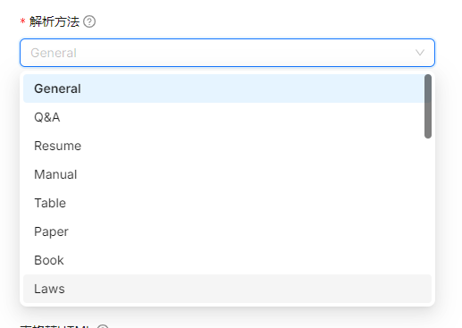

# 文檔解析
{: .no_toc }

  

    Table of contents
  

  {: .text-delta }
- TOC
{:toc}

---

## 背景

- 不同文檔類型的解析方式不同
- ragflow提供了下列幾種方式，主要針對文章的樣式

1. gereral: 一般性的文檔 
2. Q&A：一對一的段落關係
  
3. Resume：有必要的段落
4. Manual：
5. Table：
6. Paper：2欄的特殊格式
7. Book：除2欄的特殊格式，也有封面、目錄與圖表穿插
8. Law：條文的架構、換行與斷句

