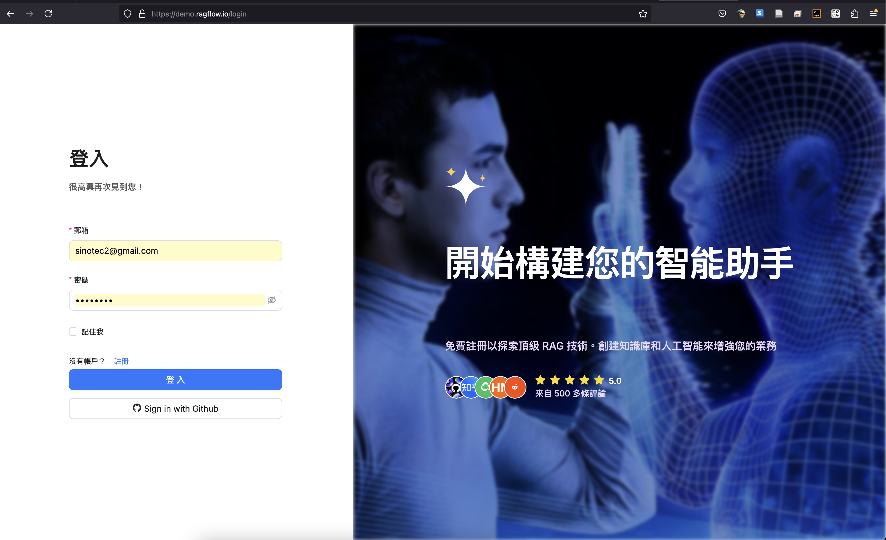

# 註冊與登入
{: .no_toc }

  

    Table of contents
  

  {: .text-delta }
- TOC
{:toc}

---

## 背景

1. 測試階段沒有收費、免費使用API解讀、聊天，但長度有限。
2. 郵箱一旦設定將無法更改。不會寄信到郵箱確認。密碼可改，但無忘記密碼功能。
3. 也可使用github帳密登入，安全性較高。
4. 有dev與正式版本可選。
5. 網址:[https://demo.ragflow.io/login](https://demo.ragflow.io/login)
