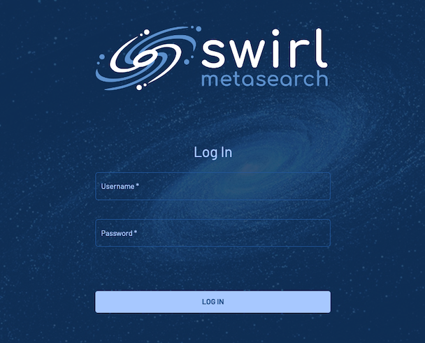

# swirl搜尋引擎+AI
{: .no_toc }

  

    Table of contents
  

  {: .text-delta }
- TOC
{:toc}

---

## 背景

{: .no_toc }

- swirl 是一家公司提供的open source,目標是讓AI可以幫忙登入個別網址、同步搜尋資料庫、再以AI彙報(暫時還未開發接受答詢功能)。
- 此處下載其原始github原始碼，加上說明與建置、本地化過程的心得。

## 簡易使用方式說明

### 登入

- [devp instance](http://200.200.32.195:8000/galaxy/login)

- swirl有嚴格的登入允許，由管理者負責新增。目前還不能自行修改密碼。

### 選擇資料庫

- 內設為`All Sources`
- 可以案性質選擇公衛資料庫(Europe pubmed)、Linkedin、或swirl自家程式文件。

### 輸入搜尋字串

- 可接受中文、雙引號等等google習慣
- 按下 `SEARCH`、或`Enter`鍵即開始上網搜尋
- 目前還不會自動偵錯、自動修正typing error

### Generate AI Response

- 打開可以產生摘要
- 如運轉中想停止，可以直接撥回按鈕。

### Select Items

- 如果不需要每一條都進到AI去摘要，可以按此進一步選擇。

{: .fs-6 .fw-300 }
