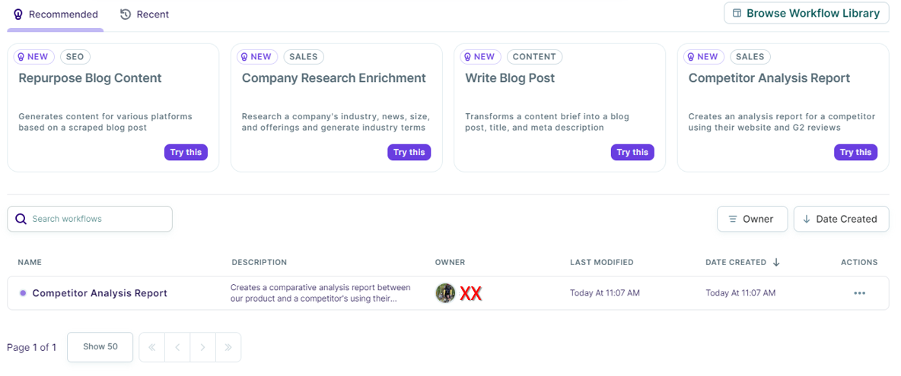
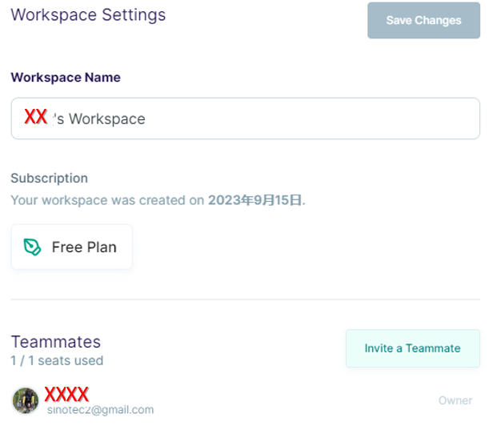

# copy.ai使用者介面
{: .no_toc }

  

    Table of contents
  

  {: .text-delta }
- TOC
{:toc}

---

## UI基本架構

- 因copy.ai的基本設計是為文本的生成，所以它的界面有點類似一般的文字編輯器或筆記軟體，中間文件預覽的部分會比較大。左側是瀏覽器，區分成工具區(TOOLS)、自動化(AUTOMATION)以及資產區(ASSETS)
- 文件或工作的架構大致上有三層
  - 工作區(Workspace)：名稱出現在左上角，下拉選單可以切換帳號、名稱等基本設定，也可以新增工作區、切換團隊角色(免費版本無此功能)。
  - 右上角可以新增專案或目錄(紅色虛線位置)
    - 目錄(Folders)：以下可以有不同的專案，如各個部分章節等，目錄是可以整批一次搬移到團隊工作區的。
    - 我的專案(MyProjects)：此處專案類似其他AI的對話框前後文，是按照內容主題來區分的。
    - 內設是名片狀顯示、照修改日期排序，也可以條列顯示、或改成按照名稱顯示。

## 功能切換

### 工具區

- copy.ai 寫好了將近100個文案模板，可供選擇直接生文。
- 不過沒有report、paper，只有article、essay等。
- 如果要生成縝密的report、paper，還是需要分段產生、再行整合、或者如[文章發展](./proposal.md)所示範的、慢慢逐步的發展。
- 這近100個模板，copy.ai又將其分類成
  - 腦力激盪工具：與發想相關的模板
  - 社群媒體工具：直接可以po網誌使用
  - 銷售文案
  - 寫作工具(跟寫報告比較有關)
  - 個人工具
  - 新創工具
  - 部落格工具
  - email信件
  - 數位廣告
  - 網頁文案
  - 產品介紹

### 自動化專區

- 這部分是新增的功能。免費方案雖然也可以執行，但有credit的上限。
- `Repurpose Blog Cont`：部落格版主常常需要在不同的社群媒體發表同一主題的內容，因為對象略有差異，目的也略有不同，因此每次需要改寫，都會是一大工程。這個自動化的流程可以產生LinkedIn、twitter、Facebook、Instagram、與（或）email行銷版本的內容。
- `Company Research Enrichment`：針對特定公司的技術、新聞、規模、職缺等等，進行公司研究與報告。因為對象公司(競爭對手)如果很多，這也會是一個需要自動化的工作流程。
- `Write Blog Post`：條列主要的發現或者亮點，AI寫手就自動產生部落格文章並張貼。
- `Competitor Analysis Report`：這個功能特別針對軟體開發公司的產品部落格進行解讀與報告。為使評估更加客觀，工作流程中還會訪問g2網站，從該網站擷取評論納入報告中。

### 資產專區

- `Infobase`：此處設定重要的資料對照表，以供產出文字時可以套用。
- `Brand Voice`：您可以使用 Copy.ai 將內容風格化為特定的語調。

## 對話框及預覽

- 和其他AI一樣，copy.ai也是以命令列對話框的方式來驅動(下圖箭頭位置)。輸入文字後、按下黑底白字的`>`鍵，copy.ai即受理執行。
- 除了輸入文字指令之外，copy.ai還可以接受檔案(`Attach`、類似文檔模板)、加入其他提示(`Browse Prompts`、穩定產出品質)、以及品牌語調(`Brand Voice`、不同檔案間的一致化文風)等，來加速優化產出的品質達到預期、一致化的效果。
- copy.ai結果產出後按下複製(`Copy`)可以轉貼到其他軟體上，也可以直接在右側畫面編輯字體(`Add To Editor`)。編輯器是個隨改隨預覽的簡單markdown編輯介面，編輯結果可以直接提供網誌使用。

## 團隊功能

- 進入Workspace Settings
- 應為企業方案之主打內容
- pro方案可以有5個人共同編輯(user seats)

