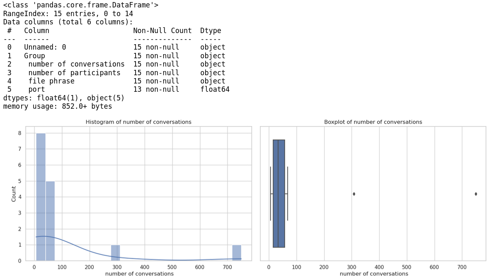
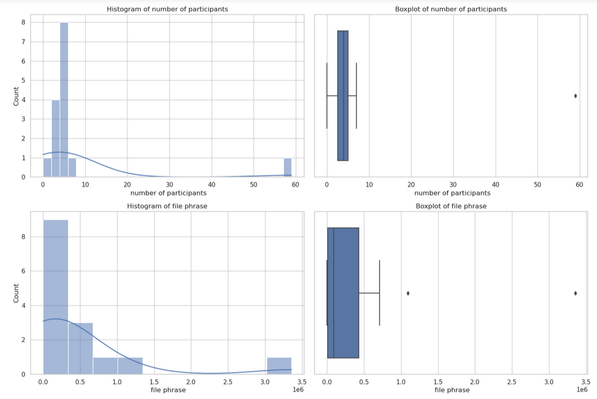
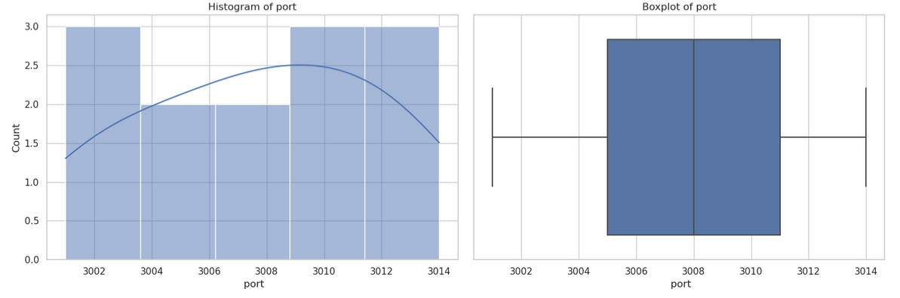

# 程式碼解釋器範例

{: .no_toc }

<details open markdown="block">
   <summary>
     Table of contents
   </summary>
   {: .text-delta }
- TOC
{:toc}
</details>
---

## 背景

- 目標：啟動openAI code interpreter助理，完成NLP指令(zero code)，執行csv檔案分析
- 架構
  - 指定分析檔案對象(分析單元)
  - 啟動助理(session、計費單元)
  - 接受NLP指令，上傳指令、完成分析、解析結果、列印結果
- code interpreter特色中文介紹
  - ChatGPT Code Interpreter 八種應用：分析 Excel、製作圖表與動畫 by [ Esor Huang 7月 08, 2023 ](https://www.playpcesor.com/2023/07/chatgpt-code-interpreter-excel.html)
  - ChatGPT Code Interpreter: 用自然語言進行數據分 by [Simon Liu(2023)][Simon Liu(2023)]

## 檔案對象範例

- 檔名：`any20240529.csv`
- 各分組的對話次數,參與人數,文件詞組,port等內容
- 最末列為"合計"，不應納入分析。
- 欄位值有可能會有加號(`+`)、千分位(`,`)等字元標示的干擾，並非單純的整數
 
```python
In [64]: !head -n1 any20240529.csv
,分組,對話次數,參與人數,文件詞組,port
In [65]: !tail -n1 any20240529.csv
14,合計,750+,59+,"3,357,487+",NaN
```

## 安裝與環境設定

- `conda activate llm`：啟動python  3.9.16
- `pip install openai`：以下使用 open 1.30.4
- `export OPEN_AI_KEY='sk-***'`：環境變數
- `pip install ipython && ipython`：安裝、啟動作業環境
  
## 執行步驟

### 指定分析檔案對象

```python
from openai import OpenAI
client = OpenAI()

fname='any20240529.csv'
file = client.files.create(
  file=open(fname, "rb"),
  purpose='assistants'
)

```

### 啟動助理

```python
assistant = client.beta.assistants.create(
  instructions="You are a personal python tutor. When asked a coding question, write and run code to answer the question.",
  model="gpt-4o",
  tools=[{"type": "code_interpreter"}],
  tool_resources={
    "code_interpreter": {
      "file_ids": [file.id]
    }
  }
)
```

### 定義串流

- 串流的內容需要綁定**主題**(`thread_id`)與前述**助理**(`assistant_id`)
- 構成**主題**(`thread`)
  - 每個NLP指令(`cmd`)需搭配角色(`role`)、附件(`attachments`)、並包括在內容(`content`)之內，以形成主題的訊息(`messages`)
- 定義完`stream`，隨即提交執行(讀取即執行)。
- 後處理：`event`的內容非常龐雜，由其中萃取我們需要的訊息即可。
  - 名稱篩選：`event`名稱為`'thread.message.completed'`
  - 內容篩選：`event.data.content[0].text.value`


```python
def run_cmd(cmd):
  thread = client.beta.threads.create(
    messages=[
    {
      "role": "user",
      "content": "I need to solve the problem \`"+cmd+"\`. Can you help me?",
      "attachments": [
        {
          "file_id": file.id,
          "tools": [{"type": "code_interpreter"}]
        }
      ]
    }
  ]
  )

  stream = client.beta.threads.runs.create(
    thread_id=thread.id,assistant_id=assistant.id,stream=True
  )
  for event in stream:
    if  event.event=='thread.message.completed': print(event.data.content[0].text.value)

  return
```

## 數據分析執行與結果

### 執行方式

```python
In [66]: run_cmd("這個數據集的基本資訊?")
In [67]: run_cmd("哪個分組有最高的「參與人數」?")
In [68]: run_cmd("哪各分組有最高的「參與人數」，且分組名稱不等於「合計」?")
In [69]: run_cmd("哪個分組有最高的「參與人數」，注意欄位的值有可能有加號(「+」)的干擾，且分組名稱不等於「合計」?")
```

### 執行結果

```python
In [69]: run_cmd("哪個分組有最高的「參與人數」，注意欄位的值有可能有加號(「+」)的干擾，且分組名稱不等於「合計」?")
Sure, let's start by inspecting the contents of the uploaded file to understand its structure. This will help us to solve the problem by identifying the group with the highest "participant count."

We will load and display the first few rows of the file to get an idea of its format.
It seems the file format is not recognized as CSV or Excel. Let's check the exact name and extension of the file to identify its type.
The file does not have an extension, which is probably why it couldn’t be identified properly. Let’s try reading the file as a CSV with different delimiters and determine its structure.

We will read the first few lines as text to better understand how to parse it.
The file appears to be in CSV format, and it looks like it uses commas as delimiters. Additionally, certain columns have "+" signs and spaces within the values.

Here is the plan:

1. Load the file as a CSV, handling potential spaces and "+" signs in the participant counts.
2. Filter out any rows where the group name is "合計".
3. Convert the "參與人數" column to numeric values by removing any "+" signs.
4. Identify the group with the highest participant count.

Let's perform these steps in code.
The dataframe has been loaded successfully. Now, let's focus on cleaning and processing the "參與人數" column to identify the group with the highest participant count. We will remove any "+" signs and convert the values to numeric. Also, we will filter out rows where the group name is "合計".
The group with the highest number of participants is \( 研發及資訊部 \) with 7 participants.

If you need any further analysis or assistance, feel free to ask!
```

## 圖形分析與結果

- 這題的目標是用NLP來產生csv檔案的分析圖形。在openAI的GPT服務中，只限plus會員才能進行繪製分析圖的功能(詳[介紹][Simon Liu(2023)])。
- openAI系統(可能是docker)繪圖模組沒有安裝中文字形，因此需先將csv中的所有中文，都轉成英文。
- 由於openAId docker的顯示介面只在他們公司的系統相容，因此會需要從`stream`結果萃取出python程式碼，複製出來，另外在本地的jupyter上執行。

### 介面與安裝

- 會需要`jupyter-notebook`
- 使用`matplotlib`及`seaborn`

### 萃取event中的程式碼

- event的過程步驟有很多，直接選取`'thread.run.step.completed'`來分析
- 如果是單純的訊息(`type='message_creation'`)，沒有程式碼，需要跳過。
- 最後輸出`event.data.step_details.tool_calls[0].code_interpreter.input`
- 以下這段程式碼，取代前述`def run_cmd`的最末段。

```python
for event in stream:
    if event.event=='thread.run.step.completed':
        a=event.data.step_details
        if a.type!="message_creation":print(a.tool_calls[0].code_interpreter.input)
```

### 生成繪圖程式碼

```python
In [71]: run_cmd("產生此數據集的各個欄位變數的統計圖形檔案，使用streamlit套件，生成程式碼。")
```

- 結果如下。輸入檔名為上載至docker上的檔名，需要修改成本地檔案名稱(前述`fname`)。

```python
import pandas as pd

​# Load the dataset

file_path = '/mnt/data/file-pkHahW6gd2M88UV1C3vf0xjx'
data = pd.read_csv(fname)

# Display the first few rows of the dataset and its info to understand its structure
data.head(), data.info()

import seaborn as sns
import matplotlib.pyplot as plt

# Clean the 'number of conversations', 'number of participants', and 'file phrase' columns
columns_to_clean = [
    ' number of conversations', 
    ' number of participants', 
    ' file phrase'
]

# Remove non-numeric characters and convert to numeric

for col in columns_to_clean:
    data[col] = pd.to_numeric(data[col].str.replace('[^0-9]', '', regex=True))

# Check the cleaned data
data.head()
# Setup the plotting environment and specify the columns for plotting

sns.set(style="whitegrid")

columns_to_plot = [' number of conversations', ' number of participants', ' file phrase', ' port']

​# Generate the plots
fig, axes = plt.subplots(nrows=4, ncols=2, figsize=(15, 20))

for i, col in enumerate(columns_to_plot):
    # Histogram
    sns.histplot(data[col], kde=True, ax=axes[i, 0])
    axes[i, 0].set_title(f'Histogram of {col.strip()}')
    # Boxplot
    sns.boxplot(x=data[col], ax=axes[i, 1])
    axes[i, 1].set_title(f'Boxplot of {col.strip()}')

plt.tight_layout()
plt.show()
```

### 結果圖形





### 檔案位置

- `/nas2/kuang/MyPrograms/query_anything/CI_query.ipynb`

[Simon Liu(2023)]: https://blog.infuseai.io/chatgpt-code-interpreter-data-profiling-application-2a6cfced574a "ChatGPT Code Interpreter: 用自然語言進行數據分 by Simon Liu(2023)"

## js版本

我們可以使用 JavaScript 實現程式碼解釋器。

### 程式碼

程式碼如下：

```javascript

const openai = require('openai');
const client = new openai.OpenAIClient();

async function runCmd(cmd) {
  const thread = await client.beta.threads.create({
    messages: [
      {
        role: 'user',
        content: `I need to solve the problem \`${cmd}\`. Can you help me?`,
        attachments: [
          {
            file_id: file.id,
            tools: [{ type: 'code_interpreter' }]
          }
        ]
      }
    ]
  });

  const stream = await client.beta.threads.runs.create({
    thread_id: thread.id,
    assistant_id: assistant.id,
    stream: true
  });

  for await (const event of stream) {
    if (event.event === 'thread.message.completed') {
      console.log(event.data.content[0].text.value);
    }
  }
}

const file = await client.files.create({
  file: fs.createReadStream('any20240529.csv'),
  purpose: 'assistants'
});

const assistant = await client.beta.assistants.create({
  instructions: 'You are a personal python tutor. When asked a coding question, write and run code to answer the question.',
  model: 'gpt-4o',
  tools: [{ type: 'code_interpreter' }],
  tool_resources: {
    code_interpreter: {
      file_ids: [file.id]
    }
  }
});

await runCmd("哪個分組有最高的「參與人數」，注意欄位的值有可能有加號(「+」)的干擾，且分組名稱不等於「合計」?");
```

### 步驟說明

這個 JavaScript 程式碼使用了 OpenAI 的 API 來實現類似的功能。主要步驟如下:

1. 初始化 OpenAI 客戶端。
2. 定義 runCmd 函數,用於執行命令並獲取結果。在 runCmd 函數中：
   - 創建一個新的對話線程。
   - 在線程中發送用戶請求。
   - 創建一個新的對話運行,並以流的方式獲取結果。
   - 在結果流中,輸出每個完成的消息。
3. 創建一個 CSV 文件作為工具資源。
4. 創建一個新的助手,並使用之前創建的文件資源。
5. 調用 runCmd 函數,執行指定的命令。

請注意,這只是一個基本實現,您可能需要根據實際需求進一步完善和優化這個程式碼。同時,您還需要安裝和設置 OpenAI 的 JavaScript 客戶端庫,並提供適當的 API 密鑰。