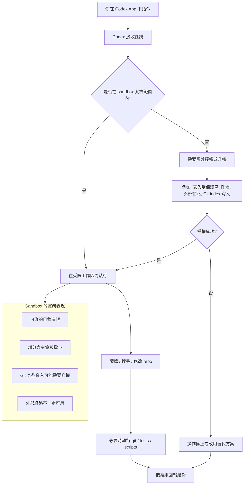

# CODEX的沙盒
{: .no_toc }

  

    Table of contents
  

  {: .text-delta }
- TOC
{:toc}

---

## 背景

在 Codex 這個 app 裡，`sandbox` 可以把它理解成一個「受控工作區」。Codex 不是直接在你整台電腦上隨便跑，而是在一個有邊界的環境裡做事，只能安全地讀寫允許的目錄，像你現在這個工作樹就是其中一部分。這樣做的目的，是讓它能幫你改檔、跑命令、查狀態，但不會不小心碰到工作區外的系統。

## 實務上有幾個重點：

1. `sandbox` 會限制可寫範圍  
   你目前這個環境只允許改 `C:\Users\4139\Documents\GitHubRep\AIEE` 和 `C:\tmp` 這類可寫目錄，所以我可以改 repo 內的檔案，但不能任意去系統其他地方寫東西。

2. 讀寫不是完全自由的  
   一般檔案讀取、搜尋、簡單修改通常可以直接做；但像 `git` 要寫 `.git/index.lock`、刪除檔案、或某些可能碰到權限邊界的動作，就可能被 sandbox 擋住，這時要請求提升權限。

3. 網路通常是受限的  
   sandbox 不是把網路當成理所當然可用；需要下載套件、拉遠端資料、碰外部服務時，常常要另外確認或授權。

4. 危險操作會被刻意卡住  
   像遞迴刪除、重設 Git、覆蓋檔案、或影響工作區外的動作，系統會要求更明確的判斷，避免一次操作把東西弄壞。

5. 你看到的很多流程，其實是在「沙盒內做事、再把結果帶回來」  
   例如我剛剛幫你處理 `.gitignore`、`git rm --cached`、`git restore --staged`，本質上都是在 sandbox 允許的範圍裡，盡量把變更限定在 repo 內。

## 你可以把它想成三層：

- 最外層：你的真實機器
- 中間層：Codex 的受控工作區 sandbox
- 內層：我實際執行的命令、檔案修改、Git 操作

## 實務建議很簡單：

- 需要改 repo 內容時，直接讓 Codex 做，通常最順
- 涉及 Git index、刪檔、系統權限、或外部下載時，要預期可能需要授權
- 如果你看到類似 `Permission denied`、`index.lock`、或「要 escalate」的訊息，通常不是程式壞了，而是 sandbox 在保護邊界

如果你要，我也可以接著用你剛剛這個 repo 的例子，幫你畫出「Codex 在本機 repo 裡實際怎麼工作」的流程圖。

## 流程圖

## 工作樹

> 例如...C:\Users\4139\.codex\worktrees\83a2\AIEE，把我的repo複製了一份?
> 所以就是sandbox的實質位置?

對，`C:\Users\4139\.codex\worktrees\83a2\AIEE` 這種路徑，通常就是 Codex 為了工作而建立的**獨立工作副本**，目的不是備份你的 repo，而是讓 AI 在一個隔離環境裡改檔、跑測試、做實驗，避免直接動到你原本的工作區。

可以把它理解成：

- **原始 repo**：你平常正在用的那份
- **`.codex\worktrees\...`**：Codex 用來操作的另一份工作樹
- 修改通常先發生在這裡，再回頭同步成 patch、commit，或提供給你 review

這樣做的好處是：

- 不會干擾你主工作區
- 可以同時做多個任務、不同分支、不同實驗
- 出問題時比較容易丟掉這個工作樹，不影響原 repo

所以答案是：

- **是，有點像複製了一份**
- 但更精確地說是 **git worktree / 獨立工作副本**
- 不是單純備份，而是 **給助理安全操作用的隔離工作區**

更準確地說：

- `C:\Users\4139\.codex\worktrees\...` 是 **Codex 用來工作的實體檔案位置**
- 這個位置通常就是我在本機上操作 repo 的地方
- 所以它常常扮演「sandbox 的落地工作區」角色

但它跟「sandbox」還是有一點差別：

- **sandbox** 是權限與隔離邏輯
- **worktree 路徑** 是實際存放檔案的磁碟位置

也就是說：

- sandbox 決定我能不能讀、能不能寫、能寫到哪裡
- worktree 決定我實際改的是哪一份檔案

所以你可以把它想成：

- **sandbox = 規則**
- **`.codex\worktrees\...` = 規則作用下的工作現場**

如果你要一句話版本：

- **是，基本上就是 sandbox 在磁碟上的工作區落點，但更精確地說它是「受 sandbox 保護的實體 worktree」**

如果你願意，我也可以接著把這三個東西畫成一個簡單關係圖：`原 repo`、`worktree`、`sandbox`。