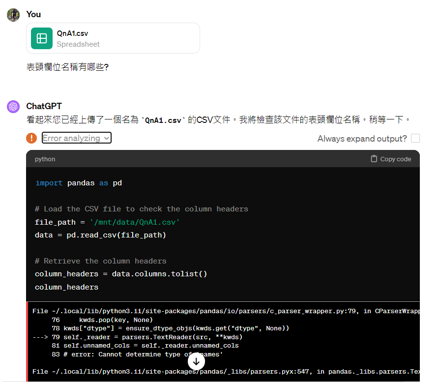
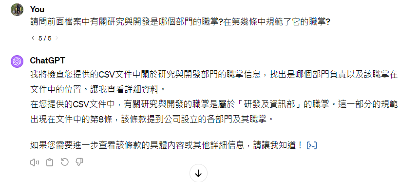
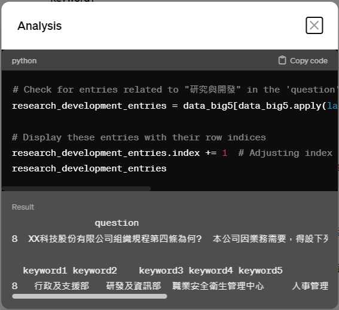
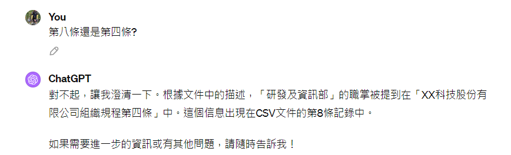
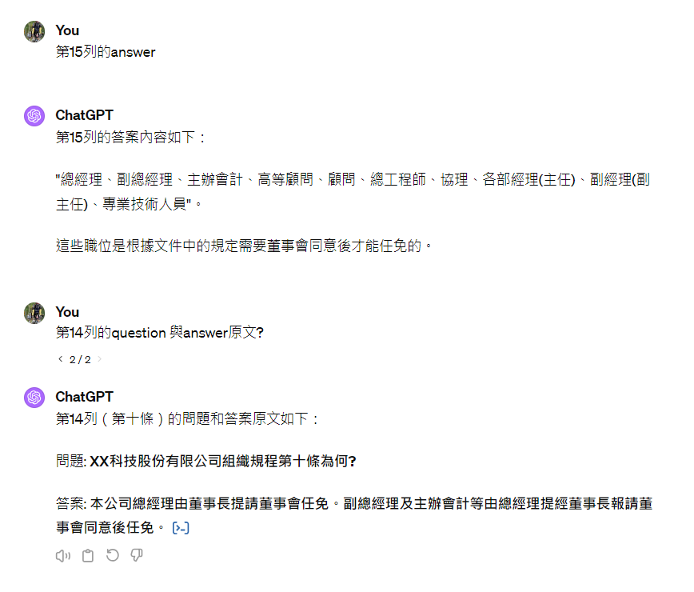

# GPT4 with csv inputs
{: .no_toc }

<details open markdown="block">
  <summary>
    Table of contents
  </summary>
  {: .text-delta }
- TOC
{:toc}
</details>
---

## 背景

- 將一個csv檔案輸入到GPT4時，GPT4會啟動分析工具，而不只是語言模型。
- 其過程與結果將在此處討論

## 輸入檔案

- 素材：XX科技股份有限公司組織規程
- 表頭欄位名稱：
  - question
  - answer
  - keyword1
  - keyword2
  - keyword3
  - keyword4
  - keyword5
- 關鍵字的產生：GPT3-turbo
- 10題簡答題與答案的產生：GPT3-turbo
- 其餘：自公司網頁複製貼上

## 執行過程

### 表頭欄位名稱

- GPT4會產生python code來分析所提供的csv檔案，如過出錯，會自行修正，直到成功。



### string findings

- note:
  - 要特別指定檔案分析，否則GPT4傾向以LLM回答(懶化)
  - 不會找相近詞(too sharp)：$ 「研究與開發」 \neq  「研究開發」 \neq 「研究發展」 $
  - "條"的誤解
    - 阿拉伯數字+條$ \rightarrow $ csv檔案的row number
    - 國字+條$ \rightarrow $ 法律條文的序號

 



```python
# Check for entries related to "研究與開發" in the 'question' and 'answer' columns
research_development_entries = data_big5[data_big5.apply(lambda x: "研究與開發" in x['question'] or "研究與開發" in x['answer'], axis=1)]

# Display these entries with their row indices
research_development_entries.index += 1  # Adjusting index to be 1-based for user convenience
research_development_entries
```



### 技術經理

- 如不指定文件，GPT4傾向忘記前面讀進的檔案(懶化)
- 如不指定「全文」只會尋找前幾行(懶化)

```bash
user
搜尋文件所有內容，顯示有關技術經理的規定有哪些?
```

```bash
assist
你提供的文件似乎是一個CSV格式的文件。我將會開啟這個文件，搜尋其中提及到「技術經理」的內容，並展示相關規定。讓我先查看文件的內容結構。

看起來在嘗試打開CSV文件時發生了編碼錯誤。這通常發生在文件使用了非UTF-8的編碼。我將試著使用其他常見的編碼方式來打開這個文件，例如Big5，這是一個在繁體中文文件中常用的編碼方式。讓我再次嘗試。

文件已成功開啟，我可以看到資料包括了問題（question）、答案（answer）和多個關鍵字欄位。為了找到有關「技術經理」的規定，我將搜尋答案欄位中包含「技術經理」的相關內容。讓我來進行這個搜尋。

根據文件中的信息，有關「技術經理」的規定提到在組織架構中，各部門可設有不同職位，包括協理、經理或主任等，這些人員需按照總經理或副總經理的指示來主管各自部門的業務。此外，高層管理職位如技術經理的任免可能需要董事會的同意。下面是具體的條文摘要：

1. 各部分別置主管各一人，得為協理、經理或主任。各部門的技術經理包括在內，需要秉承總經理或副總經理的指示來管理各自的業務 。
2. 總經理由董事長提請董事會任免，而副總經理及主辦會計等則由總經理經過董事長報請董事會同意後任免 。
3. 涉及高層管理職位的任免，如總經理、副總經理、主辦會計、技術經理等，通常需要董事會的同意 。

這些規定涉及到公司的組織結構和高層職位的管理職責及任免程序，反映了公司內部的管理規範和操作流程。如果你需要更詳細的資訊或其他相關內容，請告知。
```

```python
# Filter the rows that contain the term "技術經理" in the 'answer' column
tech_manager_data = data_big5[data_big5['answer'].str.contains('技術經理')]

# Display the filtered data
tech_manager_data
```

### 行列之指定

- csv檔的行列是按照pandas的序位計算，不是按照從1開始的excel計算
- 如果沒有指定，GPT4傾向摘要內容(消化後之記憶)回答，而不是回答原文
- 指定原文，GPT4才會重新分析，並陳報結果。



## 結語

- GPT4懶化非常嚴重，prompt條件要嚴格、詳細
- GPT4是用pandas的概念、以字串來解讀csv檔，不是以語言模型之訓練或微調。