# 👩‍💼 Page Assist 🌐

{: .no_toc }

  

    Table of contents
  

  {: .text-delta }
- TOC
{:toc}

---

::: important

[Page Assist][pa](頁面輔助)：

使用本地GPU運行的 AI 模型 🦙 來協助您瀏覽網頁、完成生成任務。

- 介面型態：側邊欄和 Web UI。
- 利用本地運行的 AI 模型在您瀏覽時進行交談，或
- 作為本地 AI 模型提供者（如 Ollama、Chrome AI 等）的 Web UI。
- 無須帳密或[API](#api)金鑰

:::

## 您需要安裝[Page Assist][pa]的3個好理由🧑

- 連結地端 AI 🦙 的好處與必要性：免費、無限、機敏。
- 單純：不佔記憶體、快速啟動、沒有額外的[剪貼工具列](./Sider.md#剪貼存取及分享)不會干擾網頁瀏覽的畫面。
- 單一窗口：快速提供 AI 的基本功能、不需啟動其他APP或伺服器來提供服務。

## 安裝

- 按照一般網路瀏覽器擴充功能的安裝方式
- 也可以參考[這段落](./Sider.md#sider安裝步驟)。

## 啟動擴充功能

- 因為擴充功能(插件)會占用不少記憶體，即使經過安裝與設定，一般瀏覽器設定是選擇不開啟的。每次開啟瀏覽器後，還是需要再次啟動[Page Assist👩‍💼][pa]喚醒其功能。
- 此處先介紹啟動方式，使用者如果還沒有連接好語言模型，還需進一步[設定](#設定地端ollama)才能開始使用聊天或網搜功能。
- [chrome](#chrome)與[Edge](#edge)的畫面小圖標與啟動方式略有不同，分別說明如下。

### chrome

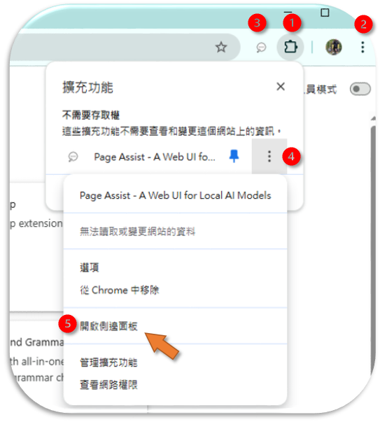

- 如果沒有上圖位置1的拼圖小圖標，可以點選設定 ( 如上圖位置2三個點小圖標下拉選單中選出，在延伸選單中選出，在**管理擴充功能**頁面中開啟至少一個插件)，就會出現拼圖小圖標。
- 如果沒有上圖位置3的[Page Assist👩‍💼][pa]小圖標：按下拼圖小圖標，釘上圖釘，即可將[Page Assist👩‍💼][pa]小圖標固定在頁面工具欄。

#### 對話網頁

- 直接點選上圖位置3的[Page Assist👩‍💼][pa]小圖標，就可以啟動[Page Assist👩‍💼][pa]整頁的對話框頁面(web UI)。

#### 右側邊欄

- 功能與整頁的對話框功能並沒有太大的差別，但若要以網頁內容來進行AI對話，就必須要開啟側邊欄。
- 可以在上圖(位置4)三個點小圖標下拉選單中選出(上圖位置5)：**開啟側邊面板**

### Edge

- 與chrome類似：

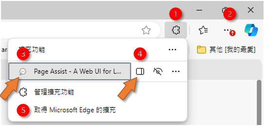

#### 對話網頁

- 如果沒有拼圖的小圖標，可以點選設定(上圖位置2三個點小圖標下拉選單中選出，在延伸下拉選單中選出，並在**管理擴充功能**頁面中允許至少一個插件)，就會出現拼圖小圖標。
- 如果工具列上沒有[Page Assist][pa]小圖標，可以點選拼圖出現所有插件，在[Page Assist][pa]小圖標旁邊三個點下拉選單中選擇**在工具列顯示**，即可將[Page Assist][pa]小圖標固定在頁面工具欄。
- 直接點選工具列上的小圖標、或點選上圖(位置3)[Page Assist][pa]的小圖標，就可以啟動[Page Assist][pa]整頁對話框頁面(web UI)。

#### 右側邊欄

- 如果使用者要以網頁的內容來進行AI對話，需要開啟側邊欄。
- 需要在上圖位置1進入擴充功能下拉清單，點選[Page Assist][pa]旁的側邊欄小圖標(上圖位置4)來開啟側邊面板。

## 設定地端ollama

- 安裝完插件、順利開啟插件頁面(web UI)或側邊欄之後，如果還沒有連上語言模型，仍無法進行聊天，這需要指定語言模型伺服器的位置。
- 此處以公司地端ollama為連接對象。位置及連接設定說明如下。

### 開啟插件的設定

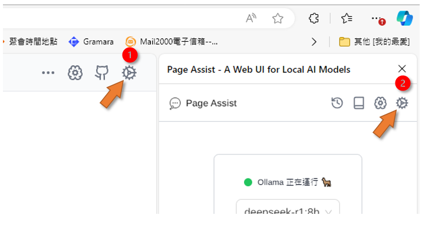

- 不論側邊欄或網頁的右上角，都有齒輪小圖標，點選即可進入[Page Assist][pa]設定

::: important

要**先**能夠連上地端ollama，才能進行後續模型選擇、[RAG](#rag)內嵌模型等等的設定。

:::

### 地端ollama的位置

- [Page Assist][pa]可以通過DNS，為資安保護請不要以數字IP鍵入
- 目前公司的GPU共有3片。運轉時況公告在[這裡](https://eng06.sinotech-eng.com/v2/news.html)或[系統手冊首頁](https://eng06.sinotech-eng.com/v2/shared/zh/)。
- GPU0,1
  - L40 &rightarrow;http://l40.sinotech-eng.com:55083 (尾端不能出現正斜線分隔)
  - 適用長時間、記憶體耗用較大的計算，如轉錄、反思工作流、長篇文章的翻譯或RAG等等作業。
- GPU2
  - eng06 &rightarrow;http://eng06.sinotech-eng.com:55083 (尾端不能出現正斜線分隔)
  - 適用短時間、需快速回應、記憶體耗用較小的對談、小檔案的RAG。
- 如果遇到GPU滿載，請自行切換。

### 填寫ollama設定

- 下圖位置1進入ollama設定畫面
- 在Ollama URL處填寫上述網址(下圖位置2)
- 開啟**進階配置**，打開**啟用或停用自訂來源 URL**(下圖位置3)，讓插件可以接受**自訂**來源，
  - 否則插件會連上**內定**官方來源。
  - 填入一樣的URL即可。
- 啟用**自動 Ollama CORS 修復**(下圖位置4)
- 記得要**儲存**。

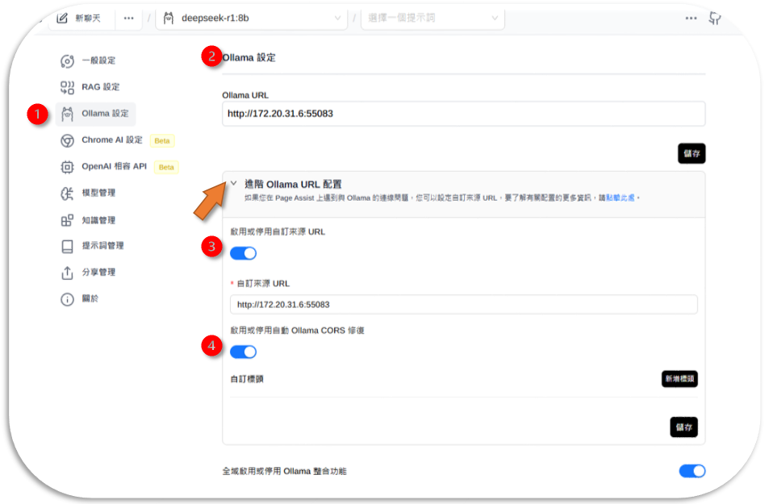

::: important
一定要在**進階配置**設定**自訂**來源，否則會連不上線。
:::

### 模型管理

- 這裡有連線成功之地端模型列表，分為[Ollama官方模型](https://ollama.com/search)與自訂模型，可以刪除、更新。

::: danger

- 因地端連線並沒有設定密碼及權限關卡，任何人都可以進行本頁的操作。
- 模型的更動會影響到伺服器穩定性、也會讓他人不能正常使用。請勿任意更動。

:::

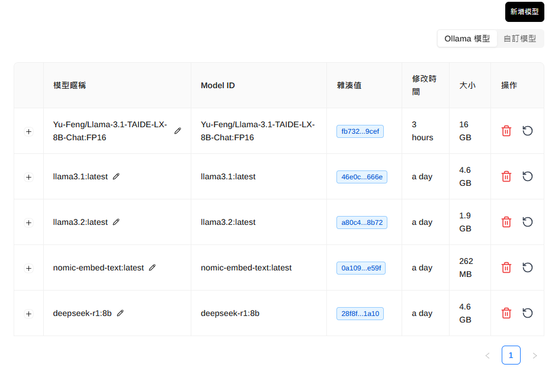

### RAG設定

- 嵌入模型只有一個選項。連線好之後從下拉選單選定即可。
- 文字分割器：需設定章節遞迴(**RecursiveChapterTextSplitter**)拆分處理
- 區塊大小與檔案類型有關，設定太小會無法理解前後文、太大則會模糊。
- 檢索到文件數：上限值。太多會越模糊。
- 知識庫上傳限制：太多，生成結果會越模糊。

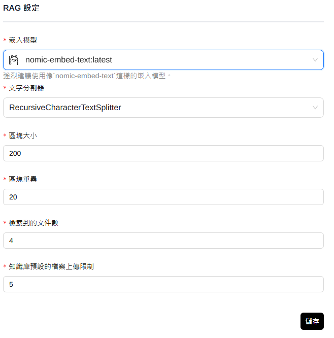

- 與網站聊天使用嵌入模型
  - 要打開此一功能，插件才會理解網頁內容。
  - 如果沒有使用，要記得退出插件、或關閉選項。否則一重整網頁，就會啟動GPU進行RAG內嵌。
- 提示詞：選擇語言後，會自動加入"使用繁體中文"，如果沒有，記得加入。

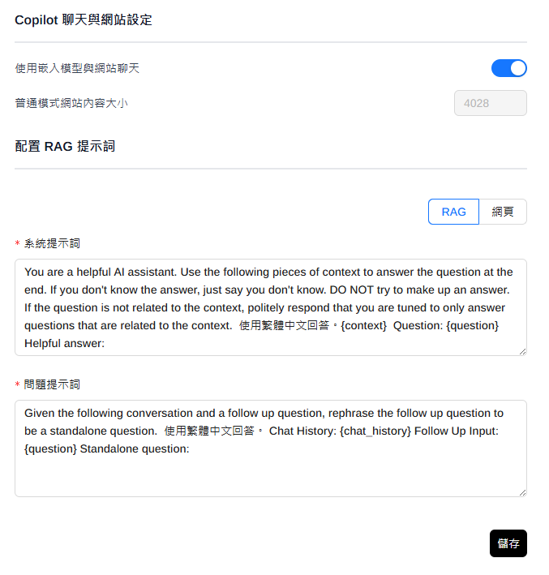

## 一般設定

### 語言與其他

語言可能要先修改，否則所有設定過程都是英文。

- 其他可以按照個人的意願點選
- 開啟越多功能，所耗費的記憶體就越多。

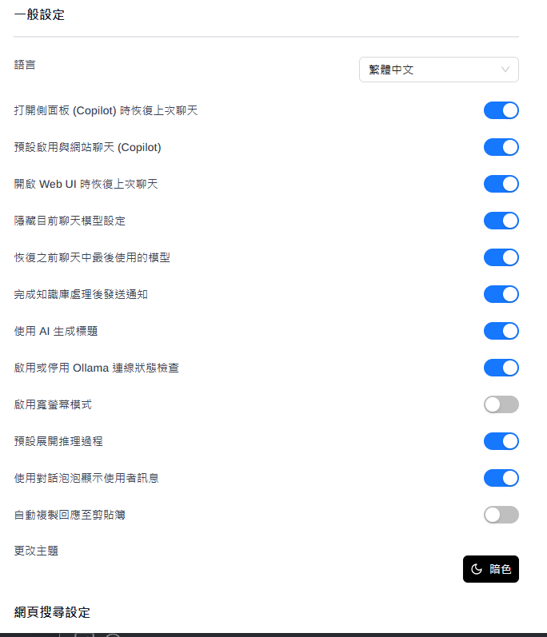

### 網頁搜尋

> 不同搜尋引擎找的領域、國家地區會略有不同，也將會決定語言模型的輸出內容。

- 內設是中國的**DuckDuckGo**，會以中國地區的網站內容為搜尋對象。
- Google引擎還可進一步點選地區。
- 自行架設的搜尋引擎如`SearXNG `，還需要先連上搜尋引擎的伺服器URL。

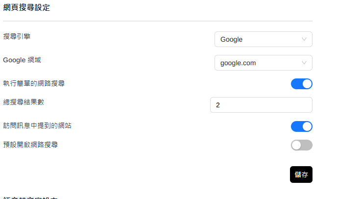

### 語音

- 語音轉文字、文字轉語音等設定：對行動裝置比較有用。

### 系統設定

> 字體大小、工具列小圖標及下拉選單的效果

- 如果希望點選工具列小圖標後是出現側邊欄，可在此修改(內設是出現整頁web UI)。
- 其他也有匯出匯入功能、一鍵重置系統等(小心⚠️)

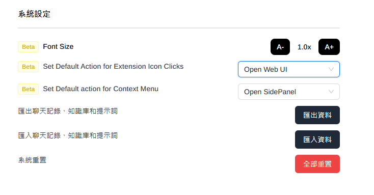

## Page Assist的應用

### 輸入與模型選擇

> 除了提示本身之外，模型種類、是否上網搜尋、或與網頁、提供的檔案對談等等條件，也會影響生成的結果。

- 開啟[對話框](#啟動)
- 確認[連線](#設定地端ollama)(下圖位置1)及[模型](#模型管理)(下圖位置2)
  - llama3.1:latest&rightarrow;一般性、較單純。(8b&rightarrow;少量token)
  - llama3.2:latest&rightarrow;一般性、較複雜
  - reflection:latest&rightarrow;複雜推理工作、反應慢、需記憶體(僅L40)
  - deepseek-r1:8b&rightarrow;推理工作、較單純、反應快
  - llama-3.1-TAIDE-LX-8B-Chat&rightarrow;台灣官方版本llama3.1
- 鍵入問題(下圖位置3)、是否[搜尋網頁](#網頁搜尋)(下圖位置4)，按下送出(下圖位置5)即可。

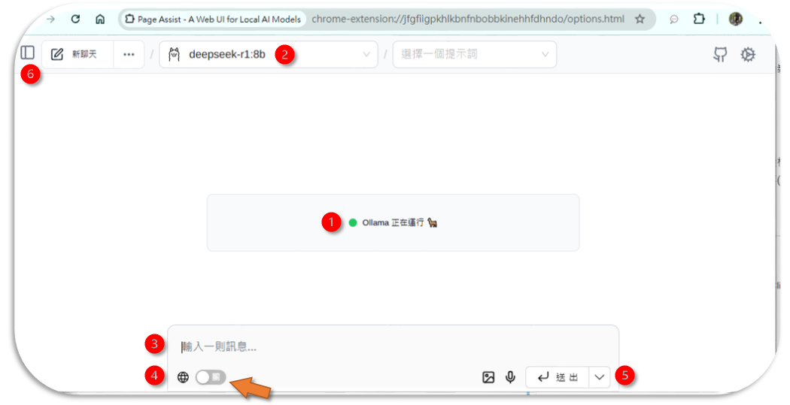

::: important

**直白**、**一般性**的問題，交給一般模型。`"甚麼是對等關稅政策?"`
要**繞彎**的問題，再交給推理模型。如`"美國對等關稅政策造成電子股下挫的原因、未來發展如何?"`
否則語言模型會給出奇怪的結果。

:::

### 應用案例

> 以下是作者對地端語言模型生成結果的評論，您可以自行重製看看。

語言模型|問題|評論
-|-|-
llama3.2|跟高中生簡短介紹一下甚麼是API|回答完整、善解人意、靈活修改
taide|摘要此一網頁的內容|面面俱到、回答快速
reflection|給我這一網頁(Page Assist 頁面輔助)的修改意見|reflection的強項在反省與推理，常常可以提供完整、批判即針對性的好意見|
deepseek-r1|美國對等關稅政策造成電子股下挫的原因、未來發展如何?(上網搜尋)|鞭辟入裡、意見犀利

### 輸出

> [Page Assist][pa]提供了每個對話的輸出(下圖位置1\~5)、以及本次所有對話的輸出(下圖位置6\~8)等2種方式。

1. 朗讀
2. 文字複製、沒有格式
3. 生成資訊：耗費資源與結果統計
4. 重新生成：修改語言模型、網路搜尋引擎等設定後、重作。
5. 編輯：因語言模型會依照過去結果繼續生成，如果發生錯誤需要及時修正，免得後續納入提示。
6. 進入批次後處理： 輸出目前工作段落 AI 所有的回復
7. 複製：複製到剪貼簿、讓使用者切換到筆記系統自行貼上(`ctrl V`)。
8. 下載：有4種格式可供選擇。可以進行後處理或連接。

### 聊天紀錄

> 何時會用到聊天紀錄：1.回復到前一討論主題、2.測試比較不同模型之輸出、3.整理筆記、4.聊天紀錄檔案管(清)理

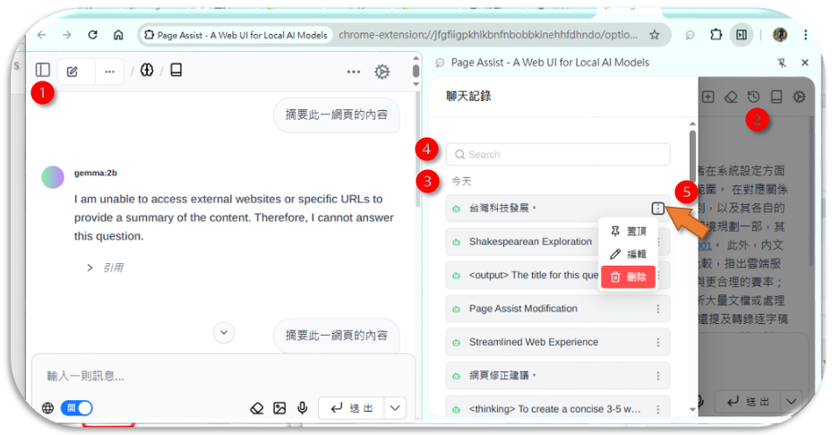

1. web UI的聊天紀錄：在左上方、類似側邊欄的小圖示，點選進入。
2. 右側邊欄對話框的聊天紀錄：時鐘小圖示，點選進入。
3. 聊天紀錄畫面的時間排序：語言模型會自行產生一個主題，並按照時間排序，可以滾輪翻頁。如果沒有顯著的主題，[Page Assist][pa]也會隨機產生一個題目。
4. 搜尋框：可以快速定位到指定的歷史紀錄
5. 點選設定：可以置頂、編輯(標題)、或刪除。

## 會員與紀錄管理

> 會員是系統資源分配的單元。，何以[Page Assist][pa]不需要會員?沒有會員又如何管理?

- 因為[Page Assist][pa]是個開源計畫，本身也沒有提供計算服務可以收費，因此沒有另外設計會員以及管理系統，就只是使用本機以及地端GPU的資源。

### 使用者本機上的紀錄

- 一般瀏覽器的延伸插件與其紀錄，都會存在使用者目錄下、瀏覽器名稱下的目錄。
- 隨著「使用者帳號同步」，瀏覽器會複製本地紀錄、通過雲端帳號的中轉、複製到不同的機器上。
- 如果不清理：本機的容量將會越來越大。
  - 這個部分沒有辦法從**清除瀏覽網頁**將其清除，
  - 也找不到一個明顯的目錄可以清除，因為融合在其Cache中了。
  - 必須以每個使用者的帳密登入、開啟每一種類的瀏覽器、回到[Page Assist][pa]介面，一一的清除歷史對話。
- 建議：將設定方式記錄下來，直接去擴充功能管理介面刪除延伸插件，所有紀錄(當然也包括設定)，就可以一鍵清除。

### 遠端主機上的Ollama docker紀錄

- Ollama會記錄每個呼叫的來源IP、工作型態以及耗費的時間與記憶體。
- 從IP的位置可以連結到部門與使用者
- docker內的history會記錄使用者的提問，但這部分目前還沒有設計存檔方式。

## 地端使用openAI之gpt-o4

### openAI公開其gpt權重

- 官網：[Introducing gpt-oss, 2025/8/5](https://openai.com/index/introducing-gpt-oss/)

#### 摘要

OpenAI 發布兩款開源權重推理模型 gpt-oss-120b 與 gpt-oss-20b，在推理、工具使用與安全性上達到同級最佳，並以 Apache 2.0 授權提供，能在消費級硬體高效運行並接近/超越同尺寸專有模型表現。兩者採用先進的 MoE 架構與長上下文設計，經監督微調與高計算量強化學習後，於程式、數學、醫療與代理工具評測中表現亮眼，且支援可調整「推理力度」、結構化輸出與完整思維鏈（CoT）。在安全方面，官方進行了最壞情境微調評估與外部審查，並啟動紅隊徵案以促進生態安全，同時提供廣泛部署與開發工具，降低各界採用與創新的門檻。

#### 重點

- gpt-oss-120b 與 gpt-oss-20b 為開源權重模型（Apache 2.0），在推理任務上達到同級最佳且成本低廉。
- 120b 在多項核心評測接近或超越**o4-mini**，20b 在常見評測相當於**o3‑mini**，並於競賽數學與醫療任務上表現突出。
- 模型原生支援長達 128k 上下文、完整思維鏈（未直接監督 CoT）、結構化輸出與工具使用（如網搜、Python）。
- 採 Mixture-of-Experts、交替稠密與局部帶狀稀疏注意力、分組多查詢注意力與 RoPE；120b 僅啟用 5.1B 參數/Token、20b 為 3.6B。
- 後訓練沿用 o4-mini 流程（SFT + 高計算 RL），並提供低/中/高三檔推理力度以在延遲與效果間權衡。
- 安全性經資料過濾（CBRN）、深度對齊與指令層級訓練，且針對生物與資安進行最壞情境微調測試，能力未達高風險門檻並通過外部審查。
- 官方提醒不應向終端用戶直接呈現 CoT，因其可能包含幻覺、有害或不符合安全政策的內容。
- 權重以 MXFP4 量化釋出：120b 可在 80GB GPU 運行，20b 僅需 16GB 記憶體，適合在地端與邊緣設備部署。
- 提供 harmony 提示格式與渲染器（Python/Rust）、PyTorch 與 Apple Metal 參考實作，以及多家平台/硬體的廣泛部署支援。
- 與 AI Sweden、Orange、Snowflake 等夥伴合作實測場景，並舉辦 50 萬美元紅隊挑戰以促進開源安全與社群共識。
- 開源模型補足託管模型生態，降低新興市場與中小組織門檻，擴大民主化與透明的 AI 研發。

#### 延伸問題

- [開源權重模型在企業資料主權與合規上的最佳實踐為何？](chrome-extension://difoiogjjojoaoomphldepapgpbgkhkb/sidepanel.html#related)
- [如何安全地監控與利用非監督 CoT 以提升系統可靠性？](chrome-extension://difoiogjjojoaoomphldepapgpbgkhkb/sidepanel.html#related)
- [在邊緣設備上部署 20B 級推理模型時，效能與能耗的最佳化策略是什麼？](chrome-extension://difoiogjjojoaoomphldepapgpbgkhkb/sidepanel.html#related)
### 台灣政治理念測試

- 雖然對民進黨有些搞混，但對國民黨的歷史掌握的還蠻齊全。
- 像其他的推理模型一樣，剛開始會有一段chain of thinkings，可以用來確認思考的過程，讓使用者可以查證。也可以降低虛構的可能性。

## 名詞解釋與常見問題

### RAG

::: info

 RAG（Retrieval-Augmented Generation）是一種結合信息檢索和生成模型的自然語言處理技術。它旨在通過檢索相關信息來增強生成的內容，有效提升回答的準確性和豐富性。

以下是對RAG的名詞解釋和常見問題，您也可以參考[AnythingLLM#RAG](../../AnythingLLM/AnyChatDoc.md#rag)或[RAGflow RAG聊天機器人](../RAGFlow/agents.md#背景)的說明：

:::

#### RAG的基本概念

1. **定義**：
   RAG是一種模型架構，結合了信息檢索（Retrieval）和文本生成（Generation）的能力。它在生成回答時，首先從一個外部知識庫中檢索相關文檔，然後基於這些檢索到的信息生成答復。

2. **組成部分**：
   - **檢索模型**：負責從大型文本數據集中提取與查詢相關的文檔或信息片段。
   - **生成模型**：基於檢索到的信息生成自然語言回答。

#### 常見問題

1. **RAG的應用範圍是什麼？**
   RAG可廣泛應用於問答系統、聊天機器人、文本摘要生成等，需要高質量回答的場景。

2. **RAG如何提高回答的準確性？**
   通過結合實時檢索的外部信息源，RAG可以在生成回答時使用最新的數據，從而降低錯誤率，提供更準確的回應。

3. **RAG與傳統生成模型的區別是什麼？**
   傳統生成模型依賴於訓練時的知識，而RAG則透過檢索過程實時獲取信息，能夠更靈活地應對新的問題和要求。

4. **RAG的挑戰有哪些？**
   - **檢索的質量**：如果檢索的內容不相關或不準確，會影響最終生成的結果。
   - **計算成本**：檢索和生成的過程可能需要較高的計算資源。

RAG是一種創新的技術，它在自然語言處理領域提供了一種有效的方法來提升生成內容的質量和可靠性。隨著技術的進步，RAG將在多種應用中扮演越來越重要的角色。

### API

::: info

API連線是使用者**用多少、付多少**的技術關鍵。雖然連線技術上複雜一些，但因資安與發展考量，現代多數服務商都同步提供了API連線的方式，也逐漸成為主流，調適到API連線方式有其必要性。

:::

- API（Application Programming Interface）是一種用於在不同系統或應用程序之間溝通的接口。
- 常見用途包括：接收和提供資料、控制系統功能等。
- 許多大型軟體系統企業都提供自己的 API，用於讓其他公司或應用程序接入他們的系統、使用他們的查詢甚至計算資源。
- 公司內部也有許多API端口的範例，如[RAGflow](../RAGFlow/api.md)，提供RAGflow的代理服務、[AnythingLLM](../../AnythingLLM/AnyChat_adm.md#api-keys)也提供了**批次請求**的服務。
- 伺服器與呼叫訊息之間，一般設有API金鑰(Token)，除了身分驗證、存取權限的規範之外，也可以用作資源使用歸賬的依據。
- 相對傳統帳密及會員制，API的優勢比較如下：

面向|傳統會員|API金鑰|說明
:-:|-|-|-
| 用戶體驗 | 簡單熟悉的登入流程、一定期限內免重登，但可能需要多組憑證 | 可能需要額外步驟或重定向(每次連線需確認)，但提供單一登入功能 |前者看似較簡單，但驗證方式會漸趨複雜。
| 資料管理 | 用戶資料儲存在遠端 | 通常API提供者不儲存管理用戶資料 |用戶自主性較高
| 安全性 | 中~高風險，可能有密碼泄漏問題 | 高安全性|API使用token驗證，服務完成後立即斷線
| 可擴展性 | 隨著用戶數增長可能變得困難 | 高可擴展性，能夠處理大量**批次請求** |後者使用者可持續發展
| 系統複雜度 | 相對簡單實現 | 複雜，需要API整合 |尤其是使用者端
| 成本與資源利用 | 前期成本較低，但需要持續維護 | 前期開發成本可能較高，但長期維護費用較低 |API開發者進版較為容易
付費方式|僵化：只能就時間頻率進行收費，如月費、年費、基本費等|連線通訊可直接歸賬到金鑰，用多少付多少|前者不易統計使用費，業者傾向"吃到飽"方案

## 專案負責人

- 研資部AI插件人員培訓專案負責人：蕭詠鍵、分機08855

[pa]: https://chromewebstore.google.com/detail/page-assist-a-web-ui-for/jfgfiigpkhlkbnfnbobbkinehhfdhndo?hl=zh-TW&utm_source=ext_sidebar "Page Assist 使用本地運行的 AI 模型來協助您瀏覽網頁。頁面輔助 - 本機 AI 模型的側邊欄和 Web UI。利用您自己的本地運行的 AI 模型在您瀏覽時進行交互，或作為本地 AI 模型提供者（如 Ollama、Chrome AI 等）的 Web UI。"