# Sider逐步教程
{: .no_toc }

  

    Table of contents
  

  {: .text-delta }
- TOC
{:toc}

---

::: important Sider逐步教程

瀏覽器AI插件選項很多， [Sider][sider] 是一個很好的起點。本教程針對那些不熟悉程式語言的普羅大眾。需要額外引介的可以參考[這篇](./intro.md)

:::

## Sider是甚麼

- Sider的讀音是`Side + er`，不是飲料cider，意思是瀏覽器的**邊欄**。雖然他也有獨立的APP(行動裝置)、也有獨立的網頁介面，但一般人會喜歡它存在側邊欄，邊爬文邊解釋、一邊閱覽同時做作業。這應該是命名為Sider的構想。
- AI的瀏覽器插件如雨後春筍，選項很多，功能特色優劣端視使用者需求而定。為利推廣、體驗，此處介紹最多人使用的[Sider][sider]。(官網統計活躍用戶已經突破千萬人了)

以下是 Sider 插件的幾項特色與選用理由。更多介紹可以參考這一篇[通電技能樹部落格](https://www.ccskillstree.com/blog/sider-ai)、或者是[iT邦幫忙][ithome]、或是[完整開箱](./intro.md)：

### Sider 插件的特色

1. **多元的 [AI 存取選項](#ai存取設定及費用)**：

- Sider 提供多種 AI 存取方式，包括內建的 Sider AI、[API 金鑰](#api連線方案)連接及 ChatGPT Webapp等3大類方式，同時切換免費、付費會員、以及用多少付多少的[API方案](#api連線方案)，滿足不同用戶的需求。

2. **搜尋結果彙總**：

- 具備將 Google 等搜尋結果進行彙總和摘要重點的能力，幫助用戶快速找到所需信息。

3. **靈活的點數系統**：

- 免費用戶每日獲得30點可用於不同 AI 功能，能進行約30次基本對話。參與其獎勵中心任務還可以得到額外的點數。
- [付費計劃][fee]則擴展了功能與點數使用。

4. **易於操作的界面**：

- 實用且不繁瑣的界面，方便用戶設置和使用，包括簡單的安裝和配置過程。
- 靈活多樣的介面，包括右下角工具列之部分功能、右側邊欄及全頁之全功能、同時也有行動裝置的APP。

5. **文檔支持**：

- 除了網頁搜尋，Sider 也支持 PDF 文件和其他文檔的查詢與互動，適用於各種閱讀需求。

### 選用理由

- **提升工作效率**：Sider 能顯著加速信息搜尋和資料處理，讓用戶在短時間内獲得所需內容，適合需要大量文獻查詢的專業人士。
  
- **靈活性與客製化**：不同的 AI 接入選項及設定讓用戶可以根據實際需求自定義使用體驗，例如選擇合適的AI模型來優化開支。

- **整合性強**：基於 Chrome 瀏覽器的設計，使 Sider 易於與其他工具配合使用，增強了用戶的整體瀏覽體驗。

- **持續更新與支持**：文檔中提到的持續改進與服務支持計劃，意味著用戶可以期待未來的功能增強和更新。

### 專有名詞介紹

- 插件(plugins)：指得是主程式或主系統以外，由第三方發展者提供的外插副程式，可以不必修改主程式就能啟動。可隨意增加或移除、啟用或停用，隨插即用。
- 擴充功能(extentions)：是前述插件的正式名稱。因為是主程式功能的延伸，不影響主程式所有功能的運作，故稱之為擴充、延伸功能。擴充功能的通俗用法是「外掛」，著眼在**外加**、**披掛**即可。
- 商店(store)：介紹並下載插件的平台，雖然大多數的插件都是免費，我們還是稱之為商店，因為插件的介紹、說明、評價等等要遵守一定的規則撰寫，讓使用者很快就可以貨比三家、找到自己需要的品項，像一般實體商店街一樣，故稱之為「商店」
- API（Application Programming Interface）是一種用於在不同系統或應用程序之間溝通的接口。常見用途包括：接收和提供資料、控制系統功能等。許多大型軟體系統企業都提供自己的 API，用於讓其他公司或應用程序接入他們的系統和資源。詳見[名詞解釋](./PageAssist.md#api)

## Sider安裝步驟

- 這裡介紹[Sider][sider]安裝在Chrome的過程。

## 從商店找到插件

- chrome的右上方(下圖位置1)有個拼圖位置可以進入，如果沒有，可以從右上方3個點下拉選單(下圖位置2)，也找到拼圖(下圖位置3)，進入「擴充功能」

  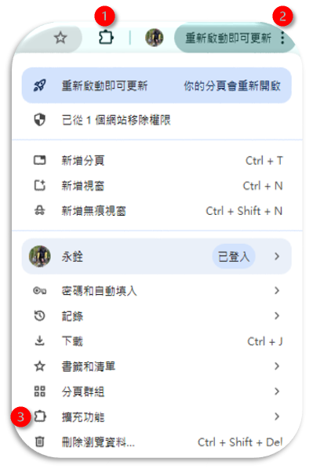

- 進入「擴充功能」如下圖畫面
  - 左欄預設進入「我的擴充功能」：就是中央欄「所有擴充功能」(下圖位置1)、是目前**已經**安裝的插件。會隨著登入的帳號而異，如果使用別人的電腦，可能會看到不一樣的插件選擇。
  - 如圖示可以看到[Sider][sider]已經安裝了，如果安裝的插件很多，可以經由搜尋列([搜尋擴充功能]())中尋找。
- 如果本地的chrome沒有安裝，就必須點選左側欄的「前往 [Chrome 線上應用程式商店][shop]探索更多擴充功能和主題」來搜尋並安裝。

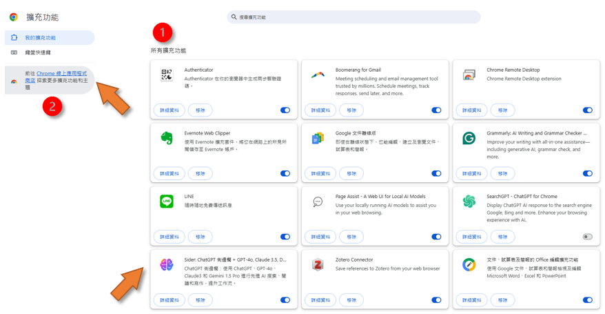

- 在[商店][shop]的搜尋列([搜尋擴充功能和主題]())中鍵入[Sider][sider]
- 點擊[加到chrome]()即可安裝。🎉🎉🎉

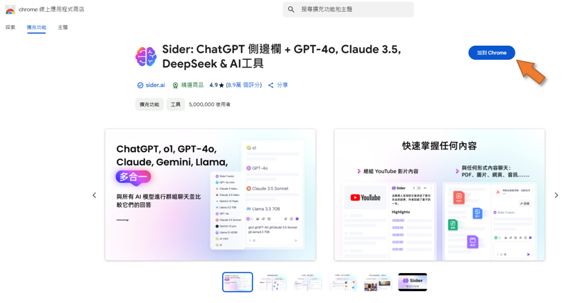

- 安裝過程、系統會提示插件可能會讀取變更所有網站上的所有資料，這是對那些**動態網頁**(會收集資料的網頁，如MIS三卡、金融交易等)，chrome提醒要記得不要隨便啟動[Sider][sider]，以避免造成錯誤。
- 一般我們正常的應用是在所謂的「靜態」網頁或是唯讀檔案，因此是**可以**接受風險的。按下「[新增擴充功能]()」

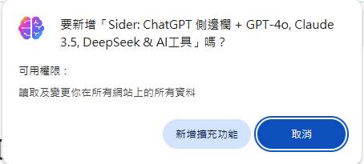

- 等候安裝插件...

## [Sider][sider]設定

- 安裝程式會引導到[Sider.ai]()公司的介紹網頁，可以點選想進一步了解的項目，網頁會導引到簡單的Gif檔案，輪轉說明。
- 必須點選「開始使用Sider」在該公司網站註冊、驗證。
- 記得要在該公司介面「一般設定」中設定[AI存取](#ai存取設定及費用)、外觀-顯示語言、字體大小等等。
- AI存取：內設是使用Sider AI、也可以選用[API](#api連線方案)、或者是OpenAI的介面(三者擇一，可以靈活切換，詳[下述](#ai存取設定及費用))。免費會員一天可以使用30點。先用這個點數來做使用範例。

## [Sider][sider]的應用

### 沒有側邊欄的使用方式

[Sider][sider]的強項是側邊欄，但很多時候也蠻干擾閱讀版面的，一般會將其關閉，此時只會在瀏覽器的右下方留下一個浮動的小工具列如下圖所示(滑過顯示)。除了最下方(位置5)會啟動邊欄之外，其餘功能介紹如下：

- 1.翻譯的設定：可以選免費的google翻譯或AI翻譯(會需要升級並且會扣點數)，沒有DeepL公司或其API方案。此外也能對翻譯的風格等很多細節進行率定。
- 2.翻譯此頁面：沉浸式、逐句翻譯對照。
- 3.總結頁面：同時啟動右側邊欄並進行網頁解讀及摘要。
- 4.保存頁面、或編輯已保存的頁面：進入[知識庫Wisebase](#知識庫wisebase)進行管理。
- 5.啟動邊欄、進入完整功能。

![瀏覽器右下角落的[Sider][sider]工具列](assets/2025-04-03-14-01-23.png)

### 網頁解讀(聊天)

- 閱讀網頁是一件苦差事，尤其是英文網頁。雖然大多數網頁都會有摘要、目錄，但如果有AI來幫忙讀就最好了。
- 可以由**聊天**按鈕進入(下圖位置1)，不必特別選取，網頁的主題就會被[Sider][sider]讀到，出現在(下圖位置2)，如果沒有，可以按下**重新整理**，這樣[Sider][sider]就能讀到了。
- 可以按下「總結」(下圖位置3)，[Sider][sider]就會讀取網頁、摘錄重點。[Sider][sider]的網頁清理工作算是非常優秀，除了主題以外的周邊資訊，大多可以清理乾淨。

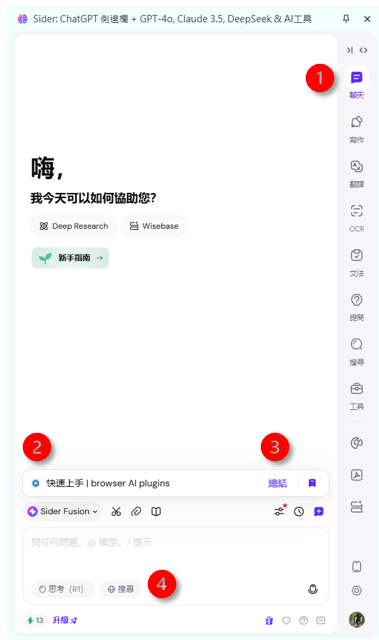

- 總結之後，還會有**相關問題**，使用者直接點入即可，不必另外再鍵入問
- **深度閱讀工具**也很好用。
  - 突出摘錄：佳句、金句、key verse的概念，省得找、直接複製到筆記即可。
  - 闡明關鍵概念：跟摘要有點不同，從不同角度來評論、比較、建議等等。
  - 識別假設：這個討論與批判的角度更高階了。從信念、意識層面來反省。
  - 了解作者：一般學術文獻對作者的追蹤是很綿密的，這個工具很重要!但是Sider似乎偏好介紹大陸的相關作者，並不是從爬文找到作者，循線再找、更不會介紹台灣的作者。
  - 相關新聞：如果是新聞類的文章，可以藉此加以印證。
  - 相關論文：也是開放性的搜尋，並不是就文本所附的參考文獻繼續尋找。

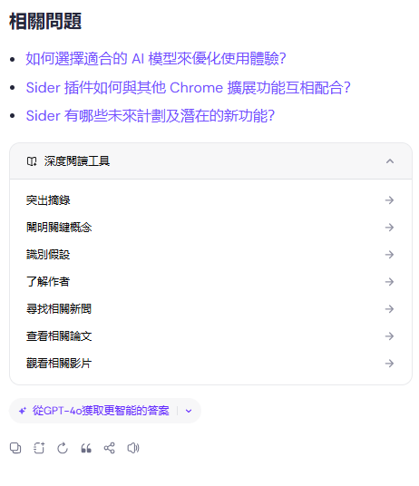

### 剪貼存取及分享

剪貼內容如何複製到[Sider][sider]介面？先介紹沒有啟動邊欄的情況。[Sider][sider]啟動之後，在網頁的文字上雙擊左鍵，不只反白該處的文字，還會出現一個小工具列如下圖，共有6個項目(組)：

- [Sider][sider]icon：隨即出現小對話框，進入對話「向AI詢問上述內容」，選取的文字會變成對話的主題名稱，鍵入問題後，按下`enter`或藍色紙飛機，即可開始詢答。小對話框的詢答似乎不會被[Sider][sider]紀錄。
- 複製：就是一般複製到剪貼簿的過程。
- 突出顯示：給點選字串一個較明顯的底色，會將網頁的標題與連結貼到**AI暫存箱**(也能選擇在[知識庫Wisebase](#知識庫wisebase)的其他目錄)，存得多了，可以讓AI進一步整理組織，存成有層次的筆記簿、可以另存目錄。底色部分則會連結到[知識庫Wisebase](#知識庫wisebase)。
- 解釋：不用再打甚麼指令，直接讓AI給出名詞定義。如果點選**繼續聊天**，則會開啟邊欄，納入對話歷史紀錄。

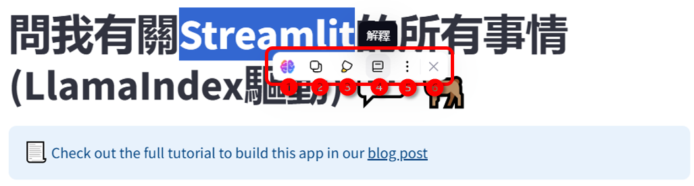

AI詢答結果如何複製到別處？

- 文字生成結果的複製：一般AI介面會在產出文字方塊的上方或下方有工具列，讓使用者可以進一步操作，[Sider][sider]是在左下方，如下圖位置1。工具列分別有：
  - 複製、
  - 保存為筆記。下圖所示，將存在[Sider][sider]的[知識庫Wisebase](#知識庫wisebase)。
  - 重新產生回答：如果更改不同語言模型，可以繼續執行直到滿意結果、
  - 引用：將之前的產出用在後面的對話。
  - 分享：有圖片與連結2種方式，可以貼在社群媒體上、與
  - 大聲朗讀：行動裝置上很好用。
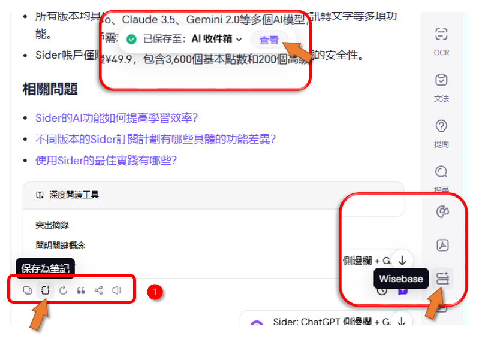

- 表格類的結果，如下圖的**識別假設**分析結果對照表，[Sider][sider]很貼心的提供2個選項，分別是csv檔案格式的試算表、或者是md(Markdown)檔案格式，前者可以用excel或其他軟體打開，後者也可以被一般整體開發環境系統程式如VSCode打開，讓筆記系統可以引用。

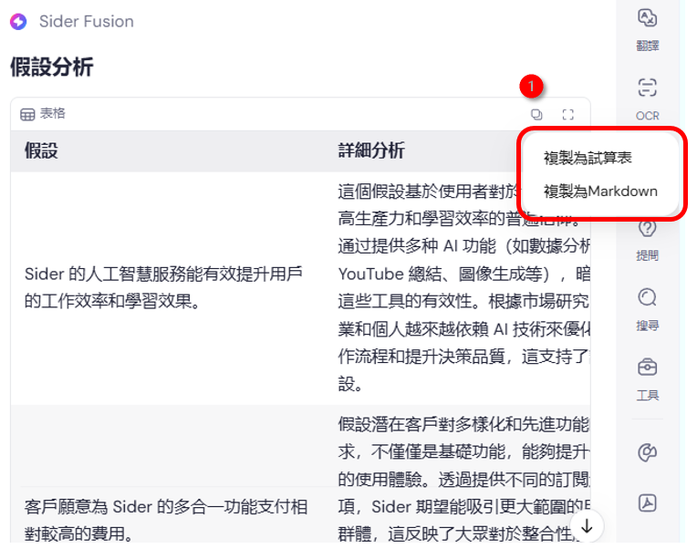

### PDF詢答

- PDF詢答是寫報告的基本作業之一。對個別文獻有深入、透徹的理解，讀懂、讀通，之後才能進一步應用、彙總到報告章節之中。
- 雖然有許多服務可以做到PDF詢答，但其中困難在於長檔案之解讀、圖文與跨頁的正確清理、以及正確的引述。前提是要能正確搜尋到關鍵詞，解讀上下文。這些方面[Sider][sider]的表現是很傑出的。

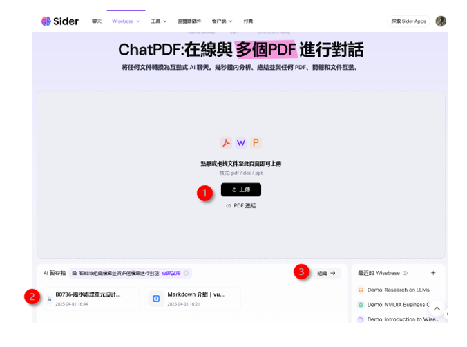

- 此外，[Sider][sider]也有類似notebookLM或deep-research功能，可以建
立並管理檔案夾，將同類的資料放在一起進行分析、以及報告撰寫。
- [Sider][sider]提供了**突出顯示**的功能，在滑鼠點選後按右鍵，會自動貼到對話窗，並且在知識庫內新增一個目錄來保存選取片段，方便報告撰寫時可以完整引述。
- 一份新的文獻讀完之後要歸類在哪裡，以便日後好找，或者納入在哪份報告、哪個章節，這些都需要好的管理、有好的工具來移動檔案。

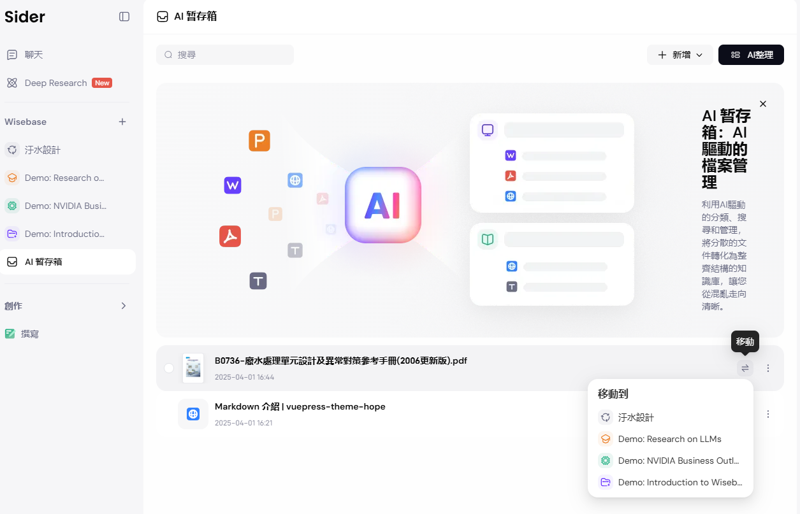

### 搜尋

- 這個功能非常有用、將google等搜尋結果進行彙總摘要重點。
- 其他方案比較
  - 雖然也有免費版的插件[SearchGPT](https://chromewebstore.google.com/detail/searchgpt/bmamgdogjklgdfgehajhiigfciebpami?hl=zh-TW&utm_source=ext_sidebar)、在搜尋結果還少量的情況下還OK，結果如果多一些常常會有延滯無法運作的情形。
  - ChatGPT也推出了搜尋彙總的功能，但沒有顯示引述的網頁內容，還得一一點進去才能看到內容。
  - 這些方案的蒐尋對象並不能指定目前的網頁(或PDF檔案)，是開放的搜尋，效果較不精確。

- 搜尋結果不單會有綜合整理，也可以直接看到依據來源，如下圖：

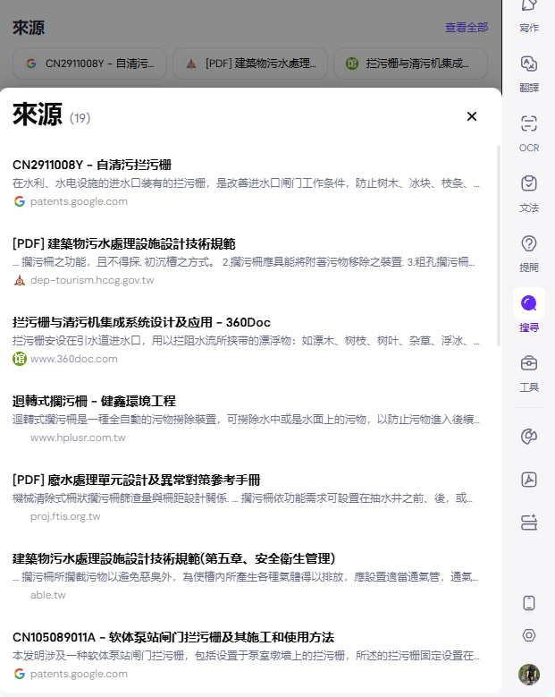  

### 知識庫Wisebase

- 傳統的研究作業可以分成：主題發展成大綱、濃縮成關鍵詞、搜尋網頁、有用的收集放在剪貼簿、整理報告、檢討是否調整大綱、重複此一動作，討論與結論。
- 這些都可以在知識庫Wisebase介面中完成。
- Deep Research則是將此一過程予以自動化。
- 類似[Google notebookLM](https://notebooklm.google.com/?original_referer=https:%2F%2Fwww.google.com%23&pli=1)或[openAI deep research ](https://openai.com/index/introducing-deep-research/)的功能，是一個集合了對話歷史、使用者文件、蒐集的網頁、佳句、名詞片語等等的目錄，使用者如果沒有自己的筆記系統，倒是可以參考看看，在此處展開小的專案研究。
- 進入知識庫Wisebase：

- 進入知識庫介面之前，會出現簡介，直接點選開始免費方案即可略過

1. 左側欄可以切換聊天主頁、Sider的Deep Research介面(免費版可以開3個主題)、以及
2. Wisebase上的資料夾、可以增加或刪除，
3. 選取資料夾：學士帽圖標示Deep Research結束後自行創設的資料夾，其餘圖標則是系統自帶。空白版有幾個示範、與一個AI暫存箱，如果一下子找不到好的歸類方式，可以先放在這裡，待日後處理。
4. 右側欄是備註：就是訪問網頁後做的摘要、片段剪貼簿、重要的筆記等等，可以想做是一張張的卡片。可以在瀏覽網頁實存成備註，也可在此直接新增。此處可以搜尋、也可直接進行AI寫作，請AI幫忙分類整理。也可以放大到全螢幕在此作業。新增備註會進入一個markdown的編輯介面，可以將AI生成結果在此進行編修。
5. 中央區：打開資料夾後，中央會出現標題，這裡是主要工作區。
6. 完整功能的對話框、
7. 有關這個主題過去的聊天歷史紀錄。
8. 也接受使用者上傳的檔案、或AI自己整理的筆記檔(從備註中整理的結果)也會存放在此。資料夾以下不能再開設資料夾，所有檔案都是平行的。但附了一個搜尋框可以全文搜索。

- 完整的使用經驗與建議，可以參考[Sider知識庫](./wisebase.md)
- 官網的[說明](https://sider.ai/wisebase)

## AI存取設定及費用

基本上有3種AI存取的方式

- Sider：會綜合各個AI，也可以從[Sider Fusion]()旁的下拉選單中點選指定的語言模型(如下圖)、較為靈活、但會扣點數、甚至有的會需要**進階點數**。

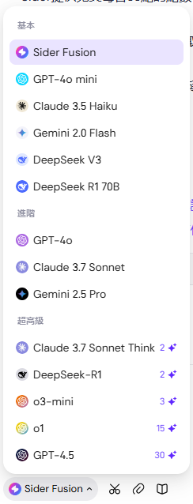

- [API金鑰](#api連線方案)：個別公司分別填入金鑰、自行選取模型、不會扣Sider點數
- ChatGPT webapp：就是openAI的介面，只是放在右側欄，適用openAI的會員方案、不會再扣Sider的點數。

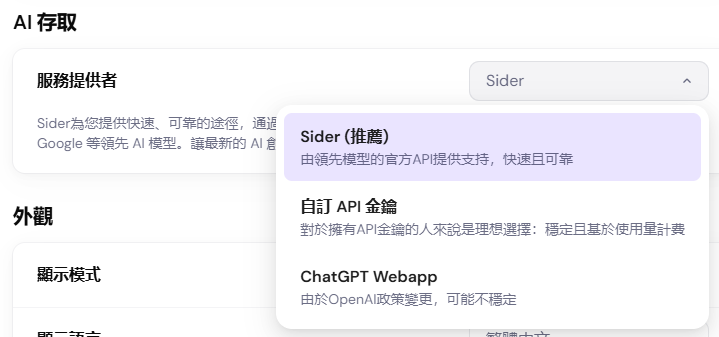

- 以下訊息可以提供申購時試算使用
- Sider公司可以提供收據pdf檔案(無法抵稅)

### AI存取設定

### [Sider][sider]

#### 免費方案

- [Sider][sider]每天提供免費使用30點。約為30次基礎模型的對話，參與「獎勵中心」任務還可以得到額外的點數。
  - *30 基本點數/天,  
  - *5 Youtube 摘要點數,  
  - *10 繪圖點數,  
  - *10 PDF/文件/連結聊天點數,  
  - *200 頁/PDF

#### 自費方案

- 付費方案基礎版RMB599/年、高級版 RMB999/年、與無限RMB1499/年，費用與OpenAI付費會員相當、但內容更豐富。因常有折扣促銷方案，還是詳見[官網說明][fee]為準。

#### 公費方案

- 循程序申請，通過後以公司指定帳號，在Google帳號登入時，選擇**使用其它帳號**

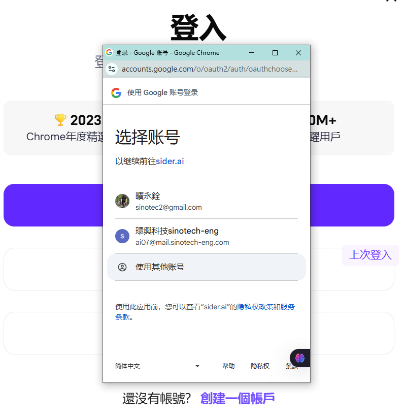

- [同時登入設備][faq]測試結果：
  - 測試發現2個人同時提問會彼此卡頓。
  - 如果多人同時，就會發生嚴重塞車，無法接受提問。
- 同組間的share方式
  - 組長管理密碼、電子郵件使用公司指定帳號。
  - 建議使用google calendar來登記。
  - 如果要用deep research功能，要特別註記，因為會佔據不少時間來生成文字。
- 同仁如果沒來上課要試看看deep research的威力，可以跟研資部來索取一次性密碼。
- 其它說明詳見官網[FAQ][faq]。

### API連線方案

- [Sider][sider]公司的API連線方式雖然已經建立了，但目前並沒有對外提供販售，僅供內部使用。
- API連線的答詢，將不會重複使用[Sider][sider]的點數。
- 雲端LLM
  - 可以接受API連線的供應商，包括openAI(and Azure)、Anthropic(Claude)、Deepseek、Google、Groq、Azure AI等公司，
  - API的密鑰需向個別公司申請購買。
  - 研資部研究計畫提供各部門使用1個月，各部門可就使用情況自行申請購買，負責申購與管理之同仁以下稱**版主**。
- 地端
  - 可以接受ollama。但經測試雖可連線，但**不能**運作。

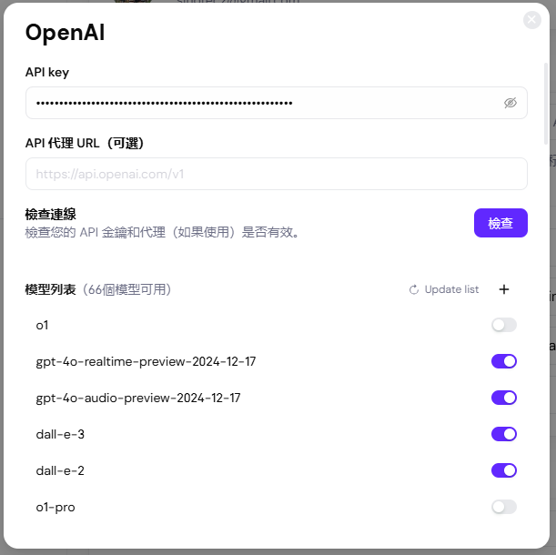

- 此處以openAI的API金鑰為例，說明設定的重點
  - 使用者(**版主**)購買API金鑰後，填入金鑰位置。
  - API代理URL：因openAI公司有統一的入口，可以不必填寫。
  - 檢查連線：確認用
  - 模型列表：可就個別模型自行設定打開或關閉

::: danger

因為供應商提供的模型單價差異很大，如果團隊成員一時不察，用到了昂貴的模型，會讓API存款一下就耗盡了，影響到大家的使用。強烈建議**自行**設定只開放CP值較高的模型。如果一定要用昂貴模型，也要記得使用過後將其關閉，以免誤觸。

:::

### chatGPT webapp

- 這個方案的會員及費用是發生在openAI公司。
- 如果使用者在2個公司的會員名稱一致(如以google會員登入)，系統會自行切換。
- 同樣的，使用openAI的資源，[Sider][sider]的點數就不會重複扣用。

## 專案負責人

- 研資部AI插件人員培訓專案負責人：蕭詠鍵、分機08855

[sider]: https://chromewebstore.google.com/detail/sider-chatgpt-%E5%81%B4%E9%82%8A%E6%AC%84-+-gpt-4/difoiogjjojoaoomphldepapgpbgkhkb?hl=zh-TW&utm_source=ext_sidebar "ChatGPT 側邊欄：使用 ChatGPT、GPT-4o、Claude3 和 Gemini 1.5 Pro 進行先進 AI 搜索、閱讀和寫作，提升工作流。"
[shop]: https://chromewebstore.google.com/category/extensions?utm_source=ext_sidebar&hl=zh-TW "Chrome 線上應用程式商店"
[ithome]: https://ithelp.ithome.com.tw/articles/10339222 "文文(2023-10-13)五星好評數第一名，你絕對不能錯過這款Chrome AI外掛！"
[fee]: https://sider.ai/pricing?trigger=ext_chrome_btm_upgrd_p_plan "基礎版訂閱每月收費¥49.9，包含3,600個基本點數和200個高級點數的使用權。無限版訂閱月費為¥116.6，提供無限制的基本和高級點數，以及支持最多8台設備登入。高級版為¥83.3每月，專為重度用戶設計，提供12,000個基本點數和400個高級點數。"
[faq]: https://sider.ai/help-center/faqs/sider-account-issue#is-it-possible-for-multiple-people-to-use-one-account-or-to-log-in-to-an-account-from-multiple-devices "是否可以讓多個人使用一個帳號或從多個設備登錄一個帳號？目前，我們不支持多個用戶在一個帳號上使用，但允許多個設備使用同一帳號。不過，每次只能有一個會話回應。最多可以用一個帳號同時登錄多少設備？目前最多可以同時登錄 8 個設備，每個瀏覽器會話計算為一個設備。當第 9 個設備登錄時，最早登錄的設備將自動登出。"