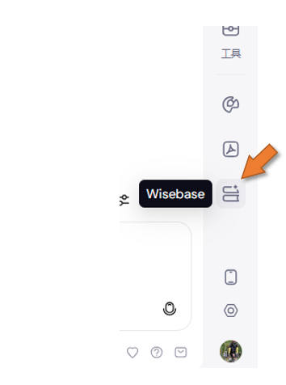
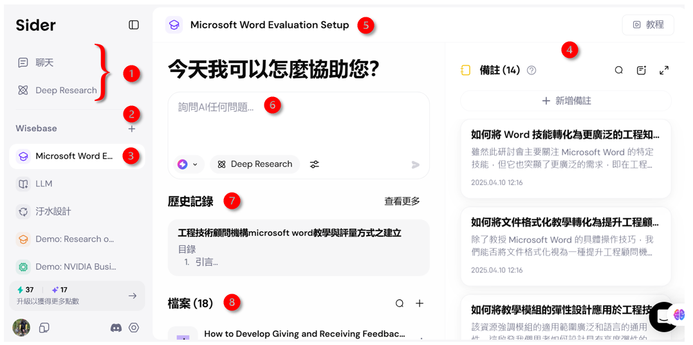
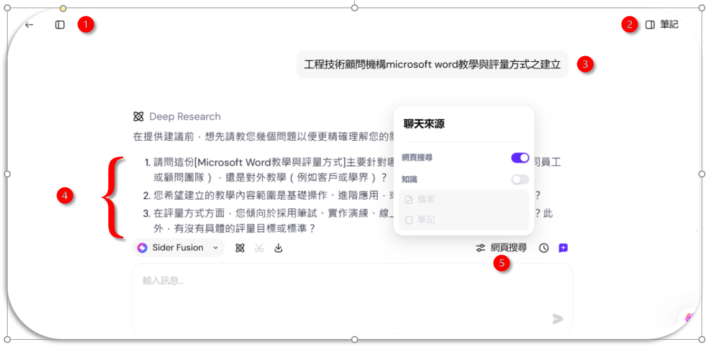
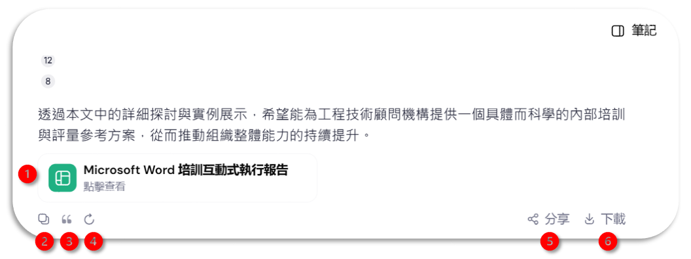
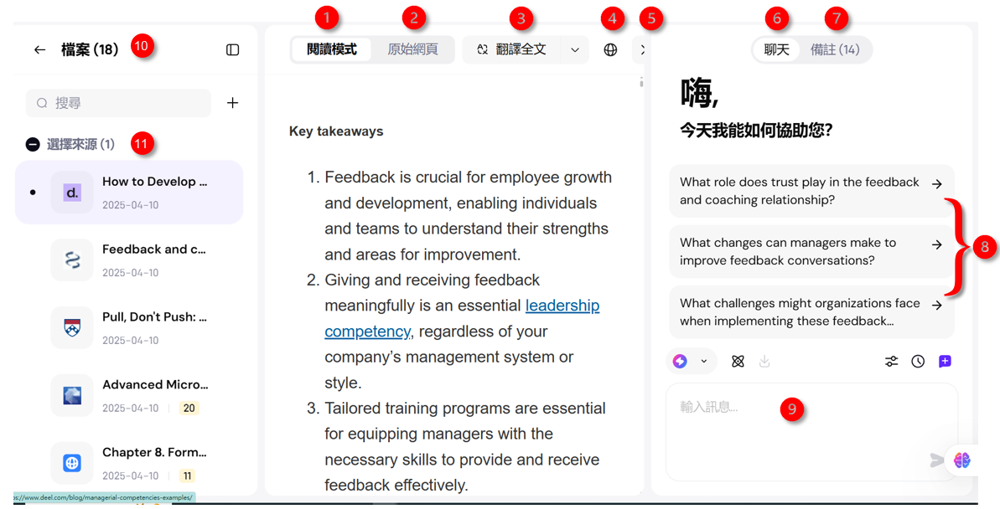
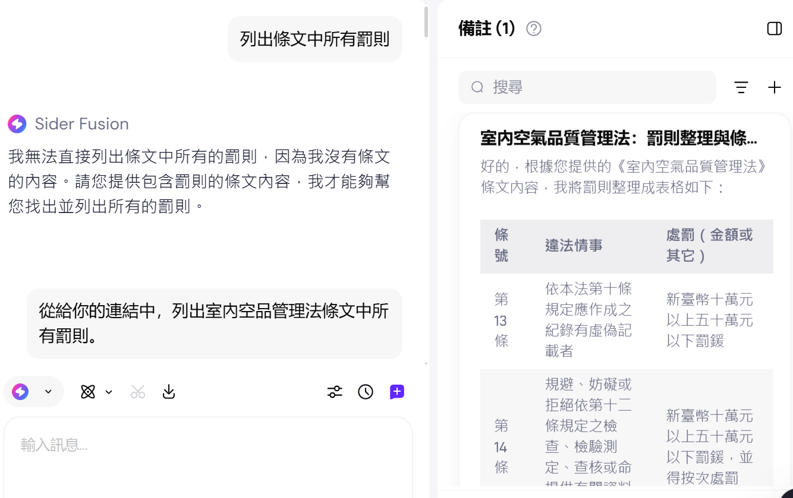

# Sider 知識庫
{: .no_toc }

  

    Table of contents
  

  {: .text-delta }
- TOC
{:toc}

---

## 介面說明

### 入口

- 進入知識庫介面之前，會出現簡介，直接點選開始免費方案即可略過

### 知識庫作業介面

1. 左側欄可以切換聊天主頁、Sider的Deep Research介面(免費版可以開3個主題)、以及
2. Wisebase上的資料夾、可以增加或刪除，
3. 選取資料夾：學士帽圖標示Deep Research結束後自行創設的資料夾，其餘圖標則是系統自帶。空白版有幾個示範、與一個AI暫存箱，如果一下子找不到好的歸類方式，可以先放在這裡，待日後處理。
4. 右側欄是備註：就是訪問網頁後做的摘要、片段剪貼簿、重要的**筆記**等等，可以想做是一張張的卡片。可以在瀏覽網頁實存成備註，也可在此直接新增。此處可以搜尋、也可直接進行AI寫作，請AI幫忙分類整理。也可以放大到全螢幕在此作業。新增備註會進入一個markdown的編輯介面，可以將AI生成結果在此進行編修。
5. 中央區：打開資料夾後，中央會出現標題，這裡是主要工作區。
6. 完整功能的對話框。
7. 歷史紀錄：有關這個主題過去的聊天[歷史紀錄](#歷史紀錄)，包括提示、以及AI生成的所有內容。
8. 也接受使用者上傳的檔案、或AI自己整理的筆記檔(從備註中整理的結果)也會存放在此。資料夾以下不能再開設資料夾，所有檔案都是平行的。但附了一個搜尋框可以全文搜索。

### 歷史紀錄檢視介面

::: important

這裡是收穫AI產出的地方，也是會花時間比較多的作業區。

:::

提示與AI回復畫面：

1. 收合左側欄(檔案)、或返回前述[知識庫作業介面](#知識庫作業介面)
2. 收合右側欄(筆記、就是**備註**)
3. 第一個提示：就是Deep Research的主題，命名原則討論如[Deep Research](./deepresearch.md#主題的訂定原則)。
4. Deep Research會先反饋需要澄清的問題，需使用者針對問題予以回應。簡答即可。
5. 接下來的對話也可以限定Deep Research對網頁、或上傳的檔案(知識)進行搜索，並據以回答。

如果沒有進一步指示，生成結果可以有幾種輸出方式：

1. Deep Research對其生成的報告提供了"互動式執行報告"，點擊生成後會產生一個`html`檔案，可以在網頁伺服器上提供其他人使用。如[此一實例](https://node03.sinotech-eng.com/word.htm)。
2. 複製到剪貼簿：沒有格式，純文字。
3. 引述：在後續的提示中可以要求進一步處理。
4. 重作：換別的模型、不同的查詢領域，要求在原來的提示下重新生成。
5. 分享：系統會提供一個專屬的網址，可以分享給其他Sider的使用者。
6. 下載：系統會將最後一筆生成結果儲存到使用者的**下載**目錄，檔名隨機給訂，附加檔名是TXT檔，markdown格式，可以做為網誌之發布。

### 檔案檢視器

- 此處所謂的"檔案"包括網頁、pdf、docx、md等等格式的文檔。
- 點選檔案之後，會進入個別檔案的檢視器(previewer)，以便確認內容的正確性、追蹤敘述的依據，是重要的查證工作。
- 檢視器也分成左、中、右三個欄位

1. 中間欄位，可以選擇閱讀模式、是經AI摘錄或轉述或清洗，提出跟研究主題關聯的要點
2. 原始網頁：原來網頁的內容(不會與閱讀模式連動)
3. 翻譯。沉浸式，便於精讀、會連動。
4. 開啟網頁：會另外開啟一個瀏覽器頁面，重新審視全頁的其他訊息。(一般會複製網址、作者、年代等等參考資訊)
5. 關閉檔案。對話框移動到中間欄，右側欄變成備註。
6. 左側邊欄聊天對話框，是針對中間欄的內容。
7. 切換過去找到的筆記卡片
8. 針對中間欄的主要想法，AI提出了可以繼續詢問的主題，可以直接點選看內容，覺得有幫助就可以收到備註中。
9. 對話框：也可以繼續針對這些想法進行Deep Research。(如果發現新的主題，建議開啟新的資料夾存取，以利管理)
10. 點選側邊欄可以開合左側邊欄。左側欄是原來檔案的選單，向左箭頭可以回到前述知識庫介面，
11. 瀏覽/選擇其他檔案：也可以尋找、新增、刪除。(但不能再增加資料夾。)

### 漸進式對話

- Sider似乎需要人特別指定互動歷程：「給你的連結...」、「剛剛...」，否則就找不到依據。
- 開啟網頁後、先做「總結」、再詢問細節，可能會是一個比較容易得到正確結果的程序。

## 文件向量化

::: important

上傳文檔的動作很簡單，但正確向量化一個文件則是RAG成功的關鍵，使用者需了解上傳檔案的特質，選擇正確的設定，來完成向量化的程序。

:::

