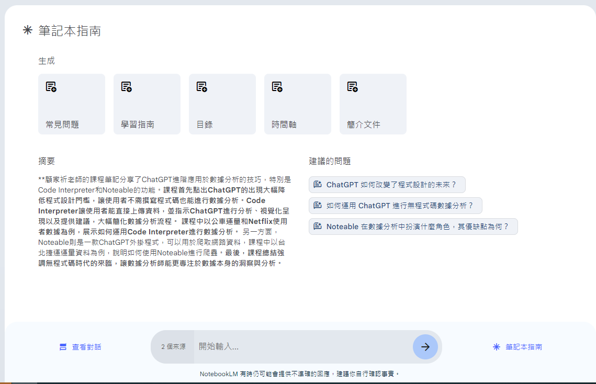

# 2024-06-12

- Google NotebookLM 免費中文 AI 筆記實例教學，老師、學生、創作者利器[Esor Huang 6月 07, 2024](https://www.playpcesor.com/2024/06/google-notebooklm-ai.html)  GN特色
- 輸入、輸出的介面流程：
  - 筆記本分類、一個筆記本中持續上傳大量的文件，並在這個筆記本中進行專案式的討論，另存多種格式檔案
  - 單一來源最多可包含 50 萬字
  - 保留階段性的輸出成果（類似產出新筆記），可針對輸出成果進一步討論：
- 協作平台
  - 記事板：每個筆記本最多可建立 1,000 則記事，並彙整在記事板上。
回答都會根據自己輸入的資料庫，並加上引用註記：
例如要求從資料庫中出學習測驗題，每一題都會顯示引用自哪一則資料。
可以共用協作！
讓夥伴、學生一起討論某個資料庫，生成新的報告、文章與問答。
個人 Gmail 帳戶和 .edu 帳戶最多可與另外 50 位使用者共用筆記本
目前免費，支援中文！但卻可以輸入大量的文件檔案、雲端文件、網頁文章進行分析與生成。
早期測試階段免費，但以後應該會收費。

創作者、研究者、老師、學生只要發揮創意，可以做出很多利用，例如下圖我讓 NotebookLM 分析大量電腦玩物文章，製作「測驗題目」（有時候上課需要），出得還不錯，而且都有明確的引用來源。

## 解讀輸入後，直接生成文件選項

