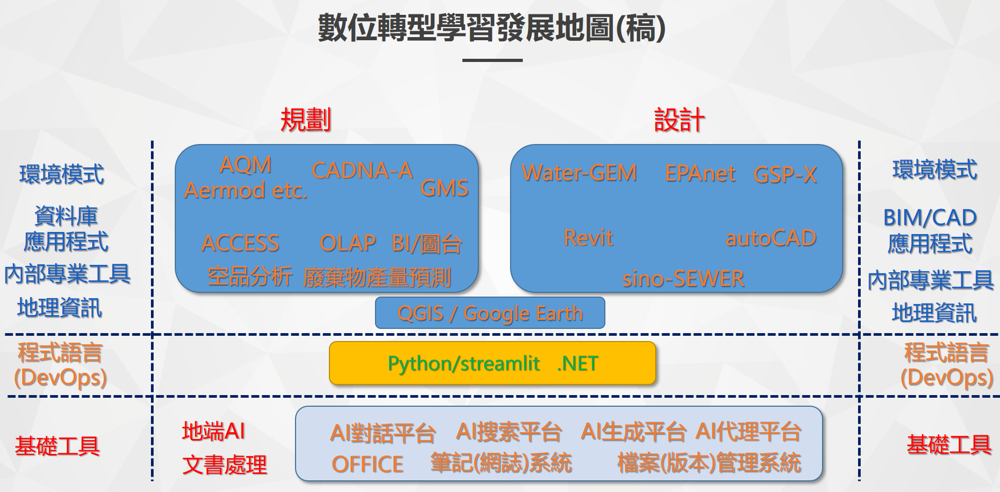
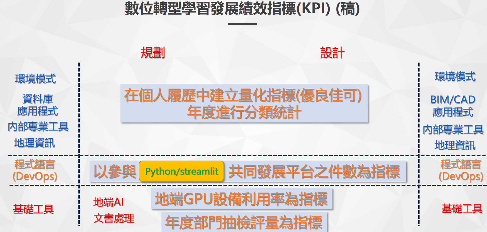
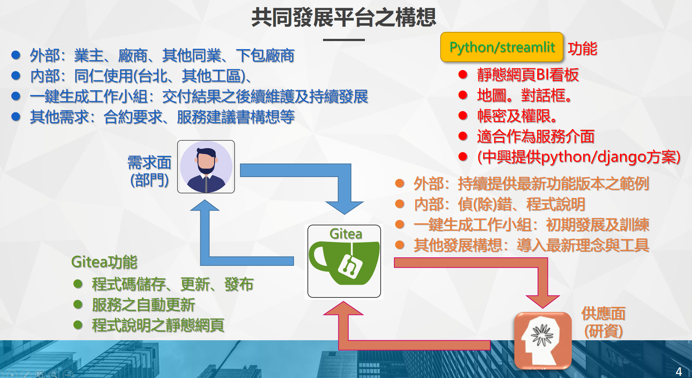
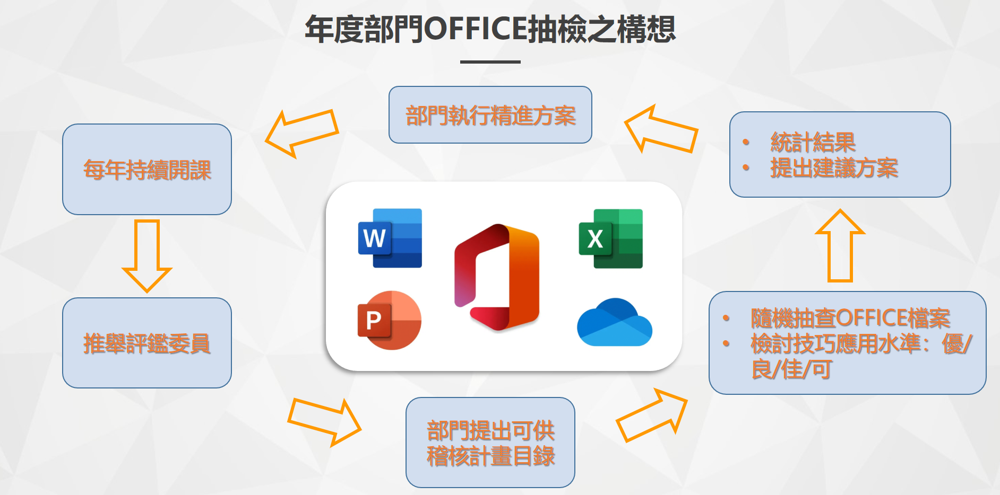

# meeting notes

## KPI 簡報

- 專業領域工作流程無人管理、
  - 數位資訊化?流程自動化?
  - AI化程度無法追蹤落實
  - 工作成果提交表中一定要出現"數位成果"
- 重度使用者俱樂部：
  - 贈送(自選)會員?贈送課程?
- 個人免費帳號-無從列管、資安無從管理
  - AI協作留下紀錄

## 設計類工作-成果提交與審查流程

- 個別工程項目的知識依據略有不同，需要模組化、最後以AI推論予以整合。
  - 調出LLM現行知識庫依據之文獻
  - 彙整市面上的教課書、課堂講義、考古題QA
  - 
- 由現有工程問題對策中找到設計問題ㄙ
- 以***工程設計為例，如何藉由AI
  - 避免引用錯誤
  - 避免設計錯誤
  - 避免計算錯誤
  - 避免失敗風險(施工、營運、除役 )

作為一名通過國家高等專業考試並擁有多年執業經驗的環境工程技師，我了解到過去曾發生多種類型的環境設計錯誤，這些錯誤對環境和社會造成了不同程度的影響。以下是一些典型案例：

**1. 水資源工程設計錯誤：**

- **金湖水庫設計缺陷：** 金湖水庫因防潮溢洪堰高程設計錯誤，導致海水倒灌，污染原水，致使耗資6.3億元的新建水庫無法發揮預期供水功能，造成公帑浪費。 citeturn0search0

**2. 工業區排水設計不當：**

- **臨海工業區大排生態工法失敗：** 高雄市臨海工業區投入約千萬元進行生態工法改善60米寬的大排水溝水質，但由於上游水源不足和工廠偷排污水等問題，導致水質未見改善，相關設施在數次颱風後毀壞，成為生態工法的失敗案例。 citeturn0search1

**3. 工業廢水處理設計缺陷：**

- **2013年日月光廢水污染事件：** 日月光半導體K7廠因廢水處理設計不當，導致含鎳廢水污染後勁溪，影響下游農業用水安全，並對環境造成嚴重影響。 citeturn0search13

**4. 重大工程施工設計疏失：**

- **2014年高雄氣爆事故：** 高雄市因地下管線設計與管理不善，導致丙烯氣體洩漏並引發大規模氣爆，造成嚴重人員傷亡和財產損失。 citeturn0search12

**5. 大型建築工程設計爭議：**

- **臺北大巨蛋案：** 大巨蛋工程在設計與施工過程中，因未充分考慮周邊環境影響，導致鄰近古蹟松山菸廠出現地基下陷、煙囪傾斜等問題，引發社會廣泛關注與討論。 citeturn0search15

這些案例顯示，環境設計中的錯誤可能源於規劃不周、設計缺陷、施工管理不善或對環境影響評估不足等因素。作為環境工程技師，應從這些案例中汲取教訓，強調在設計和實施過程中全面考慮環境因素，確保工程的安全性和可持續性。 

## 文件類工作-成果提交與審核流程

### 構想大綱階段

- 提綱經AI審查，審查要項：
- 觀念發想
  - 合理性、正確性
  - 創新性(創意訴求的價值分`析)
  - 延展性、衝擊性
- 範圍完整性審查
- 量化目標

### 分段主題之知識追溯

- 參考文獻之正確引用
- 文章前後文之正確引述
- (報告品質分階段偵錯)

### 報告總體體檢及評量

- 是否達成或超越大綱預期效果
- 
## to網管

- 精靈DNS's
- 共同開發平台的網路服務伺服器、讓部門人員也可以開發並啟動其streamlits
  - 循環部：廢棄物預測計算、清運量爬蟲結果之定期分析
  - 環評部：噪音試算、環監圖台、報告偵錯精靈
  - 能資部：OLAP與能資圖台
  - 永續部：AQM 代理
  - 水務部：會計PDF偵錯精靈(中興工地單據數化系統)
- tuning造成網路不穩?休息時間reseet cert?造成網路不穩?休息時間reseet cert?

## 開發平台

- 是否、如何規避VSCode的使用?
  - 直接使用notepad?
  - copilot?AI-aid?
- 使用甚麼CICD工具?